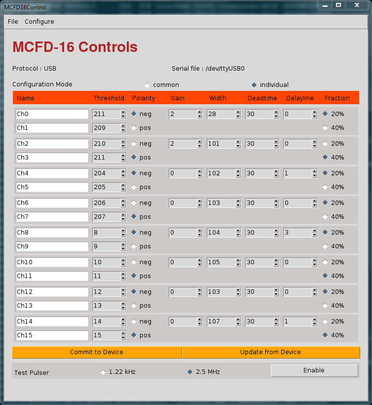

---
---

---

# <a name="AEN6576"></a>12.2. Starting the GUI for USB communication

To properly communicate over the USB protocol, the user should follow the
      the subsequent procedure. Before beginning, know that the device is
      particularly slow to respond over the USB protocol and so it is common for
      some bit of lag to exist when committing new parameters to the device.


1. Locate the name of the serial file that represents the MCFD-16 device.
             The serial file should be located in /dev with a name that begins with
             "ttyUSB". The number that forms the end of this file name is
             representative of the order in which the devices were plugged into the
             host computer. The number is therefore not unique and should be
             checked whenever the device is plugged in anew. Furthermore, ensure
             that this file is both readable and writable to your account. The
             spdaqs in the NSCL are configured to enforce these permissions.
2. At the command line, call
   ```
   
          MCFD16Control --protocol usb --serialfile your_serial_file
   ```
   Doing so should bring up a window that looks like this.
   <a name="AEN6586"></a>**Figure 12-1. The MCFD16Control Graphical User Interface for USB**
   
3. At this point, the user can manipulate the settings on the GUI safely
             without affecting the state of the device. Once the desired settings are
             configured, the user can commit those to the device by pressing the
             "Commit to Device" button. At the same time, if the user seeks to update
             the displayed settings from their device, he/she should press the
             "Update from Device" button.

---
