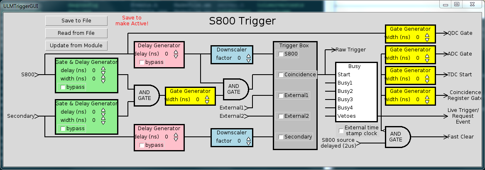

---
---

---

# <a name="AEN6795"></a>16.2. Launching the ULMTriggerGUI

It is first and foremost important to realize that the ULMTriggerGUI is a
      client of the CCUSBReadout slow controls server. In that sense, there is
      no way that the ULMTriggerGUI can run without the CCUSBReadout running
      first. So you must launch a CCUSBReadout program that has been fed the
      ctlconfig.tcl script from the previous section before you launch the
      ULMTriggerGUI. Depending on whether other processes are running that
      might have control over port 27000 already, you may have to explicitly
      specify a port to listen for connections using the --port option. Once
      the CCUSBReadout program is running, you can then proceed to launch the
      ULMTriggerGUI.

The ULMTriggerGUI requires only a few pieces of information to launch.
      They are:


- Hostname of the computer running the slow controls server
- Port on which the slow controls server listens for connections
- Slow controls module name
- Slot number that the LeCroy 2367 ULM module resides
- Name of ringbuffer to listen for state transitions on
- Configuration file name

In general, these are given reasonable default values so that you can
      typically forego specifying all of the options except for the
      slow-controls module name and the slot number. By default, the host name
      is given as "localhost", the port number is provided 27000, and the
      ringbuffer name is given tcp://localhost/USERNAME. Here the USERNAME is a
      placeholder for your user name. Note that only ring buffers on localhost
      can be specified. Only the slow controls module must be specified because
      there is no a priori way of knowing the name of the module you have
      loaded into you ctlconfig.tcl. If we continue the example from the
      previous section, you would specify the value passed to -module as
      remoteHandler.

Putting this all together, we can launch the ULMTriggerGUI to control a
      ULM in slot 10 read out by a CCUSBReadout running locally, listening on
      port 27000, and outputting data to tcp://localhost/USERNAME by either
      entering:

```

$DAQBIN/ULMTriggerGUI --module remoteHandler --slot 10
    
```

or

```

$DAQBIN/ULMTriggerGUI --moduel remoteHandler --port 27000 --host localhost --ring USERNAME --slot 10
    
```

After executing those commands, you should see a window pop up that looks like:

<a name="AEN6818"></a>**Figure 16-1. Screenshot of ULMTriggerGUI**



Screenshot of the ULMTriggerGUI after startup.

---
