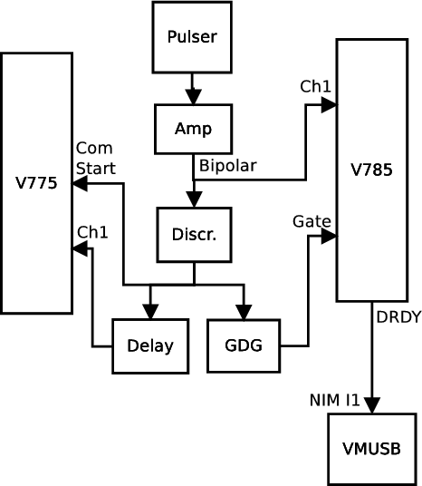
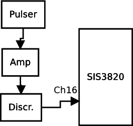

|  |  |  |
| --- | --- | --- |
| NSCL DAQ Software Documentation |
| Prev | Chapter 9. A Simple VMUSBReadout Experiment Tutorial | Next |

---

# 9.2. Setting up the Electronics

In this section, the reader will be given a schematic of the circuit the
      rest of this guide will assume. In order to set it up,
      the user must acquire *at least* the following:

- Wiener VM-USB controller
- CAEN V775 time-to-digital converter
- CAEN V785 peak-sensing analog-to-digital converter
- Struck SIS3820 32-channel scaler
- Gate and delay generator
- Delay module
- Constant-fraction discriminator
- Plenty of lemo cables
- Ribbon cable or a handful of twisted pair cables
- ECL-to-NIM converter
- Pulser
- VME crate
- NIM crate

Rather than detail how to plug each cable into each module, th electronics
      diagram for the digitizers is provided in [[*Block diagram of the V775 and V785 wiring*|https://github.com/FRIBDAQ/docs/tree/main/11.1/x4748.md#v775v785blockdiagram]].
      Take note that this is a very basic circuit that makes no attempt to
      handle busy logic properly. It is designed specifically for generating
      some test data. Be aware also that there are some signal conversions not
      shown in the block diagram because their need depends on the exact
      hardware being used. It is left up to the reader to determine whether a
      logic signal needs to be converted from ECL to NIM or ECL to TTL or
      whatever between modules. A separate diagram is provided for the the
      scaler portion of the circuit at [[*Block diagram of SIS3820 scaler wiring*|https://github.com/FRIBDAQ/docs/tree/main/11.1/x4748.md#sis3820blockdiagram]].

**Figure 9-1. 
        Block diagram of the V775 and V785 wiring
      **

**Figure 9-2. 
        Block diagram of SIS3820 scaler wiring
      **

---

|  |  |  |
| --- | --- | --- |
| Prev | Home | Next |
| A Simple VMUSBReadout Experiment Tutorial | Up | The Configuration Files |
