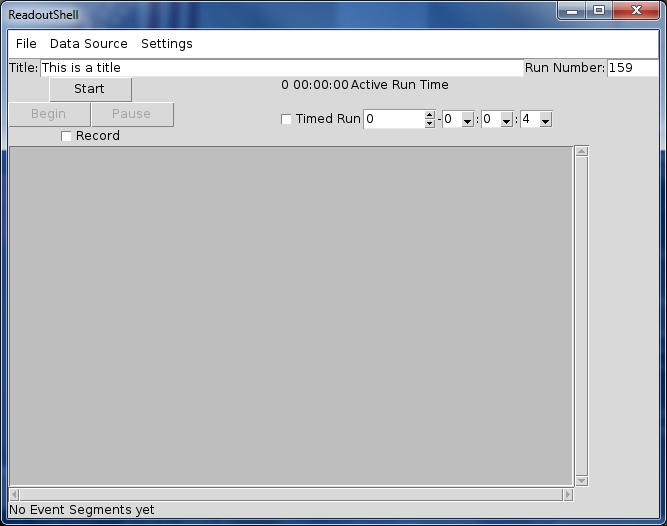
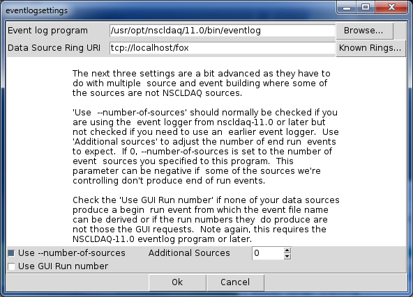

---
---

---

# 7.2. Operating the user interface

Below is a screenshot of the graphical user interface presented by
            the ReadoutShell program.

**Figure 7-2. ReadoutShell's GUI**

The GUI is divided into four vertically stripped segments. From
            top to bottom these segments are:

- The *Menu Bar* which provides acces
                      to infrequenly used operations and commands.
- The *Run management segment*
                      which allows you to set up run
                      parameters and to manage the ReadoutShell's state machine
                      as far as you are supposed to be able to stimulate it.
- The *Output Log window* which provides
                      a scrolling text widget in which modules that make up the
                      RadoutShell can place textual messages.   In many cases
                      the messages are output in a log/severity format which just
                      means that messages have a timestamp and a severity and that the
                      severity affects the formatting of the messages.
- The *Status Bar* which provides a region
                      for modules that make up the ReadoutShell, and data providers
                      to display status information that will not scroll away.

## 7.2.1. The Menu bar

The menu bar provides access to ReadoutShell commands
                that are not as frequently used as those that are presented
                by the Run Management segment described below.  In addtion
                to the fixed menus described in this section,
                [*Customizing the ReadoutShell*](https://github.com/FRIBDAQ/docs/tree/main/12.0pre/x5162.md) describes
                how your extensions to ReadoutShell can add more entries to the
                menus or create entirely new menus.

**The File menu. **
                    Provides access to file related commands.  The
                    specific operations provided are:

- File->Load...
  This command prompts for a file which must be
                                      a Tcl/Tk script.  The script selected is then
                                      sourced into the ReadoutShell.  The source is
                                      done in global level context.
- File->Add Library..
  This command prompts for a directory.  The
                                      directory is then added to the path of
                                      directories that is searched for Tcl packages.
                                      This can be used, for example, to add a directory
                                      or set of directories that have data source
                                      provider packages to the search path making
                                      them known to the data source manager.
- File->Log...
  Prompts for a file.  Once the file is selelcted,
                                      all output sent to the Output Log window is
                                      also logged to this file. Logging continues
                                      until either the Disable Log
                                      command is seleted, the program exits, or another
                                      log file is selected.
  If the selected log file already exists,
                                      it is opened for append, allowing a single file to
                                      easily log the output from more than one session.
- File->Disable Log
  Once seleted, if logging has been established,
                                      the log file is closed.
- File->Exit...
  After prompting for confirmation, exits the ReadoutShell.

**The Data Source menu. **
                    This menu provides operations that allow you to establishthe set of
                    data sources you will be using and well as to list data sources
                    and their parameterizations.

- Data Source->Add...
  Allows you to add a data source to the set of data
                                      sources being used by the Readout GUI.  This can only
                                      be done when the state is not Paused
                                      or Active.  This also forces all
                                      running data sources to stop and transitions the state
                                      to the Not Ready state.
  Prompting for a data source is a two step operation.
                                      First you will be prompted for the Data source Provider
                                      (data source type) you want to use.  The built
                                      in providers are SSHPipe (suitable
                                      for Readout programs that operate on the
                                      end of an ssh pipeline),
                                      S800 which knows how to
                                      control the S800 data acquisition system, Delay
                                      (used for inserting delay between providers), and 
                                      RemoteGUI (for remote controlling a 
                                      ReadoutGUI).
  Data sources are parameterized instances
                                      of a data source provider.  For example, the
                                      SSHPipe data source needs
                                      to  know which host the data source runs in
                                      as well as the program to run on the end
                                      of the pipe.  Optionally it an accept command
                                      line parameters for the program.
  Once you have been prompted for the
                                      data source provider, you will be prompted
                                      for its parameterization.  The dialog used
                                      to prompt for the data source parameterization
                                      will appear differently depending on the
                                      provider you choose.
- Data Source->Delete...
  Presents a list of data sources and their
                                      parameterizations.  You can click on a
                                      data source to select it. Click
                                      Ok to delete the
                                      selected data source or Cancel
                                      to do nothing.
- DataSource->List
  Lists the set of data sources you have currently
                                      selected for use and their parameterizations.

|  |  |
| --- | --- |
|  | Note |
|  | Data sources set up in the Data source menu are saved
                     and read back in when you next start the ReadoutShell,
                     this means that in general you only have to set up your
                     data sources once. |

** The Settings menu. **
                    The settings menu currently  an
                    Settings->Event Recording>>
                    selection and a
                    Settings->Output Window..
                    selection.

The
                    Settings->Output Window..
                    selection allows you to configure the shape of the output
                    window, the number of lines of history information
                    retained and accessible through the vertical scroll-bar.
                    A checkbutton also allows you to turn on or off the display
                    of debugging output.

The
                    Settings->Event Recording>>
                    allows you to configure parameters that control the way
                    events are recorded.
                    This allows you to set up a large number
                    configuration parameters for the event logging program.
                    The dialog this menu pops up is a bit complex and therefore
                    will be shown and described below.

**Figure 7-3. The Eventlog settings dialog**

- Event Log Program
  This item allows you to select the event logging
                              program.  This is normally used either to do
                              NSCLDAQ-8.x event logging via the compatibility
                              tools, or to select the 10.x event logger when
                              using the 11.x ReadoutShell with 10.x software.
  The
                              Browse...
                              button alows you to graphically
                              select the event logger.  You must be sure the event
                              logger will produce event segment files with names
                              that are compatible with what is expected by the
                              ReadoutShell.  See the section
                              [*The event logger and ReadoutShell*](https://github.com/FRIBDAQ/docs/tree/main/12.0pre/x5130.md) for
                              more information about this.
- Data Source Ring URI
  Allows you to override the ring from which data are
                              logged.  Note that if you are using the event builder,
                              it will override this setting using the output
                              ring from the event builder instead of your selection
                              here.
  If you click the Known Rings..
                              button, you can choose from a list of rings.  This
                              list will include all local rings and all rings remote
                              rings from which data has been accepted previously.
                              It is possible that the ring you want won't be
                              listed (if it is a remote ring from which data has
                              not been taken since the last reboot).  In that
                              case you can type in the ring specification which
                              is of the form
                              tcp://*host-name*/*ringname*
                              Where *host-name* is the name
                              of the host on which the ring producer is located
                              and *ringname* is the name
                              of the ring in that host.
- Use `--number-of-sources`
  This checkbutton causes the ReadoutGUI to use the
                              `--number-of-sources` option when
                              starting the event logger.  It can only be used with
                              the NSCLDAQ-11.x and later native event logger.
  This option should be used if you are combining
                              the data from more than one event source using the
                              NSCLDAQ-11.x or later event builder.
                              See
                              [*eventlog*](https://github.com/FRIBDAQ/docs/tree/main/12.0pre/r18258.md) for more
                              detailed information about this option.
- Additional Sources
  This option is related to the use --number-of-sources
                              checkbutton and only does something if that box is checked.
                              When use --number-of-sources is checked,
                              the ReadoutShell computes a
                              *base source count* from the
                              number of data sources it is controlling.  The
                              signed value of the Additional Sources
                              field is added to the base source count and used as
                              the value of the `--number-of-sources`
                              option when starting the event logger.
                              This value is the number of end run records the event
                              logger will expect to see to indicate all data in a
                              run has been received/recorded.
  Usually 0 is the right value for
                              this control.  If, however you have data sources
                              which are not being managed by the ReadoutShell, you
                              may need to put a positive number in this box.
                              If you have data sources which are managed by the
                              ReadoutShell that don't produce end run records,
                              you may need to use a negative value here to adjust
                              the base source count downward.
  The important thing is that the base source count
                              as modified by this value must be the number of active
                              sources that produce NSCL end run records at the
                              end of a data taking run.
- Use GUI Run number
  This checkbox determines if the ReadoutShell uses
                              the `--run` option when starting the
                              eventlog program.  When this option is used, its
                              value is the value in the ReadoutShell's run  number
                              control in the Run management segment of the GUI.
                              That value overrides anything eventlog might see in
                              the data stream and determines the run number field
                              of the filename in the event segments it generates.
  This checkbutton should normally  not be checked.  It
                              should only be checked if all data sources are non-NSCL
                              data sources and none of them generate anything
                              like a begin run record that has a run number.

## 7.2.2. The Run Management segment

Below the ReadoutShell menubar are a set of controls that collectively
                make up the *Run Management segment*.  These
                are used to control data taking and the state of the system.
                Here is a description of the controls and what they do.

- Title
  This entry control allows you to type in a title.
                              Titles can only be entered when the state of the
                              system is not Active or
                              Paused.  When the state is any of
                              those, the title entry is disabled.
  When a run is started, the text in this title
                              field is passed to the data source provider for each
                              data source.  It is the responsibility of that provider
                              to know what to do.  NSCL data source providers
                              use this to set the title of the run in the data source.
                              For standard NSCL data sources this sets the title of
                              the begin run ring item record. For the S800, this
                              sets the title in the Begin run buffer.
- Run Number
  As with the titlwe field, this entry control is only
                              enabled when the state is not Active
                              or Paused. When you navigate
                              focus out of this control, the value of the control
                              is checked and, if it is not a positive integer
                              (0 is legal), an error message pops up
                              and the field is restored to its prior value.
  When a run is started, the run number is passed to
                              the data source providers for  all data sources.
                              For NSCL data sources this value is passed to the readout
                              program as the run number to place in state transition
                              records.
  For the S800 data provider, the run number is passed
                              in and used by the S800 Data source to set the run
                              number in its state transition buffers.
- Run Control cluster
  The run control cluster is the set of two or
                              three buttons at the left side of the
                              Run Management segment.  The top button of this
                              cluster of buttons is always the Start
                              button.  It is enabled whenever the system is in the
                              NotReady state.
  Clicking the Start button
                              transitions to the Starting state.
                              The data source manager then attempts to start
                              all of the data sources and, if successful, the
                              system transitions to the Halted
                              state.
  The Begin/End button contains
                              a label and state that depends on the systsem state:
  - The button is disabled when the system
                                        is in the NotReady or
                                        Starting state.
  - The button is enabled and labeled
                                        Begin when the state
                                        is Halted. In this state,
                                        when clicked, the system transitions to
                                        Active and all data sources
                                        are told to start taking data.
  - The button is enabled and labeled
                                        End when the state of the'
                                        system is Active or
                                        Paused.  When clicked in
                                        this state, the data sources are told to stop
                                        taking data (end the run), and the system
                                        transitions to the Halted
                                        state.
  If all data sources support pausing a run, a third
                              button appears in this cluster.  The third button
                              is the Pause/Resume button.
  - This button is disabled when the system
                                        is not in the Active
                                        or Paused state.
  - This button is enabled and labeled
                                        Pause when the system
                                        is in the Active state.
                                        If clicked in that state, the system transitions
                                        to the Paused state and
                                        all data sources are instructed to pause data
                                        taking but keep the run alive.
  - This button is enabled and labeled
                                        Resume. Clicking
                                        this button transition to the Active
                                        state after instructing all data sources
                                        to resume data taking in their paused run.
- Record
  This is located below the Run control cluster.
                              It is enabled only when the state is not
                              Active or Paused
                              when checked, the next begin run will also initiate
                              the event logger as configured by the
                              Settings->Event Recording...
                              menu item.
- Active Run Time
  This is located to the right of the Start
                              button.  This represents the elapsed time of the
                              current or most recent run.  The timer is cleared
                              when a run begins, pauses when a run is paused
                              and runs when in the Active state.
- Timed Run Controls
  This set of controls is located to the right
                              of the Begin and
                              Pause (if visible) buttons.
                              The controls consist of two segments:
  - A Timed Run checkbutton
                                        which, when checked automatically ends
                                        a run when the Active run time counter
                                        reaches the selected length
  - A set of drop downs that allow you to
                                        select the length of time a run will
                                        be active if timed.

## 7.2.3. The Output Log window

The output log window provides a scrolling window for messages
                from components of the ReadoutShell and data sources.
                Must but not all messages will include a timestamp as well
                as a logging type.  The log type may also carry some visual form
                of emphasis.

Note that when event logging is active, the background of ths
                window is Spartan Green, otherwise it is grey.

Unless otherwise noted below, log entries are in black text
                on the current background.
                The log types are currently:

- debug
  The debug log level is intended
                              to provide debugging/tracing information that shows
                              programmers the internal operation of components of
                              the ReadoutShell.
                              By default these log entries are not displayed.
                              See, however
                                for
                              information on how to make these visible.
- log
  Log entries at the log level
                              log a significant event that represents the normal
                              operation of the program.
- output
  output log entries capture
                              output from a program that is being run under the
                              control of the ReadoutShell (usually a data source).
- warning
  warning log entries are intended
                              to warn you of an unusual condition.  They are
                              displayed in magenta text on the current background.
- error
  error log entries are intended
                              to inform you of a problem.  A typical cause of an
                              error is the unexpected exit of a data source.
                              Error log messagesa are displayed in red on a white
                              background.

The log types and their visual representations can be controlled
                programmatically. See
                 for information
                that describes how to locate the output window widget
                and the interfaces it provides.

## 7.2.4. The Status Bar

At the very bottom of the ReadoutShell GUI is the status bar.
                This is used by components of the ReadoutShell and its
                extensions to provide status information about their operation
                that should not scroll out of the visible part of the Output
                Window.  Currently the only use of the status bar by the
                core ReadoutShell components is to display the event recording
                status of active runs.

---
