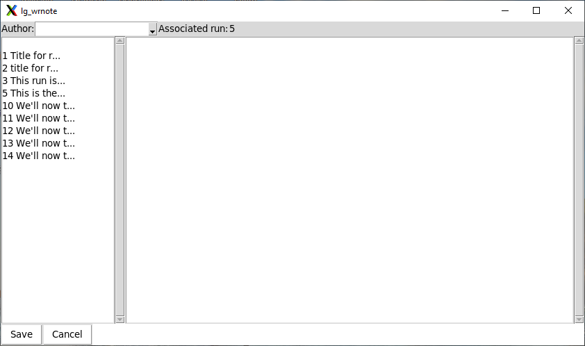
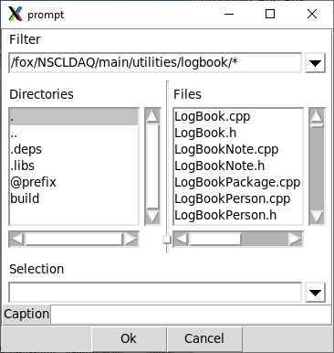
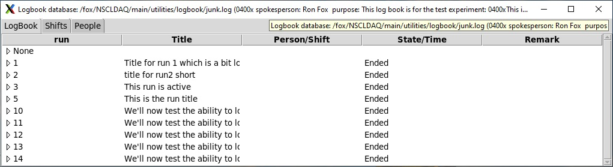
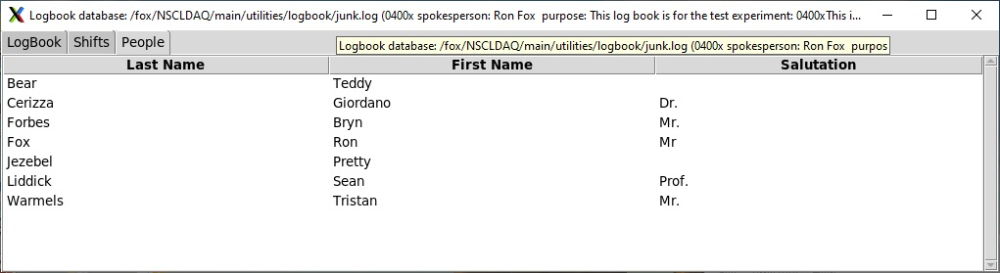
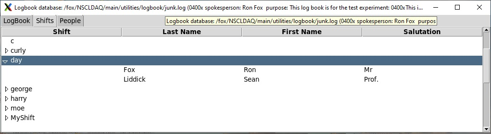
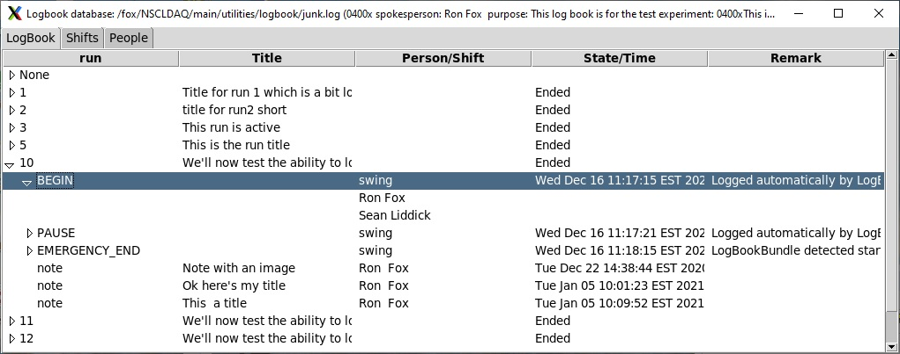

|  |  |  |
| --- | --- | --- |
| NSCL DAQ Software Documentation |
| Prev | Chapter 21. NSCLDAQ Logbook facility | Next |


---

# <a name="sec.lg_usage"></a>21.3. Using the logbook in an experiment

Before you start data taking, you should add the logbook subsystem
         to the readout GUI.  This is done by adding the following line to your
         ReadoutCallouts.tcl file:

<a name="AEN8516"></a>**Example 21-6. Enabling automatic recording of run state transitions**

```

package require logbookbundle
         
```

Simple as that.   Since the logbook subsystem makes use of the callback
         bundle facility of the readout GUI, you don't need to add any code
         to any of your Onxxx procs.

For all runs with recording enabled, the logbook will log all state
         transitions associated with a data taking run.  These include Begin runs,
         End Runs, Pause runs and Resume runs.  Furthermore, when the ReadoutGUI
         starts and the logbookbundle is pulled in, the bundle
         checks for a run in progress (from the database point of view).  This can
         happen if the previous run was improperly ended and the ReadoutGUI needed
         to be restarted.

If there is a currently active run, the logbook will log an
         EMERGENCY_END state transition for that active run.
         This makes the run inactive and creates a log entry that lets you know,
         when you review that run later on, it was improperly ended.

Since the logbook bundle will immediately access the database,
         and since it may also need to log a state transition, prior to starting
         the ReadoutGUi you must:


1. Ensure you've selected the correct current logbook using
                  **lg_current**.
2. Set the current shift using
                  **lg_selshift**

If you neglect to do so you will get errors reported by the
         ReadoutCallouts.tcl.

## <a name="AEN8534"></a>21.3.1. Creating notes

If all the logbook could do is manage shifts and log run state transitions
            it would be pretty worthless.  The notes feature of the logbook
            is what makes it worthwhile.  In this section we'll learn:


- What a note  is
- How to create notes
- How to format notes with rich content (including figures).

Note that in the next section
            [*Browsing and rendering the logbook*](https://github.com/FRIBDAQ/docs/tree/main/12.0pre/x8512.md#sec.lg_browsing)
            we'll talk about what we can do to look at the contents of our logbook
            and how to render it for printing.

### <a name="AEN8546"></a>21.3.1.1. What is a note?

A note is a formatted chunk of text.  My formatted I mean that
               it can have titles, subtitles, bulleted lists, numbered lists,
               code samples, referencdes to the web and inline images.  We'll cover
               formatting notes in
               [*How do I use Markdown to format my notes?*](https://github.com/FRIBDAQ/docs/tree/main/12.0pre/x8512.md#sec.lg_mdownprimer)

All notes are written by someone.  That is, they are associated
               with one, and exactly one person that is known to the logbook.

Notes *may*, or may not be, associated with
               a run.  When choosing if a note should be associated with a run,
               think about wether the content of the note has to do with the
               run or is a more general statement that spans the course of
               more than one run.

Notes also have a timestamp associated with them that logs when
               they were created.

While author selection and run association are done manually
               by the person editing and saving the note, the timestamp is generated
               automatically when the note is saved.

As with most entities in the logbook (other than shift membership),
               notes are write-once, read-many. As with a paper lab notebook, you're not
               allowed to modify or delete a note once it's been written.

### <a name="AEN8556"></a>21.3.1.2. How can I create a note?

Notes are created using the note editor.  This can be brought up
               either inside the browser (see
               [*Browsing and rendering the logbook*](https://github.com/FRIBDAQ/docs/tree/main/12.0pre/x8512.md#sec.lg_browsing)),
               or via the the **lg_wrnote** command.

You can invoke **lg_wrnote** in one of two ways:

<a name="AEN8563"></a>**Example 21-7. Invoking **lg_wrnote****

```

$DAQBIN/lg_wrnote   5            # Note editor initially associated with run 5.
$DAQBIN/lg_wrnote                # Note editor with no initial run association.
               
```

Note carefully, in the above, the word *initially*.
               The note editor provides a mechanism to set, or for that matter,
               remove association with a run.
               [*The note editor GUI.*](https://github.com/FRIBDAQ/docs/tree/main/12.0pre/x8512.md#fig.lg_noteeditor)
               shows what the note editor looks like.

<a name="fig.lg_noteeditor"></a>**Figure 21-4. The note editor GUI.**



Current author and run association is shown at the top of the
               window.  Author association is a pulldown menu activated by the
               down arrow to the right of it.  Select your name as it's know to the
               database from the list of authors.  Initially no author is shown
               as associated with the note.  If you try to save the note without
               selecting an author an error will be thrown.

To the right of the author assocationis the run assocation. In the
               figure, the note we are composing will be associated with run 5.
               To change the run assocation, select a run from the list in the list
               box at the left of the editor window.  For convenience, the first
               few characters of the title are provided to the right of the
               run number.  Simply double click the run the note is to be associated
               with to change the associated run.  If you don't wann a run associated
               with this note, just double click the empty line at the top of the
               listbox.

The largest area of the  editor is the big frame at the right. Edit
               the text of your note in this area.  We'll talk a bit more about
               what you can put there besides ordinary text in
               [*How do I use Markdown to format my notes?*](https://github.com/FRIBDAQ/docs/tree/main/12.0pre/x8512.md#sec.lg_mdownprimer).

Image references can be manually inserted but, not only is the
               markdown for that a bit tricky to remember, but you may want
               to browse for the image file to insert.  If you right click in the
               editor window a context menu will be posted. The
               Image...  menu
               command will bring up a dialog that allows you to specify the image file
               (must be an image file or rendering of the note will fail), and a
               caption for the image:

<a name="fig.lg_imagesel"></a>**Figure 21-5. The image selector dialog**



Use the file browser to select the image file and enter any desired
               caption in the caption entry at the bottom of the dialog.
               Click Ok, and the correct image
               link will be inserted at the cursor position in the editor.
               Click Cancel to cancel creation of the image
               link.

When the note has been formatted as you want it, click
               Save to save it to the logbook or
               Cancel to abandon the note.

Note that the images in image links are loaded into the database
               so it's not necessary to retain the image files in the filesystem
               after the note has been *saved*.

### <a name="sec.lg_mdownprimer"></a>21.3.1.3. How do I use Markdown to format my notes?

This section is a non-exhaustive primer on markdown format.
               Markdown is a simple, plain text, formatting system. It allows you
               to easily create rich content. Markdown is used in many wikis,
               as well as in gitlab and github to support formatted text.

The full description of Markdown is beyond the scope of this
               document.
               [http://https://www.markdownguide.org/](http://https://www.markdownguide.org/)
               describes Markdown fully.  We use two markdown processors to
               render content:


- Tcllib's Markdown package
  This simple package is used to render HTML output which is
                       then opened in a web-browser.
- pandoc
  This program converts markdown to several formats.  We use
                       it to convert Markdown to PDF format. Note that pandoc,
                       generates input for LaTeX which actually produces
                       the PDF via its processing chain.

But I digress. Let's dig into markdown format. First of all,
               text that begins in column 1 is just rendered, for the most part
               as is.   Here are some things in column 1, however that
               can modify this


- Headings
  A number of pound symbols # specifies
                       the text on the same line to be a heading one pound is
                       a top level heading, two a second level heading, and
                       so on.
  An alternate syntax for level 1 and two headings:
                       A line of text with a bunch of = underneath it
                       is a level 1 heading.
                       A line of text with a bunch of - underneath it
                       is a level 2 heading.
- Inline formatting (emphasis).
  Text surrounded by pairs of *
                          will be rendered as bold face. For example
                          **this is bold face**.
  Text surrounded by single * will be
                          rendered as italic.  For examplle
                          *this text is italic*.
- Lists
  Both bulleted and numbered lists are supported.
  If a series of lines are each preceded by a number and period
                          they are rendered like a numbered list for example:
  The list starts below:  
    
  1. List element 1  
  2. List element 2    
    
  And is over here.
  If a series of lines are ech preceded by a - they are
                          elements of a bulleted list for example:
  List starts below  
    
  - First bullet  
  - second bullet  
    
  List ends.
  Note that many markdown processors require an empty line
                          before and after lists.
- Weblinks
  A link to some bit of the web requires both link text and
                       the actual URL.  These are specified as follows:
                       [link text](URL) For example:
  There's a lot of (information about markdown)[http://google.com/search?q=markdown]
  Will generate link text information about markdown
                       that, when clicked will give google results for markdown.
- Image links
  I strongly suggest letting the note editor produce these for you,
                       but for completeness, an image link  has the form:
                       
                       The use of the stuff in [] depends on the
                       output format.  For web this is used as what is called
                       *alt text*, that is text that is shown
                       in browsers that are not capable of displaying images.
                       Do not count on this text being displayed.
- Tables
  The simplest format for a table in markdown uses pipes.
                       For example, this markdown:
  You should put a blank line fore:  
    
  | Animal | Species |  
  | -------|---------|  
  | Wolf   | canis lupus |  
  | Cat    | felis domesticus |  
  | Golden Hamster | mesocricetus auratus |  
    
  and aft.
  Note that the table doesn't have to line up nicely. The
                       markdown above generates something like:
  <a name="AEN8656"></a>|  |  |
  | --- | --- |
  | Animal | Species |
  | Wolf | canis lupus |
  | Cat | felis domesticus |
  | Golden Hamster | mesocricetus auratus |
- Footnotes
  A link to a footnote isof the form
                       [^n] where n is a footnote
                       number (e.g. [^1] for footnote).
                       The footnote text itself (for footnote 1 e.g.) is
                       entered as follows:
  I would put a blank line fore:  
    
  [^1]:  See the NSCL radiation safety  manual for more  
    
  And, if appropriate aft.
  In the web, the footnote text will, most likely, render in position
                       in the document while LaTeX will determine where it
                       shows up in PDF rendering.
- Internal document links
  A heading can have an identifier attached to it and links
                       to that identifier for example:
  Table of contents:  
    
  ...  
  [Some Section](#Some-section)  
  ...  
    
  ## Some Section {#Some-section  
  }
  Creates a link to a level 2 heading in the document named
                       Some Section.

Markdown can do much much more.  I encourage you to play with a toy
               logbook and browse through
               [https://www.markdownguide.org/basic-syntax/](https://www.markdownguide.org/basic-syntax/)
               for basic syntax supported by all markdown processors and
               [https://www.markdownguide.org/extended-syntax/](https://www.markdownguide.org/extended-syntax/)
               for syntax most markdown processors support.   I have not exhaustively
               checked which bits of extended markdown are supported by the Tcl
               Markdown package and pandoc.
               Play around and see what you get.

## <a name="sec.lg_browsing"></a>21.3.2. Browsing and rendering the logbook

A logbook you can write in but can't look at is worthless.  This
            chapter describes the **lg_browse** command which provides
            a graphical browser for the logbook.

For now let's just look at the main features of the browser.

<a name="fig.lg_browser"></a>**Figure 21-6. Logbook Browser**



In a bit we'll take deeper dives into the user interface.  For now
            note the tabs at the top of the interface:


- LogBook
  Allows you to browse the runs, notes associated with runs
                       and notes not associated with any run.
- Shifts
  Allow you to view the shifts you have created, as well as
                       the members of those shifts.
- People
  Allows you to brows the people that you've added to the logbook.

### <a name="AEN8714"></a>21.3.2.1. People Tab

Let's look at the contents of the People tab:

<a name="AEN8718"></a>**Figure 21-7. **lg_browse** People**



As you can see, this tab provides a list of the people that have
               been added to the logbook.  If you right click anywhere in the
               list, you'll bring up a context men. Clicking
               Add... on this menu will allow you
               to specify the first name, last name, and optional salutation
               of a person to add the logbook.

### <a name="AEN8725"></a>21.3.2.2. Shifts Tab

Let's have a look at the shift tab of the browser:

<a name="AEN8728"></a>**Figure 21-8. **lg_browse** Shifts tab**



As you can see the shifts are listed.  Clicking on a shift opens it
               up (as has been done for the day shift) to
               list the members of that shift.  If there's a current shift,
               the word (current) is shown by its name.

If a shift or one of its members has been selected, right clicking
               brings up a context menu with the following commands:


- Add Shift...
  Brings up the shift editor so that you can add a new shift
                       and populate it with members.
- Edit...
  Brings up the shift editor with the currently selected
                       shift loaded into it for editing or for use as a starting
                       point to create a new shift.
- Set Current
  Makes the selected shift the current shift.  That shift
                       will be associated with run state transitions.

### <a name="AEN8753"></a>21.3.2.3. LogBook Tab

During and after a run, you will probably spend most of your time
               on the LogBook tab. This tab allows
               you to access all of the runs that have been recorded and notes that
               have been written.  The figure below shows this tab with some of
               the items expanded:

<a name="AEN8757"></a>**Figure 21-9. **lg_browse** command's LogBook tab**



First note that this tab, as with all tabs in the browser periodically
               updates its contents.  This is done in such a way as to preserve
               the open items.  Thus changes performed by other programs and other
               people are reflected dynamically by the browser.

At the top of the list of items in this tab, is an entry
               labeled None.  If this is expanded you will
               see a list of the notes that were created that were not associated
               with any run.

Below that, each numbered entry is a run.  The title for the run
               is shown on that line as well as the state of that run.  In this
               example, there are no active runs.  Expanding a run lists all of
               its transitions, when they occured and the remarks associated with
               each transition (in this case that they were automatically logged),
               and name of the active shift when the transition occured. Finally the
               transition time is aslo shown

Each transition can be further expanded.  When that's done the
               list of people on that shift are listed.

Entries are also shown for each note associated with the run.
               In this case the notes were added after the run ended (perfectly legal),
               The notes, however are normaly interleaved with the transitions so
               that everything that was done with a run is listed in
               chronological order.

At any time a single item can be selected.  right clicking brings
               up a context menu with the following actions:


- Compose Note...
  Allows you to compose a new note.  If the selected item
                       is in a run (vs. in the None) item,
                       the initially selected associated run in the note editor
                       will be that run.  If you want to associate the note to
                       a different run or write a new note not associated with any
                       run, naturally, you can change this association in note
                       editor.
- Make PDF from selected..
  Creates a PDF file from the selected item.  If a run
                       or a transition within a a run is selected a PDF of all
                       of the items (transitions and notes) will be created.
                       If a note is selected only that selected note will be converted.
  You will be prompted for the path of the PDF file to be
                       created.  Due to restrictions in the **pandoc**
                       markdown->PDF conversion software this file 
                       *must* have a .pdf
                       extension.
- Make PDF from whole book...
  Renders the entire logbook as a PDF. You will be prompted
                       for a PDF filename (extension must be .pdf).
                       The logbook will be rendered in the following order:
                       First the runs and their contents (transitions and notes)
                       will be rendered.  Finally, the notes not associated with
                       any runs will be rendered in chronological order.

Finally, double clicking a note will build an HTML rendering of the
               note and invoke your default web browser to view it.

### <a name="AEN8792"></a>21.3.2.4. **lg_print**

Sometimes you may want to produce PDF for a logbook, or a part of
               a logbook without bothering with the browser application.
               **lg_print** allows you to do that. The
               **lg_print** command can produce PDF for the
               entire logbook or specified parts of the logbook,  in the order
               you specify.

**lg_print** requires a PDF filename
               which must have the extension .pdf in order
               to comply with the pandoc converter needs. The remaining command
               parameter specify run numbers or the text none.
               For each run number the run is rendered in PDF (as in **lg_browse**).
               If none is specified the notes not bound to
               any run are rendered in chronological order.

Here are some examples:

<a name="AEN8805"></a>**Example 21-8. Using **lg_print****

```

                  
$DAQBIN/lg_print logbook.pdf                    # print the whole logbook.
$DAQBIN/lg_print logbook.pdf none 1 2 3         # print unassoc notes,  runs 1 2 3
$DAQBIN/lg_print logbook.pdf none               # Print only unassoc notes.
$DAQBIN/lg_print logbook.pdf 1 2 3 10           # print runs 1 2 3 10.

               
```

Invoking **lg_print** with no parameters will
               output simplified usage help text.

---

|  |  |  |
| --- | --- | --- |
| Prev | Home | Next |
| Setting up a logbook for use. | Up | Making logbooks available to collaborators |
