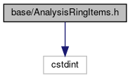
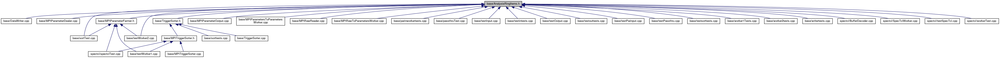

do not remove this div, it is closed by doxygen! 
|  |
| --- |
| FRIBParallelanalysis1.0FrameworkforMPIParalleldataanalysisatFRIB |

 end header part 
 Generated by Doxygen 1.8.13 

 window showing the filter options 

 iframe showing the search results (closed by default) 

- [[base|https://github.com/FRIBDAQ/docs/tree/main/apipeline/dir_e914ee4d4a44400f1fdb170cb4ead18a.md]]

 top 
[Classes](#nested-classes) |
[Typedefs](#typedef-members)

AnalysisRingItems.h File Reference

header
: Defines the analysis specific ring items  
[More...](#details)

`#include <cstdint>`

Include dependency graph for AnalysisRingItems.h:

This graph shows which files directly or indirectly include this file:

[[Go to the source code of this file.|https://github.com/FRIBDAQ/docs/tree/main/apipeline/AnalysisRingItems_8h_source.md]]

|  |  |
| --- | --- |
| Classes |
| struct | frib::analysis::_RingItemHeader |
|  |
| struct | frib::analysis::_ParameterDefintion |
|  |
| struct | frib::analysis::_ParameterDefinitions |
|  |
| struct | frib::analysis::_ParameterValue |
|  |
| struct | frib::analysis::_ParameterItem |
|  |
| struct | frib::analysis::_Variable |
|  |
| struct | frib::analysis::_VariableItem |
|  |
| struct | frib::analysis::_FRIB_MPI_Request_Data |
|  |
| struct | frib::analysis::_FRIB_MPI_Message_Header |
|  |
| struct | frib::analysis::_FRIB_MPI_Parameter_MessageHeader |
|  |
| struct | frib::analysis::_FRIB_MPI_Parameter_Value |
|  |
| struct | frib::analysis::_FRIB_MPI_ParameterDef |
|  |
| struct | frib::analysis::_FRIB_MPI_VariableDef |
|  |

|  |  |
| --- | --- |
| Typedefs |
| typedef structfrib::analysis::_RingItemHeader | frib::analysis::RingItemHeader |
|  |
| typedef structfrib::analysis::_RingItemHeader* | frib::analysis::pRingItemHeader |
|  |
| typedef structfrib::analysis::_ParameterDefintion | frib::analysis::ParameterDefinition |
|  |
| typedef structfrib::analysis::_ParameterDefintion* | frib::analysis::pParameterDefinition |
|  |
| typedef structfrib::analysis::_ParameterDefinitions | frib::analysis::ParameterDefinitions |
|  |
| typedef structfrib::analysis::_ParameterDefinitions* | frib::analysis::pParameterDefinitions |
|  |
| typedef structfrib::analysis::_ParameterValue | frib::analysis::ParameterValue |
|  |
| typedef structfrib::analysis::_ParameterValue* | frib::analysis::pParameterValue |
|  |
| typedef structfrib::analysis::_ParameterItem | frib::analysis::ParameterItem |
|  |
| typedef structfrib::analysis::_ParameterItem* | frib::analysis::pParameterItem |
|  |
| typedef structfrib::analysis::_Variable | frib::analysis::Variable |
|  |
| typedef structfrib::analysis::_Variable* | frib::analysis::pVariable |
|  |
| typedef structfrib::analysis::_VariableItem | frib::analysis::VariableItem |
|  |
| typedef structfrib::analysis::_VariableItem* | frib::analysis::pVariableItem |
|  |
| typedef structfrib::analysis::_FRIB_MPI_Request_Data | frib::analysis::FRIB_MPI_Request_Data |
|  |
| typedef structfrib::analysis::_FRIB_MPI_Request_Data* | frib::analysis::pFRIB_MPI_Request_Data |
|  |
| typedef structfrib::analysis::_FRIB_MPI_Message_Header | frib::analysis::FRIB_MPI_Message_Header |
|  |
| typedef structfrib::analysis::_FRIB_MPI_Message_Header* | frib::analysis::pFRIB_MPI_MessageHeader |
|  |
| typedef structfrib::analysis::_FRIB_MPI_Parameter_MessageHeader | frib::analysis::FRIB_MPI_Parameter_MessageHeader |
|  |
| typedef structfrib::analysis::_FRIB_MPI_Parameter_MessageHeader* | frib::analysis::pFRIB_MPI_Parameter_MessageHeader |
|  |
| typedef structfrib::analysis::_FRIB_MPI_Parameter_Value | frib::analysis::FRIB_MPI_Parameter_Value |
|  |
| typedef structfrib::analysis::_FRIB_MPI_Parameter_Value* | frib::analysis::pFRIB_MPI_Parameter_Value |
|  |
| typedef structfrib::analysis::_FRIB_MPI_ParameterDef | frib::analysis::FRIB_MPI_ParameterDef |
|  |
| typedef structfrib::analysis::_FRIB_MPI_ParameterDef* | frib::analysis::pFRIB_MPI_ParameterDef |
|  |
| typedef structfrib::analysis::_FRIB_MPI_VariableDef | frib::analysis::FRIB_MPI_VariableDef |
|  |
| typedef structfrib::analysis::_FRIB_MPI_VariableDef* | frib::analysis::pFRIB_MPI_VariableDef |
|  |

## Detailed Description

: Defines the analysis specific ring items

- Note
  normally a user will also include an appropriate DataFormat.h from the version of NSCLDAQ their data used.

## Typedef Documentation

## [◆](#file_adc2c13781502d5fa0d1469ee37d0e33a)ParameterDefinition

|  |
| --- |
| typedef structfrib::analysis::_ParameterDefintionfrib::analysis::ParameterDefinition |

This item is a parameter definition:

- sizeof is not useful.

## [◆](#file_aabf9208334c80bdefc5213ff35c32182)ParameterDefinitions

|  |
| --- |
| typedef structfrib::analysis::_ParameterDefinitionsfrib::analysis::ParameterDefinitions |

parameter defintion ring item sizeof is not useful.

## [◆](#file_ae8ed5756818ffb5b3d5c90d9eed74585)ParameterValue

|  |
| --- |
| typedef structfrib::analysis::_ParameterValuefrib::analysis::ParameterValue |

This contains the value of one parameter.

## [◆](#file_ad8ee341907474d780a43729568d35f97)RingItemHeader

|  |
| --- |
| typedef structfrib::analysis::_RingItemHeaderfrib::analysis::RingItemHeader |

Analysis ring items don't have body headers so:

## [◆](#file_a2e321393dd0d9f8ce67a1971bfab2e71)Variable

|  |
| --- |
| typedef structfrib::analysis::_Variablefrib::analysis::Variable |

Variable data is used to document steering parameters:

 contents 
 start footer part 

---

Generated by   1.8.13
