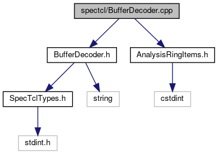

do not remove this div, it is closed by doxygen! 
|  |
| --- |
| FRIBParallelanalysis1.0FrameworkforMPIParalleldataanalysisatFRIB |

 end header part 
 Generated by Doxygen 1.8.13 

 window showing the filter options 

 iframe showing the search results (closed by default) 

- [spectcl](https://github.com/FRIBDAQ/docs/tree/main/apipeline/dir_18495d4159aaa38323f4c7ea9307a4f7.md)

 top 
BufferDecoder.cpp File Reference

header
: Implement the stubbed CBufferDecoder class  
[More...](#details)

`#include "BufferDecoder.h"`  

`#include "AnalysisRingItems.h"`

Include dependency graph for BufferDecoder.cpp:

## Detailed Description

: Implement the stubbed CBufferDecoder class

 contents 
 start footer part 

---

Generated by   1.8.13
