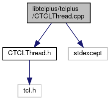

do not remove this div, it is closed by doxygen! 
|  |
| --- |
| FRIBParallelanalysis1.0FrameworkforMPIParalleldataanalysisatFRIB |

 end header part 
 Generated by Doxygen 1.8.13 

 window showing the filter options 

 iframe showing the search results (closed by default) 

- [[dir_4b82a50f27f43da3ef4ad81c5c8f36d1]]
- [[dir_c948a11158a47e9d05fa31773eff393c]]

 top 
CTCLThread.cpp File Reference

header
: Implement the [[classCTCLThread]] class.  
[More...](#details)

`#include <CTCLThread.h>`  

`#include <stdexcept>`

Include dependency graph for CTCLThread.cpp:

## Detailed Description

: Implement the [[classCTCLThread]] class.

 contents 
 start footer part 

---

Generated by   1.8.13
