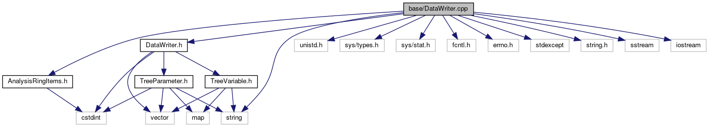

do not remove this div, it is closed by doxygen! 
|  |
| --- |
| FRIBParallelanalysis1.0FrameworkforMPIParalleldataanalysisatFRIB |

 end header part 
 Generated by Doxygen 1.8.13 

 window showing the filter options 

 iframe showing the search results (closed by default) 

- [base](https://github.com/FRIBDAQ/docs/tree/main/apipeline/dir_e914ee4d4a44400f1fdb170cb4ead18a.md)

 top 
DataWriter.cpp File Reference

header
: Implement the data writer class.  
[More...](#details)

`#include "DataWriter.h"`  

`#include <unistd.h>`  

`#include <sys/types.h>`  

`#include <sys/stat.h>`  

`#include <fcntl.h>`  

`#include <errno.h>`  

`#include <stdexcept>`  

`#include <string>`  

`#include <string.h>`  

`#include <sstream>`  

`#include <iostream>`  

`#include "AnalysisRingItems.h"`

Include dependency graph for DataWriter.cpp:

## Detailed Description

: Implement the data writer class.

 contents 
 start footer part 

---

Generated by   1.8.13
