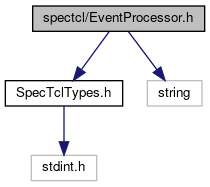
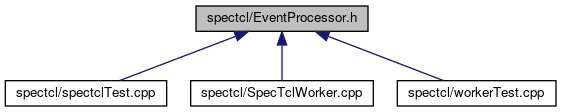

do not remove this div, it is closed by doxygen! 
|  |
| --- |
| FRIBParallelanalysis1.0FrameworkforMPIParalleldataanalysisatFRIB |

 end header part 
 Generated by Doxygen 1.8.13 

 window showing the filter options 

 iframe showing the search results (closed by default) 

- [[dir_18495d4159aaa38323f4c7ea9307a4f7]]

 top 
[Classes](#nested-classes)

EventProcessor.h File Reference

header
: Stand in for SpecTcl Event processor base class.  
[More...](#details)

`#include "SpecTclTypes.h"`  

`#include <string>`

Include dependency graph for EventProcessor.h:

This graph shows which files directly or indirectly include this file:

[[EventProcessor_8h_source]]

|  |  |
| --- | --- |
| Classes |
| class | frib::analysis::CEventProcessor |
|  |

## Detailed Description

: Stand in for SpecTcl Event processor base class.

 contents 
 start footer part 

---

Generated by   1.8.13
