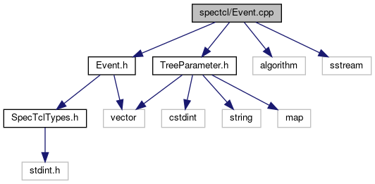

do not remove this div, it is closed by doxygen! 
|  |
| --- |
| FRIBParallelanalysis1.0FrameworkforMPIParalleldataanalysisatFRIB |

 end header part 
 Generated by Doxygen 1.8.13 

 window showing the filter options 

 iframe showing the search results (closed by default) 

- [[dir_18495d4159aaa38323f4c7ea9307a4f7]]

 top 
Event.cpp File Reference

header
: Implement [[classfrib_1_1analysis_1_1CEvent]]
[More...](#details)

`#include "Event.h"`  

`#include "TreeParameter.h"`  

`#include <algorithm>`  

`#include <sstream>`

Include dependency graph for Event.cpp:

## Detailed Description

: Implement [[classfrib_1_1analysis_1_1CEvent]]

 contents 
 start footer part 

---

Generated by   1.8.13
