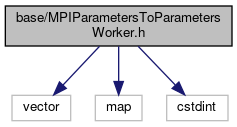
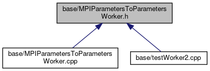

do not remove this div, it is closed by doxygen! 
|  |
| --- |
| FRIBParallelanalysis1.0FrameworkforMPIParalleldataanalysisatFRIB |

 end header part 
 Generated by Doxygen 1.8.13 

 window showing the filter options 

 iframe showing the search results (closed by default) 

- [[dir_e914ee4d4a44400f1fdb170cb4ead18a]]

 top 
[Classes](#nested-classes)

MPIParametersToParametersWorker.h File Reference

header
: [[classWorker]] framework for pipeline stage that takes params -> params.  
[More...](#details)

`#include <vector>`  

`#include <map>`  

`#include <cstdint>`

Include dependency graph for MPIParametersToParametersWorker.h:

This graph shows which files directly or indirectly include this file:

[[MPIParametersToParametersWorker_8h_source]]

|  |  |
| --- | --- |
| Classes |
| class | frib::analysis::CMPIParametersToParametersWorker |
|  |

## Detailed Description

: [[classWorker]] framework for pipeline stage that takes params -> params.

 contents 
 start footer part 

---

Generated by   1.8.13
