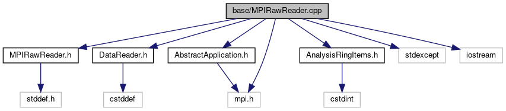

do not remove this div, it is closed by doxygen! 
|  |
| --- |
| FRIBParallelanalysis1.0FrameworkforMPIParalleldataanalysisatFRIB |

 end header part 
 Generated by Doxygen 1.8.13 

 window showing the filter options 

 iframe showing the search results (closed by default) 

- [[base|https://github.com/FRIBDAQ/docs/tree/main/apipeline/dir_e914ee4d4a44400f1fdb170cb4ead18a.md]]

 top 
MPIRawReader.cpp File Reference

header
: Implementy the CMPIRawReader class.  
[More...](#details)

`#include "MPIRawReader.h"`  

`#include "DataReader.h"`  

`#include "AbstractApplication.h"`  

`#include "AnalysisRingItems.h"`  

`#include <mpi.h>`  

`#include <stdexcept>`  

`#include <iostream>`

Include dependency graph for MPIRawReader.cpp:

## Detailed Description

: Implementy the CMPIRawReader class.

 contents 
 start footer part 

---

Generated by   1.8.13
