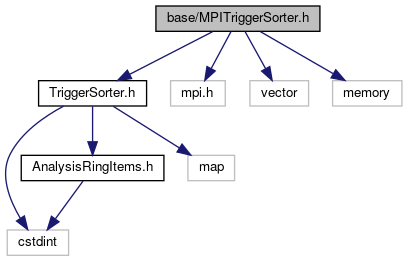
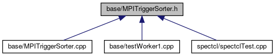

do not remove this div, it is closed by doxygen! 
|  |
| --- |
| FRIBParallelanalysis1.0FrameworkforMPIParalleldataanalysisatFRIB |

 end header part 
 Generated by Doxygen 1.8.13 

 window showing the filter options 

 iframe showing the search results (closed by default) 

- [base](https://github.com/FRIBDAQ/docs/tree/main/apipeline/dir_e914ee4d4a44400f1fdb170cb4ead18a.md)

 top 
[Classes](#nested-classes)

MPITriggerSorter.h File Reference

header
: Sorts triggers sent by workers sending them to outputter.  
[More...](#details)

`#include "TriggerSorter.h"`  

`#include <mpi.h>`  

`#include <vector>`  

`#include <memory>`

Include dependency graph for MPITriggerSorter.h:

This graph shows which files directly or indirectly include this file:

[Go to the source code of this file.](https://github.com/FRIBDAQ/docs/tree/main/apipeline/MPITriggerSorter_8h_source.md)

|  |  |
| --- | --- |
| Classes |
| class | frib::analysis::CMPITriggerSorter |
|  |

## Detailed Description

: Sorts triggers sent by workers sending them to outputter.

 contents 
 start footer part 

---

Generated by   1.8.13
