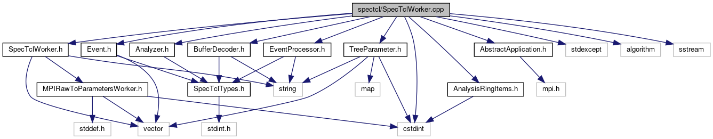

do not remove this div, it is closed by doxygen! 
|  |
| --- |
| FRIBParallelanalysis1.0FrameworkforMPIParalleldataanalysisatFRIB |

 end header part 
 Generated by Doxygen 1.8.13 

 window showing the filter options 

 iframe showing the search results (closed by default) 

- [[spectcl|https://github.com/FRIBDAQ/docs/tree/main/apipeline/dir_18495d4159aaa38323f4c7ea9307a4f7.md]]

 top 
SpecTclWorker.cpp File Reference

header
: Implement the CSpecTclWorker class.  
[More...](#details)

`#include "SpecTclWorker.h"`  

`#include "BufferDecoder.h"`  

`#include "Analyzer.h"`  

`#include "Event.h"`  

`#include "EventProcessor.h"`  

`#include <AbstractApplication.h>`  

`#include <AnalysisRingItems.h>`  

`#include <TreeParameter.h>`  

`#include <stdexcept>`  

`#include <algorithm>`  

`#include <sstream>`  

`#include <cstdint>`

Include dependency graph for SpecTclWorker.cpp:

## Detailed Description

: Implement the CSpecTclWorker class.

 contents 
 start footer part 

---

Generated by   1.8.13
