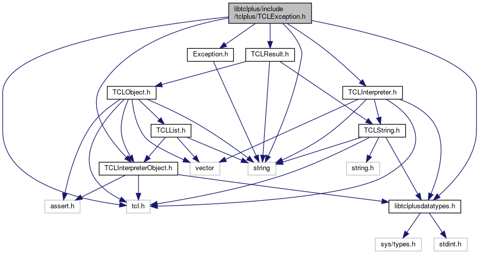

do not remove this div, it is closed by doxygen! 
|  |
| --- |
| FRIBParallelanalysis1.0FrameworkforMPIParalleldataanalysisatFRIB |

 end header part 
 Generated by Doxygen 1.8.13 

 window showing the filter options 

 iframe showing the search results (closed by default) 

- [[libtclplus|https://github.com/FRIBDAQ/docs/tree/main/apipeline/dir_4b82a50f27f43da3ef4ad81c5c8f36d1.md]]
- [[include|https://github.com/FRIBDAQ/docs/tree/main/apipeline/dir_916a1320d72df91b2427bdb1c4bfd305.md]]
- [[tclplus|https://github.com/FRIBDAQ/docs/tree/main/apipeline/dir_adcafb5ceb560ba729c79a378a2d6426.md]]

 top 
[Classes](#nested-classes)

TCLException.h File Reference

header
:  
[More...](#details)

`#include <tcl.h>`  

`#include "TCLInterpreterObject.h"`  

`#include "TCLInterpreter.h"`  

`#include "TCLResult.h"`  

`#include "Exception.h"`  

`#include <string>`  

`#include <libtclplusdatatypes.h>`

Include dependency graph for TCLException.h:

[[Go to the source code of this file.|https://github.com/FRIBDAQ/docs/tree/main/apipeline/TCLException_8h_source.md]]

|  |  |
| --- | --- |
| Classes |
| class | CTCLException |
|  |

## Detailed Description

:

 contents 
 start footer part 

---

Generated by   1.8.13
