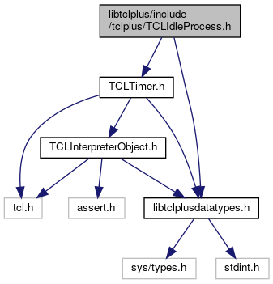

do not remove this div, it is closed by doxygen! 
|  |
| --- |
| FRIBParallelanalysis1.0FrameworkforMPIParalleldataanalysisatFRIB |

 end header part 
 Generated by Doxygen 1.8.13 

 window showing the filter options 

 iframe showing the search results (closed by default) 

- [[dir_4b82a50f27f43da3ef4ad81c5c8f36d1]]
- [[dir_916a1320d72df91b2427bdb1c4bfd305]]
- [[dir_adcafb5ceb560ba729c79a378a2d6426]]

 top 
[Classes](#nested-classes)

TCLIdleProcess.h File Reference

header
:  
[More...](#details)

`#include "TCLTimer.h"`  

`#include <libtclplusdatatypes.h>`

Include dependency graph for TCLIdleProcess.h:

[[TCLIdleProcess_8h_source]]

|  |  |
| --- | --- |
| Classes |
| class | CTCLIdleProcess |
|  |

## Detailed Description

:

 contents 
 start footer part 

---

Generated by   1.8.13
