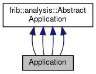

do not remove this div, it is closed by doxygen! 
|  |
| --- |
| FRIBParallelanalysis1.0FrameworkforMPIParalleldataanalysisatFRIB |

 end header part 
 Generated by Doxygen 1.8.13 

 window showing the filter options 

 iframe showing the search results (closed by default)

 top 
[Public Member Functions](#pub-methods) |
[[classApplication-members]]

Application Class Reference

header
Inheritance diagram for Application:

[[[graph_legend]]]

Collaboration diagram for Application:

[[[graph_legend]]]

|  |  |
| --- | --- |
| Public Member Functions |
|  | Application(int argc, char **argv) |
|  |
| virtual void | dealer(int argc, char **argv,AbstractApplication*pApp) |
|  |
| virtual void | farmer(int argc, char **argv,AbstractApplication*pApp) |
|  |
| virtual void | outputter(int argc, char **argv,AbstractApplication*pApp) |
|  |
| virtual void | worker(int argc, char **argv,AbstractApplication*pApp) |
|  |
|  | Application(int argc, char **argv) |
|  |
| virtual void | dealer(int argc, char **argv,AbstractApplication*pApp) |
|  |
| virtual void | farmer(int argc, char **argv,AbstractApplication*pApp) |
|  |
| virtual void | outputter(int argc, char **argv,AbstractApplication*pApp) |
|  |
| virtual void | worker(int argc, char **argv,AbstractApplication*pApp) |
|  |
|  | Application(int argc, char **argv) |
|  |
| virtual void | dealer(int argc, char **argv,AbstractApplication*pApp) |
|  |
| virtual void | farmer(int argc, char **argv,AbstractApplication*pApp) |
|  |
| virtual void | outputter(int argc, char **argv,AbstractApplication*pApp) |
|  |
| virtual void | worker(int argc, char **argv,AbstractApplication*pApp) |
|  |
|  | Application(int argc, char **argv) |
|  |
| virtual void | dealer(int argc, char **argv,AbstractApplication*pApp) |
|  |
| virtual void | farmer(int argc, char **argv,AbstractApplication*pApp) |
|  |
| virtual void | outputter(int argc, char **argv,AbstractApplication*pApp) |
|  |
| virtual void | worker(int argc, char **argv,AbstractApplication*pApp) |
|  |
| Public Member Functions inherited fromfrib::analysis::AbstractApplication |
|  | AbstractApplication(int argc, char **argv) |
|  |
| virtual | ~AbstractApplication() |
|  |
| virtual void | operator()(CParameterReader&paramReader) |
|  |
| MPI_Datatype & | messageHeaderType() |
|  |
| MPI_Datatype & | requestDataType() |
|  |
| MPI_Datatype & | parameterHeaderDataType() |
|  |
| MPI_Datatype & | parameterValueDataType() |
|  |
| MPI_Datatype & | parameterDefType() |
|  |
| MPI_Datatype & | variableDefType() |
|  |
| unsigned | numWorkers() |
|  |
| void | forwardPassThrough(const void *pData, size_t nBytes) |
|  |
| int | getRequest() |
|  |
| void | sendEofs() |
|  |
| void | sendEof() |
|  |
| void | requestData(size_t maxBytes) |
|  |
| void | throwMPIError(int status, const char *reason) |
|  |
|  | AbstractApplication(int argc, char **argv) |
|  |

|  |  |
| --- | --- |
| Additional Inherited Members |
| Protected Member Functions inherited fromfrib::analysis::AbstractApplication |
| int | getArgc() const |
|  |
| char ** | getArgv() |
|  |
| void | makeDataTypes() |
|  |

## Detailed Description

[[classApplication]] We're going to have rank 0 (dealer) just deal a few passthrough items directly at the Outputter and then send an end.. No worker or farmers are needed.

## Member Function Documentation

## [◆](#a55563d0781e526a1befe8e7b5497110c)dealer()

|  |  |  |  |  |  |  |  |  |  |  |  |  |  |  |  |  |  |
| --- | --- | --- | --- | --- | --- | --- | --- | --- | --- | --- | --- | --- | --- | --- | --- | --- | --- |
| void Application::dealer(intargc,char **argv,AbstractApplication*pApp) | void Application::dealer | ( | int | argc, |  |  | char ** | argv, |  |  | AbstractApplication* | pApp |  | ) |  |  | virtual |
| void Application::dealer | ( | int | argc, |
|  |  | char ** | argv, |
|  |  | AbstractApplication* | pApp |
|  | ) |  |  |

dealer: We just create a few random passthrough ring items for the outputter to send. They don't actually mean anything but they have known contents. and are therefore amenable to testing.

Implements [[classfrib_1_1analysis_1_1AbstractApplication]].

---

The documentation for this class was generated from the following files:- base/[[passthruTest_8cpp]]
- base/[[testOutput_8cpp]]
- base/[[testWorker1_8cpp]]
- spectcl/[[spectclTest_8cpp]]

 contents 
 start footer part 

---

Generated by   1.8.13
