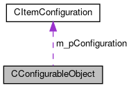

do not remove this div, it is closed by doxygen! 
|  |
| --- |
| FRIBParallelanalysis1.0FrameworkforMPIParalleldataanalysisatFRIB |

 end header part 
 Generated by Doxygen 1.8.13 

 window showing the filter options 

 iframe showing the search results (closed by default)

 top 
[Public Member Functions](#pub-methods) |
[Protected Attributes](#pro-attribs) |
[[classCConfigurableObject-members]]

CConfigurableObject Class Referenceabstract

header
`#include <CConfigurableObject.h>`

Collaboration diagram for CConfigurableObject:

[[[graph_legend]]]

|  |  |
| --- | --- |
| Public Member Functions |
|  | CConfigurableObject(constCConfigurableObject&rhs) |
|  |
| CConfigurableObject& | operator=(constCConfigurableObject&rsh) |
|  |
| int | operator==(constCConfigurableObject&rhs) const |
|  |
| int | operator!=(constCConfigurableObject&rhs) const |
|  |
| void | Attach(CItemConfiguration*pConfiguration, bool dynamic=true) |
|  |
| void | configure(std::string name, std::string value) |
|  |
| std::string | getName() const |
|  |
| std::string | cget(std::string name) |
|  |
| CItemConfiguration::ConfigurationArray | cget() |
|  |
| virtual void | onAttach()=0 |
|  |

|  |  |
| --- | --- |
| Protected Attributes |
| CItemConfiguration* | m_pConfiguration |
|  |

## Detailed Description

This is the base class for an item that has a configuration. Normally this has to be extended tremendously to be usable as e.g. a readout module.

The class contains as a protected member, an object of type CItemConfiguration* At construction time, this is NULL. It is attached via the Attach member function, whic is virtual, and invokes the pure virtual onAttach member function to allow concrete classes to setup the configuration keywords supported.

Copy construction is supported and results in a copy of the item configuration itself.

The [[classCItemConfiguration]] member functions:

- getName
- cget
- configure
- clearConfiguration

are facaded through this base class so that configurable objects can be configured and inquired by script level beasts that only need to manipulate configurations.

## Constructor & Destructor Documentation

## [◆](#a2530834533e07edc79bc76c610749ae9)CConfigurableObject()

|  |  |  |  |  |  |
| --- | --- | --- | --- | --- | --- |
| CConfigurableObject::CConfigurableObject | ( | constCConfigurableObject& | rhs | ) |  |

Copy construction.

## Member Function Documentation

## [◆](#aafbbd0bde74e09ab80cdb2563d0bb7f8)Attach()

|  |  |  |  |
| --- | --- | --- | --- |
| void CConfigurableObject::Attach | ( | CItemConfiguration* | pConfiguration, |
|  |  | bool | dynamic=true |
|  | ) |  |  |

Once constructed, at some point the oustide world attaches a configuration to the object. This does that and then invokes the onAttach member function which provides concrete subclasses the chance to create the configuration parameters.

Parameters
|  |  |
| --- | --- |
| pConfiguration | - Pointer to the configuration to attach. |
| dynamic | - If true, pConfiguration point to a dynamcially allocated object that should be deleted in our destructors. |

Note- no assumption is made about only attaching once.

## [◆](#aae4ec025f95b4d1adee857ec8b083800)cget() [1/2]

|  |  |  |  |  |  |
| --- | --- | --- | --- | --- | --- |
| std::string CConfigurableObject::cget | ( | std::string | name | ) |  |

Parameters
|  |  |
| --- | --- |
| name | - Name of a configuration parameteter. |

Returnsstring 
Return values
|  |  |
| --- | --- |
| Value | of that parameter. |

Exceptions
|  |  |
| --- | --- |
| CInvalidArgumentException |  |
| string | - message if the parameter name does not exist. |

## [◆](#a8b96c54742c2dfe96347db83b7793b93)cget() [2/2]

|  |  |  |  |  |
| --- | --- | --- | --- | --- |
| CItemConfiguration::ConfigurationArray CConfigurableObject::cget | ( |  | ) |  |

ReturnsCItemConfiguration::ConfigurationArray 
Return values
|  |  |
| --- | --- |
| the | entire configuration for this module. |

Exceptions
|  |  |
| --- | --- |
| CInvalidArgumentException | if no configuration. |

## [◆](#a30d2aad9cd8ac76e163419d53fa69b2f)configure()

|  |  |  |  |
| --- | --- | --- | --- |
| void CConfigurableObject::configure | ( | std::string | name, |
|  |  | std::string | value |
|  | ) |  |  |

Configure the value of the defined parameter. This can throw for the following reasons;

- The delegated function throws,
- m_pConfiguration is null.

## [◆](#a27193bd8b235f3f2401e89ba4f43b348)getName()

|  |  |  |  |  |
| --- | --- | --- | --- | --- |
| std::string CConfigurableObject::getName | ( |  | ) | const |

Get the name of the configuration item which is usually the name of the object.

Returnsstd::string 
Return values
|  |  |
| --- | --- |
| Name | of the configuration. |

## [◆](#ae4645f7e507cf6fa2ec6deed2c85bbe4)operator!=()

|  |  |  |  |  |  |
| --- | --- | --- | --- | --- | --- |
| int CConfigurableObject::operator!= | ( | constCConfigurableObject& | rhs | ) | const |

Inequality is simpler.. just negate equality compare:

## [◆](#a1633f75662cacd25932d7faad9f3fd95)operator=()

|  |  |  |  |  |  |
| --- | --- | --- | --- | --- | --- |
| CConfigurableObject& CConfigurableObject::operator= | ( | constCConfigurableObject& | rhs | ) |  |

Objects assign much like a copy construction, however the old configuration may need to be deleted.

## [◆](#afdfb2e07b41f1167ec8d9d9f1f8addb7)operator==()

|  |  |  |  |  |  |
| --- | --- | --- | --- | --- | --- |
| int CConfigurableObject::operator== | ( | constCConfigurableObject& | rhs | ) | const |

Equality means the configuration is identical:

---

The documentation for this class was generated from the following files:- libtclplus/include/tclplus/[[CConfigurableObject_8h_source]]
- libtclplus/tclplus/CConfigurableObject.cpp

 contents 
 start footer part 

---

Generated by   1.8.13
