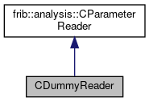

do not remove this div, it is closed by doxygen! 
|  |
| --- |
| FRIBParallelanalysis1.0FrameworkforMPIParalleldataanalysisatFRIB |

 end header part 
 Generated by Doxygen 1.8.13 

 window showing the filter options 

 iframe showing the search results (closed by default)

 top 
[Public Member Functions](#pub-methods) |
[List of all members](https://github.com/FRIBDAQ/docs/tree/main/apipeline/classCDummyReader-members.md)

CDummyReader Class Reference

header
Inheritance diagram for CDummyReader:

[[legend](https://github.com/FRIBDAQ/docs/tree/main/apipeline/graph_legend.md)]

Collaboration diagram for CDummyReader:

[[legend](https://github.com/FRIBDAQ/docs/tree/main/apipeline/graph_legend.md)]

|  |  |
| --- | --- |
| Public Member Functions |
| virtual void | read() |
|  |
| Public Member Functions inherited fromfrib::analysis::CParameterReader |
|  | CParameterReader(const char *pFilename) |
|  |

|  |  |
| --- | --- |
| Additional Inherited Members |
| Protected Attributes inherited fromfrib::analysis::CParameterReader |
| std::string | m_filename |
|  |

---

The documentation for this class was generated from the following file:- base/[sortTest.cpp](https://github.com/FRIBDAQ/docs/tree/main/apipeline/sortTest_8cpp.md)

 contents 
 start footer part 

---

Generated by   1.8.13
