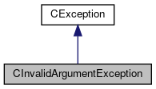

do not remove this div, it is closed by doxygen! 
|  |
| --- |
| FRIBParallelanalysis1.0FrameworkforMPIParalleldataanalysisatFRIB |

 end header part 
 Generated by Doxygen 1.8.13 

 window showing the filter options 

 iframe showing the search results (closed by default)

 top 
[Public Member Functions](#pub-methods) |
[[classCInvalidArgumentException-members]]

CInvalidArgumentException Class Reference

header
`#include <CInvalidArgumentException.h>`

Inheritance diagram for CInvalidArgumentException:

[[[graph_legend]]]

Collaboration diagram for CInvalidArgumentException:

[[[graph_legend]]]

|  |  |
| --- | --- |
| Public Member Functions |
|  | CInvalidArgumentException(std::string argument, std::string whybad, std::string wasDoing) |
|  |
|  | CInvalidArgumentException(constCInvalidArgumentException&rhs) |
|  |
| virtual | ~CInvalidArgumentException() |
|  |
| CInvalidArgumentException& | operator=(constCInvalidArgumentException&rhs) |
|  |
| int | operator==(constCInvalidArgumentException&rhs) const |
|  |
| int | operator!=(constCInvalidArgumentException&rhs) const |
|  |
| virtual const char * | ReasonText() const |
|  |
| Public Member Functions inherited fromCException |
|  | CException(const char *pszAction) |
|  |
|  | CException(const std::string &rsAction) |
|  |
|  | CException(constCException&aCException) |
|  |
| CException& | operator=(constCException&aCException) |
|  |
| int | operator==(constCException&aCException) const |
|  |
| int | operator!=(constCException&rException) const |
|  |
| const char * | getAction() const |
|  |
| virtual int | ReasonCode() const |
|  |
| const char * | WasDoing() const |
|  |

|  |  |
| --- | --- |
| Additional Inherited Members |
| Protected Member Functions inherited fromCException |
| void | setAction(const char *pszAction) |
|  |
| void | setAction(const std::string &rsAction) |
|  |
| virtual void | DoAssign(constCException&rhs) |
|  |

## Detailed Description

This class is ressponsible for reporting exceptions that occur because some function (member or otherwise) has been passed an invalid argument of some sort.

To use this exception type, the thrower must be able to create a textual equivalent of the bad argument, a string that describes why the argument is bad as well as supplying the usual context string.

## Constructor & Destructor Documentation

## [◆](#aa053afbd23d13a95d77bda82bca7d918)CInvalidArgumentException() [1/2]

|  |  |  |  |
| --- | --- | --- | --- |
| CInvalidArgumentException::CInvalidArgumentException | ( | std::string | argument, |
|  |  | std::string | whybad, |
|  |  | std::string | wasDoing |
|  | ) |  |  |

Parameters
|  |  |
| --- | --- |
| argument | - The texulized version of the bad argument. |
| whybad | - The reason the argument is bad. |
| wasdoing | - Context information about what was happening when the exception was thrown. |

## [◆](#ad2a052656984f849708ec9dfae5adb5a)CInvalidArgumentException() [2/2]

|  |  |  |  |  |  |
| --- | --- | --- | --- | --- | --- |
| CInvalidArgumentException::CInvalidArgumentException | ( | constCInvalidArgumentException& | rhs | ) |  |

Copy construction

Parameters
|  |  |
| --- | --- |
| rhs | Object from which a new copy is constructed. |

## [◆](#aff4278e0b07216890a5d16ed21bb2fef)~CInvalidArgumentException()

|  |  |  |  |  |  |  |
| --- | --- | --- | --- | --- | --- | --- |
| CInvalidArgumentException::~CInvalidArgumentException() | CInvalidArgumentException::~CInvalidArgumentException | ( |  | ) |  | virtual |
| CInvalidArgumentException::~CInvalidArgumentException | ( |  | ) |  |

Destructor just needs to chain to the base class.

## Member Function Documentation

## [◆](#a63efd7820cbe5cbada635376c2a7edac)operator!=()

|  |  |  |  |  |  |
| --- | --- | --- | --- | --- | --- |
| int CInvalidArgumentException::operator!= | ( | constCInvalidArgumentException& | rhs | ) | const |

Inequality is the logical inverse of equality.

Parameters
|  |  |
| --- | --- |
| rhs | - Object being compared to *this. |

Returnsint 
Return values
|  |  |
| --- | --- |
| !operator==(rhs) |  |

## [◆](#a14d4fc6619f0905e3231cfa5f249d2f3)operator=()

|  |  |  |  |  |  |
| --- | --- | --- | --- | --- | --- |
| CInvalidArgumentException& CInvalidArgumentException::operator= | ( | constCInvalidArgumentException& | rhs | ) |  |

Assignement from rhs.

Parameters
|  |  |
| --- | --- |
| rhs | - The object that will be assigned into *this. |

Returns[[classCInvalidArgumentException]]& 
Return values
|  |  |
| --- | --- |
| *this |  |

## [◆](#a3a629aaae631bf2b83a71013b5cbeb9e)operator==()

|  |  |  |  |  |  |
| --- | --- | --- | --- | --- | --- |
| int CInvalidArgumentException::operator== | ( | constCInvalidArgumentException& | rhs | ) | const |

Parameters
|  |  |
| --- | --- |
| rhs | - Object compared for equality with *this. |

Returnsint 
Return values
|  |  |
| --- | --- |
| 1 | - Equal. |
| 0 | - Not equal. |

## [◆](#a07b531e0e9a04a282654d870ae424209)ReasonText()

|  |  |  |  |  |  |  |
| --- | --- | --- | --- | --- | --- | --- |
| const char * CInvalidArgumentException::ReasonText()const | const char * CInvalidArgumentException::ReasonText | ( |  | ) | const | virtual |
| const char * CInvalidArgumentException::ReasonText | ( |  | ) | const |

Returnsconst char* 
Return values
|  |  |
| --- | --- |
| A | human readable string that describes the error that caused the exception to be thrown. |

Reimplemented from [[classCException]].

---

The documentation for this class was generated from the following files:- libtclplus/include/exception/[[CInvalidArgumentException_8h_source]]
- libtclplus/exception/CInvalidArgumentException.cpp

 contents 
 start footer part 

---

Generated by   1.8.13
