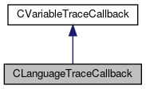

do not remove this div, it is closed by doxygen! 
|  |
| --- |
| FRIBParallelanalysis1.0FrameworkforMPIParalleldataanalysisatFRIB |

 end header part 
 Generated by Doxygen 1.8.13 

 window showing the filter options 

 iframe showing the search results (closed by default)

 top 
[Public Member Functions](#pub-methods) |
[[List of all members|classCLanguageTraceCallback-members]]

CLanguageTraceCallback Class Reference

header
`#include <CLanguageTraceCallbacks.h>`

Inheritance diagram for CLanguageTraceCallback:

[[[legend|graph_legend]]]

Collaboration diagram for CLanguageTraceCallback:

[[[legend|graph_legend]]]

|  |  |
| --- | --- |
| Public Member Functions |
|  | CLanguageTraceCallback(VariableTraceCallback *pCallback, void *pClientData) |
|  |
| virtual | ~CLanguageTraceCallback() |
|  |
| virtual char * | operator()(CTCLInterpreter*pInterp, char *pVariable, char *pElement, int flags) |
|  |

## Detailed Description

This is a variable trace callback that interfaces to unbound functions (e.g. those written in C).

## Constructor & Destructor Documentation

## [◆](#a6d84c8ab8f0b5ea98d738c2e93c8c3f1)CLanguageTraceCallback()

|  |  |  |  |
| --- | --- | --- | --- |
| CLanguageTraceCallback::CLanguageTraceCallback | ( | VariableTraceCallback * | pCallback, |
|  |  | void * | pClientData |
|  | ) |  |  |

Constrution just means save the parameters in the member data:

## [◆](#a1b3572a9bd4330233d6eba7c032858ef)~CLanguageTraceCallback()

|  |  |  |  |  |  |  |
| --- | --- | --- | --- | --- | --- | --- |
| CLanguageTraceCallback::~CLanguageTraceCallback() | CLanguageTraceCallback::~CLanguageTraceCallback | ( |  | ) |  | virtual |
| CLanguageTraceCallback::~CLanguageTraceCallback | ( |  | ) |  |

Destructor is noop.

## Member Function Documentation

## [◆](#a9b45c6e9b881649e1c1389a16ab94fb7)operator()()

|  |  |  |  |  |  |  |  |  |  |  |  |  |  |  |  |  |  |  |  |  |  |
| --- | --- | --- | --- | --- | --- | --- | --- | --- | --- | --- | --- | --- | --- | --- | --- | --- | --- | --- | --- | --- | --- |
| char * CLanguageTraceCallback::operator()(CTCLInterpreter*pInterp,char *pVariable,char *pElement,intFlags) | char * CLanguageTraceCallback::operator() | ( | CTCLInterpreter* | pInterp, |  |  | char * | pVariable, |  |  | char * | pElement, |  |  | int | Flags |  | ) |  |  | virtual |
| char * CLanguageTraceCallback::operator() | ( | CTCLInterpreter* | pInterp, |
|  |  | char * | pVariable, |
|  |  | char * | pElement, |
|  |  | int | Flags |
|  | ) |  |  |

Function call operator... called for a trace. We delegate to the callback.

Parameters
|  |  |
| --- | --- |
| pInterp | (CTCLInterpreter*) Pointer to the interpreter object that is calling us. |
| pVariable | (char*): Pointer to the name of the variable or basename of the array that fired the trace. |
| pElement | (char*) If the trace was fired on an array element this is the index, otherwise this will be null. |
| flags | (int): A bitmask describing why the traace fired. |

NoteIf the user tried to trick us by providing a null function pointer, we raise that as a TCL error. 
Implements [[CVariableTraceCallback|classCVariableTraceCallback]].

---

The documentation for this class was generated from the following files:- libtclplus/include/tclplus/[[CLanguageTraceCallbacks.h|CLanguageTraceCallbacks_8h_source]]
- libtclplus/tclplus/CLanguageTraceCallbacks.cpp

 contents 
 start footer part 

---

Generated by   1.8.13
