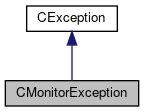

do not remove this div, it is closed by doxygen! 
|  |
| --- |
| FRIBParallelanalysis1.0FrameworkforMPIParalleldataanalysisatFRIB |

 end header part 
 Generated by Doxygen 1.8.13 

 window showing the filter options 

 iframe showing the search results (closed by default)

 top 
[Public Member Functions](#pub-methods) |
[[List of all members|https://github.com/FRIBDAQ/docs/tree/main/apipeline/classCMonitorException-members.md]]

CMonitorException Class Reference

header
`#include <MonitorException.h>`

Inheritance diagram for CMonitorException:

[[[legend|https://github.com/FRIBDAQ/docs/tree/main/apipeline/graph_legend.md]]]

Collaboration diagram for CMonitorException:

[[[legend|https://github.com/FRIBDAQ/docs/tree/main/apipeline/graph_legend.md]]]

|  |  |
| --- | --- |
| Public Member Functions |
|  | CMonitorException(int correctOwner, int actualOwner, const char *file, const char *line) |
|  |
|  | CMonitorException(constCMonitorException&rhs) |
|  |
| CMonitorException& | operator=(constCMonitorException&rhs) |
|  |
| int | operator==(constCMonitorException&rhs) const |
|  |
| int | operator!=(constCMonitorException&rhs) const |
|  |
| virtual const char * | ReasonText() const |
|  |
| virtual int | ReasonCode() const |
|  |
| Public Member Functions inherited fromCException |
|  | CException(const char *pszAction) |
|  |
|  | CException(const std::string &rsAction) |
|  |
|  | CException(constCException&aCException) |
|  |
| CException& | operator=(constCException&aCException) |
|  |
| int | operator==(constCException&aCException) const |
|  |
| int | operator!=(constCException&rException) const |
|  |
| const char * | getAction() const |
|  |
| const char * | WasDoing() const |
|  |

|  |  |
| --- | --- |
| Additional Inherited Members |
| Protected Member Functions inherited fromCException |
| void | setAction(const char *pszAction) |
|  |
| void | setAction(const std::string &rsAction) |
|  |
| virtual void | DoAssign(constCException&rhs) |
|  |

## Detailed Description

Objects of this class are exceptions that describe errors in a monitor states. A monitor is a synchronization primitive that is supported by the threads library in the NSCL DAQ base software libraries.

There are several operations on monitors that require the monitor to be held by the invoking thread. This exception is thrown if that is not the case.

## Constructor & Destructor Documentation

## [◆](#a9cb5d9635b7cb7d6df2bb592959335f6)CMonitorException() [1/2]

|  |  |  |  |
| --- | --- | --- | --- |
| CMonitorException::CMonitorException | ( | int | correctOwner, |
|  |  | int | actualOwner, |
|  |  | const char * | file, |
|  |  | const char * | line |
|  | ) |  |  |

Construct the exception. The context text will be "Performing operations on a Synchronizable object" The reason will be: Mutex should be owned by correctOwner but was owned by actualOwner at **FILE**:**LINE** : WasDoing

- Parameters
  |  |  |
  | --- | --- |
  | correctOwner | - The Pid of the thread that should be owning the mutex. |
  | actualOwner | - The Pid of the thread that actually owns the mutex. |
  | file | - Name of the file in which the exception was constructed Typically useFILE |
  | line | - Line number in file where exception was constructed, Typically useLINE |

## [◆](#a78ad05e647818e2c959fdf0ecd98b0e4)CMonitorException() [2/2]

|  |  |  |  |  |  |
| --- | --- | --- | --- | --- | --- |
| CMonitorException::CMonitorException | ( | constCMonitorException& | rhs | ) |  |

Copy construction:

## Member Function Documentation

## [◆](#ab63ba4d74df907f6eb73d7dce4cb818b)operator!=()

|  |  |  |  |  |  |
| --- | --- | --- | --- | --- | --- |
| int CMonitorException::operator!= | ( | constCMonitorException& | rhs | ) | const |

Inequality is when equality is not true:

## [◆](#a0c3b4036cfb2fbaa6035344ad939715c)operator=()

|  |  |  |  |  |  |
| --- | --- | --- | --- | --- | --- |
| CMonitorException& CMonitorException::operator= | ( | constCMonitorException& | rhs | ) |  |

Assignement

## [◆](#ac5c9065f553f9e95d8067a06848ffd79)operator==()

|  |  |  |  |  |  |
| --- | --- | --- | --- | --- | --- |
| int CMonitorException::operator== | ( | constCMonitorException& | rhs | ) | const |

Comparison for equality.

## [◆](#ae679ab4f73d3c2a9c3ae3717bba608b2)ReasonCode()

|  |  |  |  |  |  |  |
| --- | --- | --- | --- | --- | --- | --- |
| int CMonitorException::ReasonCode()const | int CMonitorException::ReasonCode | ( |  | ) | const | virtual |
| int CMonitorException::ReasonCode | ( |  | ) | const |

Return the computer usable reason code. This is always -1 in this class.

Reimplemented from [[CException|https://github.com/FRIBDAQ/docs/tree/main/apipeline/classCException.md]].

## [◆](#aa6f1efc8c3e4bd310ff0966078f52e34)ReasonText()

|  |  |  |  |  |  |  |
| --- | --- | --- | --- | --- | --- | --- |
| const char * CMonitorException::ReasonText()const | const char * CMonitorException::ReasonText | ( |  | ) | const | virtual |
| const char * CMonitorException::ReasonText | ( |  | ) | const |

Return human readable exception information. See the class description to see what that means.

Reimplemented from [[CException|https://github.com/FRIBDAQ/docs/tree/main/apipeline/classCException.md]].

---

The documentation for this class was generated from the following files:- libtclplus/include/exception/[[MonitorException.h|https://github.com/FRIBDAQ/docs/tree/main/apipeline/MonitorException_8h_source.md]]
- libtclplus/exception/MonitorException.cpp

 contents 
 start footer part 

---

Generated by   1.8.13
