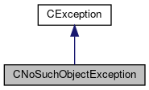

do not remove this div, it is closed by doxygen! 
|  |
| --- |
| FRIBParallelanalysis1.0FrameworkforMPIParalleldataanalysisatFRIB |

 end header part 
 Generated by Doxygen 1.8.13 

 window showing the filter options 

 iframe showing the search results (closed by default)

 top 
[Public Member Functions](#pub-methods) |
[Protected Member Functions](#pro-methods) |
[[List of all members|https://github.com/FRIBDAQ/docs/tree/main/apipeline/classCNoSuchObjectException-members.md]]

CNoSuchObjectException Class Reference

header
Inheritance diagram for CNoSuchObjectException:

[[[legend|https://github.com/FRIBDAQ/docs/tree/main/apipeline/graph_legend.md]]]

Collaboration diagram for CNoSuchObjectException:

[[[legend|https://github.com/FRIBDAQ/docs/tree/main/apipeline/graph_legend.md]]]

|  |  |
| --- | --- |
| Public Member Functions |
|  | CNoSuchObjectException(const char *pDoing, const char *pName) |
|  |
|  | CNoSuchObjectException(const char *pDoing, const std::string &rName) |
|  |
|  | CNoSuchObjectException(const std::string &rDoing, const char *pName) |
|  |
|  | CNoSuchObjectException(const std::string &rDoing, const std::string &rName) |
|  |
|  | CNoSuchObjectException(constCNoSuchObjectException&aCNoSuchObjectException) |
|  |
| CNoSuchObjectException | operator=(constCNoSuchObjectException&aCNoSuchObjectException) |
|  |
| int | operator==(constCNoSuchObjectException&aCNoSuchObjectException) |
|  |
| std::string | getName() const |
|  |
| void | setName(std::string am_sName) |
|  |
| virtual const char * | ReasonText() const |
|  |
| Public Member Functions inherited fromCException |
|  | CException(const char *pszAction) |
|  |
|  | CException(const std::string &rsAction) |
|  |
|  | CException(constCException&aCException) |
|  |
| CException& | operator=(constCException&aCException) |
|  |
| int | operator==(constCException&aCException) const |
|  |
| int | operator!=(constCException&rException) const |
|  |
| const char * | getAction() const |
|  |
| virtual int | ReasonCode() const |
|  |
| const char * | WasDoing() const |
|  |

|  |  |
| --- | --- |
| Protected Member Functions |
| void | UpdateReasonText() |
|  |
| Protected Member Functions inherited fromCException |
| void | setAction(const char *pszAction) |
|  |
| void | setAction(const std::string &rsAction) |
|  |
| virtual void | DoAssign(constCException&rhs) |
|  |

---

The documentation for this class was generated from the following files:- libtclplus/include/exception/[[CNoSuchObjectException.h|https://github.com/FRIBDAQ/docs/tree/main/apipeline/CNoSuchObjectException_8h_source.md]]
- libtclplus/exception/CNoSuchObjectException.cpp

 contents 
 start footer part 

---

Generated by   1.8.13
