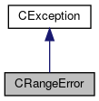

do not remove this div, it is closed by doxygen! 
|  |
| --- |
| FRIBParallelanalysis1.0FrameworkforMPIParalleldataanalysisatFRIB |

 end header part 
 Generated by Doxygen 1.8.13 

 window showing the filter options 

 iframe showing the search results (closed by default)

 top 
[Public Types](#pub-types) |
[Public Member Functions](#pub-methods) |
[Protected Member Functions](#pro-methods) |
[List of all members](https://github.com/FRIBDAQ/docs/tree/main/apipeline/classCRangeError-members.md)

CRangeError Class Reference

header
Inheritance diagram for CRangeError:

[[legend](https://github.com/FRIBDAQ/docs/tree/main/apipeline/graph_legend.md)]

Collaboration diagram for CRangeError:

[[legend](https://github.com/FRIBDAQ/docs/tree/main/apipeline/graph_legend.md)]

|  |  |
| --- | --- |
| Public Types |
| enum | {knTooLow,knTooHigh} |
|  |

|  |  |
| --- | --- |
| Public Member Functions |
|  | CRangeError(int nLow, int nHigh, int nRequested, const char *pDoing) |
|  |
|  | CRangeError(int nLow, int nHigh, int nRequested, const std::string &rDoing) |
|  |
|  | CRangeError(constCRangeError&aCRangeError) |
|  |
| CRangeError | operator=(constCRangeError&aCRangeError) |
|  |
| int | operator==(constCRangeError&aCRangeError) const |
|  |
| int | operator!=(constCRangeError&aCRangeError) const |
|  |
| int | getLow() const |
|  |
| int | getHigh() const |
|  |
| int | getRequested() const |
|  |
| virtual const char * | ReasonText() const |
|  |
| virtual int | ReasonCode() const |
|  |
| Public Member Functions inherited fromCException |
|  | CException(const char *pszAction) |
|  |
|  | CException(const std::string &rsAction) |
|  |
|  | CException(constCException&aCException) |
|  |
| CException& | operator=(constCException&aCException) |
|  |
| int | operator==(constCException&aCException) const |
|  |
| int | operator!=(constCException&rException) const |
|  |
| const char * | getAction() const |
|  |
| const char * | WasDoing() const |
|  |

|  |  |
| --- | --- |
| Protected Member Functions |
| void | setLow(int am_nLow) |
|  |
| void | setHigh(int am_nHigh) |
|  |
| void | setRequested(int am_nRequested) |
|  |
| void | UpdateReason() |
|  |
| Protected Member Functions inherited fromCException |
| void | setAction(const char *pszAction) |
|  |
| void | setAction(const std::string &rsAction) |
|  |
| virtual void | DoAssign(constCException&rhs) |
|  |

---

The documentation for this class was generated from the following files:- libtclplus/include/exception/[RangeError.h](https://github.com/FRIBDAQ/docs/tree/main/apipeline/RangeError_8h_source.md)
- libtclplus/exception/RangeError.cpp

 contents 
 start footer part 

---

Generated by   1.8.13
