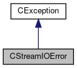

do not remove this div, it is closed by doxygen! 
|  |
| --- |
| FRIBParallelanalysis1.0FrameworkforMPIParalleldataanalysisatFRIB |

 end header part 
 Generated by Doxygen 1.8.13 

 window showing the filter options 

 iframe showing the search results (closed by default)

 top 
[Public Types](#pub-types) |
[Public Member Functions](#pub-methods) |
[Protected Member Functions](#pro-methods) |
[[classCStreamIOError-members]]

CStreamIOError Class Reference

header
Inheritance diagram for CStreamIOError:

[[[graph_legend]]]

Collaboration diagram for CStreamIOError:

[[[graph_legend]]]

|  |  |
| --- | --- |
| Public Types |
| enum | _IoStreamConditions{EndFile,BadSet,FailSet} |
|  |
| typedef enum CStreamIOError::_IoStreamConditions | IoStreamConditions |
|  |

|  |  |
| --- | --- |
| Public Member Functions |
|  | CStreamIOError(IoStreamConditions eReason, const char *pDoing, std::ios &rStream) |
|  |
|  | CStreamIOError(IoStreamConditions eReason, const std::string &rDoing, std::ios &rStream) |
|  |
|  | CStreamIOError(constCStreamIOError&aCStreamIOError) |
|  |
| int | operator==(constCStreamIOError&aCStreamIOError) const |
|  |
| int | operator!=(constCStreamIOError&aCStreamIOError) const |
|  |
| IoStreamConditions | getReason() const |
|  |
| std::ios & | getStream() |
|  |
| const char * | getErrorMessage() const |
|  |
| virtual const char * | ReasonText() const |
|  |
| virtual int | ReasonCode() const |
|  |
| Public Member Functions inherited fromCException |
|  | CException(const char *pszAction) |
|  |
|  | CException(const std::string &rsAction) |
|  |
|  | CException(constCException&aCException) |
|  |
| CException& | operator=(constCException&aCException) |
|  |
| int | operator==(constCException&aCException) const |
|  |
| int | operator!=(constCException&rException) const |
|  |
| const char * | getAction() const |
|  |
| const char * | WasDoing() const |
|  |

|  |  |
| --- | --- |
| Protected Member Functions |
| void | setReason(const IoStreamConditions am_eReason) |
|  |
| Protected Member Functions inherited fromCException |
| void | setAction(const char *pszAction) |
|  |
| void | setAction(const std::string &rsAction) |
|  |
| virtual void | DoAssign(constCException&rhs) |
|  |

---

The documentation for this class was generated from the following files:- libtclplus/include/exception/[[StreamIOError_8h_source]]
- libtclplus/exception/StreamIOError.cpp

 contents 
 start footer part 

---

Generated by   1.8.13
