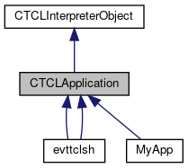
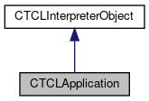

do not remove this div, it is closed by doxygen! 
|  |
| --- |
| FRIBParallelanalysis1.0FrameworkforMPIParalleldataanalysisatFRIB |

 end header part 
 Generated by Doxygen 1.8.13 

 window showing the filter options 

 iframe showing the search results (closed by default)

 top 
[Public Member Functions](#pub-methods) |
[[List of all members|https://github.com/FRIBDAQ/docs/tree/main/apipeline/classCTCLApplication-members.md]]

CTCLApplication Class Referenceabstract

header
Inheritance diagram for CTCLApplication:

[[[legend|https://github.com/FRIBDAQ/docs/tree/main/apipeline/graph_legend.md]]]

Collaboration diagram for CTCLApplication:

[[[legend|https://github.com/FRIBDAQ/docs/tree/main/apipeline/graph_legend.md]]]

|  |  |
| --- | --- |
| Public Member Functions |
|  | CTCLApplication() |
|  |
|  | CTCLApplication(constCTCLApplication&aCTCLApplication) |
|  |
| CTCLApplication& | operator=(constCTCLApplication&aCTCLApplication) |
|  |
| int | operator==(constCTCLApplication&aCTCLApplication) |
|  |
| virtual int | operator()()=0 |
|  |
| void | getProgramArguments(int &argc, char **&argv) |
|  |
| Tcl_ThreadId | getThread() const |
|  |
| Public Member Functions inherited fromCTCLInterpreterObject |
|  | CTCLInterpreterObject(CTCLInterpreter*pInterp) |
|  |
|  | CTCLInterpreterObject(constCTCLInterpreterObject&aCTCLInterpreterObject) |
|  |
| CTCLInterpreterObject& | operator=(constCTCLInterpreterObject&aCTCLInterpreterObject) |
|  |
| int | operator==(constCTCLInterpreterObject&aCTCLInterpreterObject) const |
|  |
| CTCLInterpreter* | getInterpreter() const |
|  |
| CTCLInterpreter* | Bind(CTCLInterpreter&rBinding) |
|  |
| CTCLInterpreter* | Bind(CTCLInterpreter*pBinding) |
|  |

|  |  |
| --- | --- |
| Additional Inherited Members |
| Protected Member Functions inherited fromCTCLInterpreterObject |
| CTCLInterpreter* | AssertIfNotBound() |
|  |

## Constructor & Destructor Documentation

## [◆](#ac03ac227764742c8a2ea1f16681e3517)CTCLApplication()

|  |  |  |  |  |
| --- | --- | --- | --- | --- |
| CTCLApplication::CTCLApplication | ( |  | ) |  |

Construction of the application:

## Member Function Documentation

## [◆](#a5067209bd356af56d6b66d04aceecb3c)getProgramArguments()

|  |  |  |  |
| --- | --- | --- | --- |
| void CTCLApplication::getProgramArguments | ( | int & | argc, |
|  |  | char **& | argv |
|  | ) |  |  |

Provide a hook for the application to get the program arguments.

- Parameters
  |  |  |
  | --- | --- |
  | argc | - reference to integer that will get the argument count. |
  | argv | - reference to char** that will get the argument count. |

## [◆](#aef856e10505416d4058da94e84adfed8)getThread()

|  |  |  |  |  |
| --- | --- | --- | --- | --- |
| Tcl_ThreadId CTCLApplication::getThread | ( |  | ) | const |

Get the thread for the interpreter/application:

---

The documentation for this class was generated from the following files:- libtclplus/include/tclplus/[[TCLApplication.h|https://github.com/FRIBDAQ/docs/tree/main/apipeline/TCLApplication_8h_source.md]]
- libtclplus/tclplus/TCLApplication.cpp

 contents 
 start footer part 

---

Generated by   1.8.13
