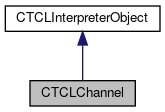

do not remove this div, it is closed by doxygen! 
|  |
| --- |
| FRIBParallelanalysis1.0FrameworkforMPIParalleldataanalysisatFRIB |

 end header part 
 Generated by Doxygen 1.8.13 

 window showing the filter options 

 iframe showing the search results (closed by default)

 top 
[Public Member Functions](#pub-methods) |
[Protected Member Functions](#pro-methods) |
[[List of all members|classCTCLChannel-members]]

CTCLChannel Class Reference

header
`#include <TCLChannel.h>`

Inheritance diagram for CTCLChannel:

[[[legend|graph_legend]]]

Collaboration diagram for CTCLChannel:

[[[legend|graph_legend]]]

|  |  |
| --- | --- |
| Public Member Functions |
|  | CTCLChannel(CTCLInterpreter*pInterp, std::string Filename, const char *pMode, int permissions) |
|  | Construct file channel. |
|  |
|  | CTCLChannel(CTCLInterpreter*pInterp, int argc, const char **pargv, int flags) |
|  | Construct command pipeline.More... |
|  |
|  | CTCLChannel(CTCLInterpreter*pInterp, int port, std::string host) |
|  | Construct a TCP/Client channel. |
|  |
|  | CTCLChannel(CTCLInterpreter*pInterp, int port, Tcl_TcpAcceptProc *proc, ClientData AppData) |
|  | Create a TCP/IP server listener.More... |
|  |
|  | CTCLChannel(CTCLInterpreter*pInterp, Tcl_Channel Channel) |
|  | Construct from existing channel.More... |
|  |
|  | CTCLChannel(constCTCLChannel&rhs) |
|  | Copy construction.More... |
|  |
| virtual | ~CTCLChannel() |
|  |
| Tcl_Channel | getChannel() const |
|  |
| bool | ClosesOnDestroy() const |
|  |
| int | Read(void **pData, int nChars) |
|  | Read data from the channel.More... |
|  |
| int | Write(const void *pData, int nBytes) |
|  | Write data to the channel.More... |
|  |
| bool | atEof() |
|  | True if EOF on channel.More... |
|  |
| void | Flush() |
|  | Flush channel data buffers.More... |
|  |
| void | Close() |
|  | Close channel (dangerous!!!).More... |
|  |
| void | Register() |
|  | Expose channel name to scripts (dangerous!!)More... |
|  |
| void | SetEncoding(std::string Name) |
|  |
| std::string | GetEncoding() |
|  |
| Public Member Functions inherited fromCTCLInterpreterObject |
|  | CTCLInterpreterObject(CTCLInterpreter*pInterp) |
|  |
|  | CTCLInterpreterObject(constCTCLInterpreterObject&aCTCLInterpreterObject) |
|  |
| CTCLInterpreterObject& | operator=(constCTCLInterpreterObject&aCTCLInterpreterObject) |
|  |
| int | operator==(constCTCLInterpreterObject&aCTCLInterpreterObject) const |
|  |
| CTCLInterpreter* | getInterpreter() const |
|  |
| CTCLInterpreter* | Bind(CTCLInterpreter&rBinding) |
|  |
| CTCLInterpreter* | Bind(CTCLInterpreter*pBinding) |
|  |

|  |  |
| --- | --- |
| Protected Member Functions |
| void | setChannel(Tcl_Channel Channel) |
|  |
| void | CloseOnDestroy(bool state) |
|  |
| Protected Member Functions inherited fromCTCLInterpreterObject |
| CTCLInterpreter* | AssertIfNotBound() |
|  |

## Detailed Description

This class defines a class that encapsulates a TCL Channel. TCL channels in turn abstract the I/O subsystem of the underlying operating system. TCL Channels are represented in TCL by an opaque pointer typedef'd as a Tcl_Channel. This pointer contains all the state required for a channel.

We support the following types of construction:

- Construction of a file channel given a filename, mode string and permissions.
- Construction of a command channel Given an argc/argv array and redirection flags.
- Construction of a client Tcp/Ip channel given a remote port, and hostname.
- Construction of a Tcp/Ip server listener channel given a port, a client connection handler procedure and an application specific parameter to pass to that procedure.
- Construction of a channel object given an existing Tcl_Channel.
- Copy construction

Notes:

- In all cases except constuction from an exsting Tcl_Channel or Copy Constructed objects, or objects filled in via assignment, destruction implies channel close.
- Copy construction is supported but only for objects with shorter lifetime than the original.
- Assignment implies closure of the original channel if it would close on destruction and the creation of an object that will not close on destroy. (in other words, only the original object closes on destroy).
- The behavior of this object in the presence of a Tcl close command that closes the underlying channel (or for that matter a call to Tcl_Close outside of this object), is then undefined.

## Constructor & Destructor Documentation

## [◆](#a4eec506c1c3dedf8a995966adbd6ca98)CTCLChannel() [1/4]

|  |  |  |  |
| --- | --- | --- | --- |
| CTCLChannel::CTCLChannel | ( | CTCLInterpreter* | pInterp, |
|  |  | int | argc, |
|  |  | const char ** | pargv, |
|  |  | int | flags |
|  | ) |  |  |

Construct command pipeline.

Construct a command pipeline channel. A command pipeline is a channel abstraction to a pipeline of executing programs. Using command pipelines, the client can feed input to stdin of the pipeline as well as gather the stdout and stderr The pipeline is specified using the argc/argv style where I believe a multistage pipe can be constructed via elements of argv that contain '|' and I/O redirection can be done similarly as described in the documentation of the Tcl [exec] and [open] commands.

Parameters
|  |  |
| --- | --- |
| pInterp | (CTCLInterpreter* [m]): The interpreter on which this channel will be registered/executed. |
| argc | (int): Number of words describing the command pipeline. |
| pargv | (char** [in]): The command pipeline description words. |
| flags | (int) Bitwise or of Flags that describe how the pipeline is connected to the channel:TCL_STDIN - the first element of the pipeline takes stdin from writes to the channel.TCL_STDOUT - The last element's stdout is connected to reads from the channel.TCL_STDERR - The last element's stderr is connected to reads from the channelTCL_ENFORCE_MODE - Causes the open to return an error to be returned if the pipeline then further redirects file descriptors that should go to or come from the channel. |

Exceptions
|  |  |
| --- | --- |
| string | - contaning an error if there's a problem opening the pipe. |

## [◆](#a36d5c618999a8dea29b934388eccc922)CTCLChannel() [2/4]

|  |  |  |  |
| --- | --- | --- | --- |
| CTCLChannel::CTCLChannel | ( | CTCLInterpreter* | pInterp, |
|  |  | int | port, |
|  |  | Tcl_TcpAcceptProc * | proc, |
|  |  | ClientData | AppData |
|  | ) |  |  |

Create a TCP/IP server listener.

Construct a Tcp/ip server channel. The server channel is listening on the designated port for connection requests. When a client connects, the user's handler is called. The handler is passed three parameters in order:

- ClientData AppData - the AppData parameter passed to us without interpretation.
- Tcl_Channel cChan - Channel open to communicate with the client.
- char* pHost - Name of the host connecting.
- int port - Port assigned for communication.

Note that the seerver has already done an accept(2), the only way to reject a client is to close the corresponding channel.

Parameters
|  |  |
| --- | --- |
| pInterp | (CTCLInterpreter* [m]): The interpreter on which this channel will be opened. |
| port | (int): The port on which the server we connect to will be running. |
| proc | (Tcl_TcpAcceptProc [callback]): This function is called when a client connects. Parameters are described above. |
| AppData | (ClientData [?]): Data that is passed to the client without any interpretation. In the OO world, this is recommended to be a pointer to the object that will service the client. |

Exceptions
|  |  |
| --- | --- |
| string | If the channel cannot be opened, a string exception is thrown. The string dscribes the reason the channel could not be opened. |

## [◆](#af706de99f238b2d04132e9a002ab699a)CTCLChannel() [3/4]

|  |  |  |  |
| --- | --- | --- | --- |
| CTCLChannel::CTCLChannel | ( | CTCLInterpreter* | pInterp, |
|  |  | Tcl_Channel | Channel |
|  | ) |  |  |

Construct from existing channel.

Create a channel from an existing open channel. In this case, we are not allowed to close or register the channel... only the original creator can do that.

Parameters
|  |  |
| --- | --- |
| pInterp | (CTCLInterpreter* [m]): The interpreter on which the channel is open |
| Channel | (Tcl_Channel [m]): The channel to bless into this object. |

## [◆](#a85c44dc1d66a8d5969de14c5da109175)CTCLChannel() [4/4]

|  |  |  |  |  |  |
| --- | --- | --- | --- | --- | --- |
| CTCLChannel::CTCLChannel | ( | constCTCLChannel& | rhs | ) |  |

Copy construction.

Create a channel via copy construction. The channel created will have a copy of m_Channel, and the flags all set to false to prevent close/unregister on destroy.

## [◆](#a95dd4eac914d62235a257c99e73ad996)~CTCLChannel()

|  |  |  |  |  |  |  |
| --- | --- | --- | --- | --- | --- | --- |
| CTCLChannel::~CTCLChannel() | CTCLChannel::~CTCLChannel | ( |  | ) |  | virtual |
| CTCLChannel::~CTCLChannel | ( |  | ) |  |

Destroy a channel, nothing happens unless m_fCloseOnDestroy is set then:

- if m_fRegistered is set, Tcl_UnregisterChannel is called
- if m_fRegistered is not set, Tcl_Close is called.

## Member Function Documentation

## [◆](#a9f4b714276d2f283b64fbb975b01e32d)atEof()

|  |  |  |  |  |
| --- | --- | --- | --- | --- |
| bool CTCLChannel::atEof | ( |  | ) |  |

True if EOF on channel.

Returns true if the channel is at eof.

## [◆](#a3530b66bf350f14621a0cd5bc65dc47f)Close()

|  |  |  |  |  |
| --- | --- | --- | --- | --- |
| void CTCLChannel::Close | ( |  | ) |  |

Close channel (dangerous!!!).

Closes the channel. This is a bit more complex than it appears:

- This is a no-op if CloseOnDestroy is not true.
- If m_fRegistered is true, then this just unregisters.

## [◆](#ae4c4e2a5a4295307bccbe5704e14d957)Flush()

|  |  |  |  |  |
| --- | --- | --- | --- | --- |
| void CTCLChannel::Flush | ( |  | ) |  |

Flush channel data buffers.

Flushes the output data buffer to the underlying stream.

## [◆](#ae8773009047643e7875da9a023de3a84)GetEncoding()

|  |  |  |  |  |
| --- | --- | --- | --- | --- |
| string CTCLChannel::GetEncoding | ( |  | ) |  |

Return the current encoding.

## [◆](#a85519b45b4f80b3b610ce50ca7414ba5)Read()

|  |  |  |  |
| --- | --- | --- | --- |
| int CTCLChannel::Read | ( | void ** | pData, |
|  |  | int | nChars |
|  | ) |  |  |

Read data from the channel.

Read data from the channel. The data are read using Tcl_ReadChars which implies that transformations consistent with the current encoding on the channel are applied to convert the data to UTF-8 unless the channel encoding has been set to binary.. in which case no transformations are performed. See SetEncoding and GetEncoding for more about this... as well as the TCL documentation.

Parameters
|  |  |
| --- | --- |
| pData | (void** [in]): Points to a pointer. The pointer will be filled in with a dynamically allocated buffer in which the data have been transferred. The buffer must be deleted by the caller. It was allocated as new char[nnn]. No effot is made to null terminate etc. since in binary mode, this may be just bytes. |

This is done because in general there's no way for the caller to know a-priori how large a buffer is required to hold nchars o UTF-8 encoded textual data.

Parameters
|  |  |
| --- | --- |
| nChars | (int): The number of bytes to read. |

Returnsint 
Return values
|  |  |
| --- | --- |
| >= | 0: The number ofcharacterstransfered. See the special cases below. |
| < | 0: An error occured that is stored in errno. |

Special cases:

- If the return value is 0, this means either that the end file was reached or that the channel is in nonblocking mode and had nothing to read. A call to [[atEof()|classCTCLChannel#a9f4b714276d2f283b64fbb975b01e32d]] will distinguish between these two cases.
- The return value can be less than the requested value either because the end file was encountered, or because the encoding of the file required more than 1 byte per character.

## [◆](#af55ae3947c01fd3cdf59a7113945f946)Register()

|  |  |  |  |  |
| --- | --- | --- | --- | --- |
| void CTCLChannel::Register | ( |  | ) |  |

Expose channel name to scripts (dangerous!!)

Registers a channel to make it visible to the TCL script world.

Parameters
|  |  |
| --- | --- |
| Name | (string [in]): Name under which the channel should be registered. |

## [◆](#ac315ad4f7a78c1e416c9b28338990eff)SetEncoding()

|  |  |  |  |  |  |
| --- | --- | --- | --- | --- | --- |
| void CTCLChannel::SetEncoding | ( | std::string | Name | ) |  |

Set the input/output encoding of the channel (binary means no encoding).

Parameters
|  |  |
| --- | --- |
| name | (string): The name of the encoding. |

## [◆](#ad2716c4fd8dd102c314cc22bf11dc8c6)Write()

|  |  |  |  |
| --- | --- | --- | --- |
| int CTCLChannel::Write | ( | const void * | pData, |
|  |  | int | nBytes |
|  | ) |  |  |

Write data to the channel.

Writes a set of bytes to the channel. Note that unless the encoding has been set to binary, the buffer is assumed to contain nbytes of utf-8 data that will be encoded as described by the encoding. Note that data written with Write may not appear in the underlying operating system channel until Flush is called.

Parameters
|  |  |
| --- | --- |
| pData | (const void* [in]): Pointer to the data to be written. |
| nBytes | (int) Number of bytes to write. |

Returnsint 
Return values
|  |  |
| --- | --- |
| >= | 0 Number of bytes asctually written. 0 may indicate that the channel is in nonblocking mode and cannot be written yet.  <=0 Indicates an error described by errno. |

Notes:

- The returned value may be larger than nBytes because the encoding may expand the data.

---

The documentation for this class was generated from the following files:- libtclplus/include/tclplus/[[TCLChannel.h|TCLChannel_8h_source]]
- libtclplus/tclplus/TCLChannel.cpp

 contents 
 start footer part 

---

Generated by   1.8.13
