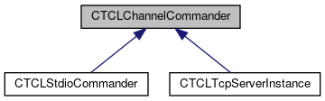
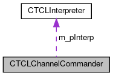

do not remove this div, it is closed by doxygen! 
|  |
| --- |
| FRIBParallelanalysis1.0FrameworkforMPIParalleldataanalysisatFRIB |


 end header part 
 Generated by Doxygen 1.8.13 


 window showing the filter options 


 iframe showing the search results (closed by default)

 top 
[Public Member Functions](#pub-methods) |
[Static Public Member Functions](#pub-static-methods) |
[Protected Member Functions](#pro-methods) |
[Protected Attributes](#pro-attribs) |
[[List of all members|https://github.com/FRIBDAQ/docs/tree/main/apipeline/classCTCLChannelCommander-members.md]]


CTCLChannelCommander Class Reference

header
`#include <CTCLChannelCommander.h>`


Inheritance diagram for CTCLChannelCommander:





[[[legend|https://github.com/FRIBDAQ/docs/tree/main/apipeline/graph_legend.md]]]


Collaboration diagram for CTCLChannelCommander:





[[[legend|https://github.com/FRIBDAQ/docs/tree/main/apipeline/graph_legend.md]]]


|  |  |
| --- | --- |
| Public Member Functions |
|  | CTCLChannelCommander(CTCLInterpreter*interp, Tcl_Channel channel) |
|  |
| virtual | ~CTCLChannelCommander() |
|  |
| virtual void | start() |
|  |
| virtual void | stop() |
|  |
| Tcl_Channel | getChannel() const |
|  |
| virtual void | onInput() |
|  |
| virtual void | onInputException() |
|  |
| virtual void | onEndFile() |
|  |
| virtual void | onCommand() |
|  |
| virtual void | returnResult() |
|  |
| virtual void | prompt1() |
|  |
| virtual void | prompt2() |
|  |
| virtual void | sendPrompt(std::string prompt) |
|  |
| bool | stopped() const |
|  |

|  |  |
| --- | --- |
| Static Public Member Functions |
| static void | inputRelay(ClientData pData, int mask) |
|  |

|  |  |
| --- | --- |
| Protected Member Functions |
| std::string | prompt1String() |
|  |
| std::string | prompt2String() |
|  |
| std::string | getPromptString(const char *scriptVariable, const char *defaultValue) |
|  |

|  |  |
| --- | --- |
| Protected Attributes |
| CTCLInterpreter* | m_pInterp |
|  |
| Tcl_Channel | m_channel |
|  |
| std::string | m_command |
|  |
| bool | m_active |
|  |


<a name="details"></a>## Detailed Description


A Channel commander is an object that can accept commands on some channel in an event driven way, and submit them for processing to the interpreter. Commanders could point to some interactive channel (e.g. see [[CTCLStdioCommander|https://github.com/FRIBDAQ/docs/tree/main/apipeline/classCTCLStdioCommander.md]]), or something less interactive like the socket of [[CTCLTcpServerInstance|https://github.com/FRIBDAQ/docs/tree/main/apipeline/classCTCLTcpServerInstance.md]].


This base class is suitable for the generic case but has member functions that can be overriden for more specific cases.

## Constructor & Destructor Documentation


## [◆](#abeac8d18d39e9273ee5526fb41b7519b)CTCLChannelCommander()


|  |  |  |  |
| --- | --- | --- | --- |
| CTCLChannelCommander::CTCLChannelCommander | ( | CTCLInterpreter* | interp, |
|  |  | Tcl_Channel | channel |
|  | ) |  |  |

The channel commanders use a 2 phase construction scheme so that we can hang on to a commander and put it in and out of the event loop as we please.


Construction does nothing but save data. To enable event procesing/command dispatch on the channel, you must call start. Event/command processing can be disabled by invoking stop.


- Parameters
  |  |  |
  | --- | --- |
  | interp | - Pointer to theCTCLInterpreterobject to which complete commands will be dispatched. |
  | channel | - Tcl_Channel on which commands will be accepted for submission to *interp. |


## [◆](#aa8f54d07606ad6c360f3f10555ead2c6)~CTCLChannelCommander()


|  |  |  |  |  |  |  |
| --- | --- | --- | --- | --- | --- | --- |
| CTCLChannelCommander::~CTCLChannelCommander() | CTCLChannelCommander::~CTCLChannelCommander | ( |  | ) |  | virtual |
| CTCLChannelCommander::~CTCLChannelCommander | ( |  | ) |  |

Destruction will stop command processing.

- The interpreter will, of course remain alive.
- The channel will not be closed. That's up to the framing software.


## Member Function Documentation


## [◆](#a7f3d388c5732727b6e88e7bed89bc468)getChannel()


|  |  |  |  |  |
| --- | --- | --- | --- | --- |
| Tcl_Channel CTCLChannelCommander::getChannel | ( |  | ) | const |

- Returns
  Tcl_Channel

- Return values
  |  |  |
  | --- | --- |
  | The | channel on which commands are processed. |


## [◆](#aa480f008ed8f5018268b1ef09df2ee0f)inputRelay()


|  |  |  |  |  |  |  |  |  |  |  |  |  |  |
| --- | --- | --- | --- | --- | --- | --- | --- | --- | --- | --- | --- | --- | --- |
| void CTCLChannelCommander::inputRelay(ClientDatapData,intmask) | void CTCLChannelCommander::inputRelay | ( | ClientData | pData, |  |  | int | mask |  | ) |  |  | static |
| void CTCLChannelCommander::inputRelay | ( | ClientData | pData, |
|  |  | int | mask |
|  | ) |  |  |

This static function establishes object context and calls onInput if there was an input event or onInputException if there was an exception event.


- Parameters
  |  |  |
  | --- | --- |
  | pData | - Really a pointer to a CTCLChannelHandler. |
  | mask | - Mask of the events that actually fired. In theory, more than one event can be dispatched to us. Since exceptions may result in channel closures, reads are handled first. |


## [◆](#a7617b283cf33901f4686ac747a9ea343)onCommand()


|  |  |  |  |  |  |  |
| --- | --- | --- | --- | --- | --- | --- |
| void CTCLChannelCommander::onCommand() | void CTCLChannelCommander::onCommand | ( |  | ) |  | virtual |
| void CTCLChannelCommander::onCommand | ( |  | ) |  |

Called when a command has been received. Default behavior:

- submits the command to the interpreter for execution.
- calls returnResult so that it can decide what to do with the interpreter result. Interpreter errors are just absorbed in the sense that we just let the result speak for itself,and Tcl's own -abort the proc on error- behavior deal with it all.


## [◆](#aafec1c21cbf1a697f56e3d84b70abd18)onEndFile()


|  |  |  |  |  |  |  |
| --- | --- | --- | --- | --- | --- | --- |
| void CTCLChannelCommander::onEndFile() | void CTCLChannelCommander::onEndFile | ( |  | ) |  | virtual |
| void CTCLChannelCommander::onEndFile | ( |  | ) |  |

Called when an end of file was seen on the input. This calls the stop function by default, leaving it up to the client software to decidew what to do about the channel (which is still open).


Reimplemented in [[CTCLTcpServerInstance|https://github.com/FRIBDAQ/docs/tree/main/apipeline/classCTCLTcpServerInstance.md#a3b9d392f4d54f196904547990e642d68]].


## [◆](#af83cd2d38b6fb8fc242303c4273f97e7)onInput()


|  |  |  |  |  |  |  |
| --- | --- | --- | --- | --- | --- | --- |
| void CTCLChannelCommander::onInput() | void CTCLChannelCommander::onInput | ( |  | ) |  | virtual |
| void CTCLChannelCommander::onInput | ( |  | ) |  |

Input handler. The default action is to read a line of input with Tcl_GetsObj. The resulting object is converted to its string representation and appended to m_command. The m_command is then sent through Tcl_CommandComplete and, if the command is complete, onCommand is invoked to handle it. Prompting is done as follows:

- If the object acquired does not complete a line, then prompt2 is called.
- If the object acquired completes the line, then on the return from onCommand, [[prompt1()|https://github.com/FRIBDAQ/docs/tree/main/apipeline/classCTCLChannelCommander.md#ae0d0e4783a4f7c8ecf82801d8c36c2e4]] is called.


- Note
  Tcl_GetsObj will return a -1 if no input is available This can happen for three reasons which are all dealt with:- Channel is in nonblocking mode and there's no data (normal return).
  - Channel has an eof condition (onEndFile called).

- Channel has some error (onInputException called).


## [◆](#adbeddf8c32b2842ad740849bc08750f1)onInputException()


|  |  |  |  |  |  |  |
| --- | --- | --- | --- | --- | --- | --- |
| void CTCLChannelCommander::onInputException() | void CTCLChannelCommander::onInputException | ( |  | ) |  | virtual |
| void CTCLChannelCommander::onInputException | ( |  | ) |  |

This is called when there's a problem on the input. default action is to stop accepting input events. The channel remains open, it's up to the client software to determine when, and if, the channel should be closed.


## [◆](#ae0d0e4783a4f7c8ecf82801d8c36c2e4)prompt1()


|  |  |  |  |  |  |  |
| --- | --- | --- | --- | --- | --- | --- |
| void CTCLChannelCommander::prompt1() | void CTCLChannelCommander::prompt1 | ( |  | ) |  | virtual |
| void CTCLChannelCommander::prompt1 | ( |  | ) |  |

Performs the begin of command prompt. Default action is to fetcht he prompt1 string and pass it to sendPrompt which has to decide what to do with it:


## [◆](#a5532318b1f6dfc170459c1076f7c058e)prompt2()


|  |  |  |  |  |  |  |
| --- | --- | --- | --- | --- | --- | --- |
| void CTCLChannelCommander::prompt2() | void CTCLChannelCommander::prompt2 | ( |  | ) |  | virtual |
| void CTCLChannelCommander::prompt2 | ( |  | ) |  |

Pefrorms the prompt for the middle of a command e.g.

```
prompt1>  proc a {b} {
prompt2>    ...
```


## [◆](#a61d2bdbc8ceab654a01e93f8063af807)returnResult()


|  |  |  |  |  |  |  |
| --- | --- | --- | --- | --- | --- | --- |
| void CTCLChannelCommander::returnResult() | void CTCLChannelCommander::returnResult | ( |  | ) |  | virtual |
| void CTCLChannelCommander::returnResult | ( |  | ) |  |

Return the result of a command to well... somewhere. By default this does nothing. In other contexts, you could expect it to write the result string somewhere (e.g. for sockets back to the client, for stdin, to stdout or stderr.


Reimplemented in [[CTCLTcpServerInstance|https://github.com/FRIBDAQ/docs/tree/main/apipeline/classCTCLTcpServerInstance.md#a3ec4aca2a91bafb9115f76620f85b922]].


## [◆](#a319902cfe4affa3a2fe47c9ad20f2604)sendPrompt()


|  |  |  |  |  |  |  |  |
| --- | --- | --- | --- | --- | --- | --- | --- |
| void CTCLChannelCommander::sendPrompt(std::stringprompt) | void CTCLChannelCommander::sendPrompt | ( | std::string | prompt | ) |  | virtual |
| void CTCLChannelCommander::sendPrompt | ( | std::string | prompt | ) |  |

Peform a prompt, given a string. The default is to do nothing leaving it to the derived classes to determine how prompting is emitted. Note that if different behavior is required for prompt1 and prompt2, those members can be directly overridden.


## [◆](#ad84952a6bb1a977eb22096db5f0a83d3)start()


|  |  |  |  |  |  |  |
| --- | --- | --- | --- | --- | --- | --- |
| void CTCLChannelCommander::start() | void CTCLChannelCommander::start | ( |  | ) |  | virtual |
| void CTCLChannelCommander::start | ( |  | ) |  |

Start accumulating commands to be processed. This involves setting a channel handler for input on the channel pointed to the inputRelay function that establishes object context and calls the virtual function onInput. Note that since channel handlers are like highlander (there can be only one), there's no harm in calling this function if the handler is already established, so there's no attempt to catch this as an error.


## [◆](#a983642b3e68221f4577577e7a40e3b95)stop()


|  |  |  |  |  |  |  |
| --- | --- | --- | --- | --- | --- | --- |
| void CTCLChannelCommander::stop() | void CTCLChannelCommander::stop | ( |  | ) |  | virtual |
| void CTCLChannelCommander::stop | ( |  | ) |  |

Stop accumulating commands by disabling the channel handler. Any data in m_command is discarded, so that if start is called later, there's no stale partial command. m_command is cleared here, rather than in start so that multiple calls to start are harmless.


## [◆](#a8c4c5d5597dfb9b933fd55c70b67419c)stopped()


|  |  |  |  |  |
| --- | --- | --- | --- | --- |
| bool CTCLChannelCommander::stopped | ( |  | ) | const |

stopped Returns true if the channel has stopped (due to eof).


---

The documentation for this class was generated from the following files:- libtclplus/include/tclplus/[[CTCLChannelCommander.h|https://github.com/FRIBDAQ/docs/tree/main/apipeline/CTCLChannelCommander_8h_source.md]]
- libtclplus/tclplus/CTCLChannelCommander.cpp

 contents 
 start footer part 

---


Generated by  [](http://www.doxygen.org/index.html) 1.8.13
