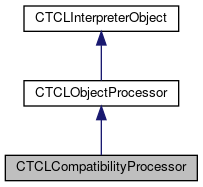

do not remove this div, it is closed by doxygen! 
|  |
| --- |
| FRIBParallelanalysis1.0FrameworkforMPIParalleldataanalysisatFRIB |

 end header part 
 Generated by Doxygen 1.8.13 

 window showing the filter options 

 iframe showing the search results (closed by default)

 top 
[Public Member Functions](#pub-methods) |
[[List of all members|classCTCLCompatibilityProcessor-members]]

CTCLCompatibilityProcessor Class Reference

header
`#include <TCLCompatibilityProcessor.h>`

Inheritance diagram for CTCLCompatibilityProcessor:

[[[legend|graph_legend]]]

Collaboration diagram for CTCLCompatibilityProcessor:

[[[legend|graph_legend]]]

|  |  |
| --- | --- |
| Public Member Functions |
|  | CTCLCompatibilityProcessor(CTCLProcessor&actualCommand) |
|  |
| virtual | ~CTCLCompatibilityProcessor() |
|  |
| virtual int | operator()(CTCLInterpreter&interp, std::vector<CTCLObject> &objv) |
|  |
| virtual void | onUnregister() |
|  |
| Public Member Functions inherited fromCTCLObjectProcessor |
|  | CTCLObjectProcessor(CTCLInterpreter&interp, std::string name, bool registerMe=true) |
|  |
| virtual | ~CTCLObjectProcessor() |
|  |
| void | Register() |
|  |
| Tcl_Command | RegisterAs(std::string name) |
|  |
| void | unregister() |
|  |
| void | unregisterAs(Tcl_Command token) |
|  |
| std::string | getName() const |
|  |
| Tcl_CmdInfo | getInfo() const |
|  |
| Public Member Functions inherited fromCTCLInterpreterObject |
|  | CTCLInterpreterObject(CTCLInterpreter*pInterp) |
|  |
|  | CTCLInterpreterObject(constCTCLInterpreterObject&aCTCLInterpreterObject) |
|  |
| CTCLInterpreterObject& | operator=(constCTCLInterpreterObject&aCTCLInterpreterObject) |
|  |
| int | operator==(constCTCLInterpreterObject&aCTCLInterpreterObject) const |
|  |
| CTCLInterpreter* | getInterpreter() const |
|  |
| CTCLInterpreter* | Bind(CTCLInterpreter&rBinding) |
|  |
| CTCLInterpreter* | Bind(CTCLInterpreter*pBinding) |
|  |

|  |  |
| --- | --- |
| Additional Inherited Members |
| Protected Member Functions inherited fromCTCLObjectProcessor |
| void | bindAll(CTCLInterpreter&interp, std::vector<CTCLObject> &objv) |
|  |
| void | requireAtLeast(std::vector<CTCLObject> &objv, unsigned n, const char *msg=0) const |
|  |
| void | requireAtMost(std::vector<CTCLObject> &objv, unsigned n, const char *msg=0) const |
|  |
| void | requireExactly(std::vector<CTCLObject> &objv, unsigned n, const char *msg=0) const |
|  |
| Protected Member Functions inherited fromCTCLInterpreterObject |
| CTCLInterpreter* | AssertIfNotBound() |
|  |

## Detailed Description

This is an adapter pattern class between object based commands and the classic argc/argv command interface. See the [[CTCLProcessor|classCTCLProcessor]] class for more information. The idea is that a [[CTCLProcessor|classCTCLProcessor]] will contain one of these which will marshall the object interface parameters to the argc/argv interface, create at [[CTCLResult|classCTCLResult]] object and then dispatch to the [[CTCLProcessor|classCTCLProcessor]] so that old commands written using the argc/argv interface can continue to work even if Tcl 9.0 deprecates or even eliminates this interface.

## Constructor & Destructor Documentation

## [◆](#a2c78f91d6e2be970550bf676b6bb12f1)CTCLCompatibilityProcessor()

|  |  |  |  |  |  |
| --- | --- | --- | --- | --- | --- |
| CTCLCompatibilityProcessor::CTCLCompatibilityProcessor | ( | CTCLProcessor& | actualCommand | ) |  |

Construct the object. The assumption is that the CTCL processor is constructed 'enough' that we can pull out the command name, and the interpreter from it.

- Parameters
  |  |  |
  | --- | --- |
  | actualCommand | :CTCLProcessorObject that implements an old style argc/argv command. |

- Note
  the [[CTCLProcessor|classCTCLProcessor]] required a two-step construct/register, we enforce that by not allowing the base class constructor to register us.

## [◆](#ab59b0d24eed6b7e23e6de3948a0d5bec)~CTCLCompatibilityProcessor()

|  |  |  |  |  |  |  |
| --- | --- | --- | --- | --- | --- | --- |
| CTCLCompatibilityProcessor::~CTCLCompatibilityProcessor() | CTCLCompatibilityProcessor::~CTCLCompatibilityProcessor | ( |  | ) |  | virtual |
| CTCLCompatibilityProcessor::~CTCLCompatibilityProcessor | ( |  | ) |  |

Destruction is all taken care of by the base class destructor.

## Member Function Documentation

## [◆](#abceaeaf2e5ac8b16675703188ebe7e6e)onUnregister()

|  |  |  |  |  |  |  |
| --- | --- | --- | --- | --- | --- | --- |
| void CTCLCompatibilityProcessor::onUnregister() | void CTCLCompatibilityProcessor::onUnregister | ( |  | ) |  | virtual |
| void CTCLCompatibilityProcessor::onUnregister | ( |  | ) |  |

Adapt to actual commands command deletion handler.

Reimplemented from [[CTCLObjectProcessor|classCTCLObjectProcessor#a3bb43c6ecbdf32cb1187cb17de8d7923]].

## [◆](#ae25f04c8bf0f229cd652148e611b354c)operator()()

|  |  |  |  |  |  |  |  |  |  |  |  |  |  |
| --- | --- | --- | --- | --- | --- | --- | --- | --- | --- | --- | --- | --- | --- |
| int CTCLCompatibilityProcessor::operator()(CTCLInterpreter&interp,std::vector<CTCLObject> &objv) | int CTCLCompatibilityProcessor::operator() | ( | CTCLInterpreter& | interp, |  |  | std::vector<CTCLObject> & | objv |  | ) |  |  | virtual |
| int CTCLCompatibilityProcessor::operator() | ( | CTCLInterpreter& | interp, |
|  |  | std::vector<CTCLObject> & | objv |
|  | ) |  |  |

Called to execute the command. Here's where the serious adaptor work comes in to play. We need to turn the objects passed in to us into an argc/argv pair, and create a [[CTCLResult|classCTCLResult]] to give the command we're adapting for.

- Parameters
  |  |  |
  | --- | --- |
  | interp | :CTCLInterpreter& Interpreter that's running this command |
  | objv | : vector<CTCLOBject>& Reference to the vector of command line objects. |

- Returns
  int

- Return values
  |  |  |
  | --- | --- |
  | from | m_ActualCommand->operator() |

Implements [[CTCLObjectProcessor|classCTCLObjectProcessor]].

---

The documentation for this class was generated from the following files:- libtclplus/include/tclplus/[[TCLCompatibilityProcessor.h|TCLCompatibilityProcessor_8h_source]]
- libtclplus/tclplus/TCLCompatibilityProcessor.cpp

 contents 
 start footer part 

---

Generated by   1.8.13
