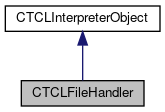

do not remove this div, it is closed by doxygen! 
|  |
| --- |
| FRIBParallelanalysis1.0FrameworkforMPIParalleldataanalysisatFRIB |

 end header part 
 Generated by Doxygen 1.8.13 

 window showing the filter options 

 iframe showing the search results (closed by default)

 top 
[Public Member Functions](#pub-methods) |
[Static Public Member Functions](#pub-static-methods) |
[[List of all members|classCTCLFileHandler-members]]

CTCLFileHandler Class Referenceabstract

header
Inheritance diagram for CTCLFileHandler:

[[[legend|graph_legend]]]

Collaboration diagram for CTCLFileHandler:

[[[legend|graph_legend]]]

|  |  |
| --- | --- |
| Public Member Functions |
|  | CTCLFileHandler(CTCLInterpreterObject*pInterp, TCLPLUS::UInt_t am_nFid=STDIN_FILENO) |
|  |
|  | CTCLFileHandler(CTCLInterpreterObject*pInterp, FILE *pFile) |
|  |
|  | CTCLFileHandler(CTCLInterpreter*pInterp, TCLPLUS::UInt_t am_nFid=STDIN_FILENO) |
|  |
|  | CTCLFileHandler(CTCLInterpreter*pInterp, FILE *pFile) |
|  |
|  | CTCLFileHandler(constCTCLFileHandler&aCTCLFileHandler) |
|  |
| CTCLFileHandler& | operator=(constCTCLFileHandler&aCTCLFileHandler) |
|  |
| int | operator==(constCTCLFileHandler&aCTCLFileHandler) const |
|  |
| TCLPLUS::UInt_t | getFid() const |
|  |
| void | setFid(TCLPLUS::UInt_t am_nFid) |
|  |
| virtual void | operator()(int mask)=0 |
|  |
| void | Set(int mask) |
|  |
| void | Clear() |
|  |
| Public Member Functions inherited fromCTCLInterpreterObject |
|  | CTCLInterpreterObject(CTCLInterpreter*pInterp) |
|  |
|  | CTCLInterpreterObject(constCTCLInterpreterObject&aCTCLInterpreterObject) |
|  |
| CTCLInterpreterObject& | operator=(constCTCLInterpreterObject&aCTCLInterpreterObject) |
|  |
| int | operator==(constCTCLInterpreterObject&aCTCLInterpreterObject) const |
|  |
| CTCLInterpreter* | getInterpreter() const |
|  |
| CTCLInterpreter* | Bind(CTCLInterpreter&rBinding) |
|  |
| CTCLInterpreter* | Bind(CTCLInterpreter*pBinding) |
|  |

|  |  |
| --- | --- |
| Static Public Member Functions |
| static void | CallbackRelay(ClientData pObject, int mask) |
|  |

|  |  |
| --- | --- |
| Additional Inherited Members |
| Protected Member Functions inherited fromCTCLInterpreterObject |
| CTCLInterpreter* | AssertIfNotBound() |
|  |

---

The documentation for this class was generated from the following files:- libtclplus/include/tclplus/[[TCLFileHandler.h|TCLFileHandler_8h_source]]
- libtclplus/tclplus/TCLFileHandler.cpp

 contents 
 start footer part 

---

Generated by   1.8.13
