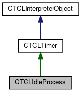

do not remove this div, it is closed by doxygen! 
|  |
| --- |
| FRIBParallelanalysis1.0FrameworkforMPIParalleldataanalysisatFRIB |

 end header part 
 Generated by Doxygen 1.8.13 

 window showing the filter options 

 iframe showing the search results (closed by default)

 top 
[Public Member Functions](#pub-methods) |
[[List of all members|classCTCLIdleProcess-members]]

CTCLIdleProcess Class Referenceabstract

header
Inheritance diagram for CTCLIdleProcess:

[[[legend|graph_legend]]]

Collaboration diagram for CTCLIdleProcess:

[[[legend|graph_legend]]]

|  |  |
| --- | --- |
| Public Member Functions |
|  | CTCLIdleProcess(CTCLInterpreterObject*pInterp) |
|  |
|  | CTCLIdleProcess(CTCLInterpreter*pInterp) |
|  |
| int | operator==(constCTCLIdleProcess&rRhs) |
|  |
| void | Set() |
|  |
| void | Clear() |
|  |
| virtual void | operator()()=0 |
|  |

|  |  |
| --- | --- |
| Additional Inherited Members |
| Protected Member Functions inherited fromCTCLTimer |
| void | setToken(Tcl_TimerToken am_tToken) |
|  |
| void | setMsec(TCLPLUS::UInt_t am_nMsec) |
|  |
| void | setSet(TCLPLUS::Bool_t am_fSet) |
|  |
|  | CTCLTimer(CTCLInterpreter*pInterp, TCLPLUS::UInt_t nMsec=0) |
|  |
| Tcl_TimerToken | getToken() const |
|  |
| TCLPLUS::UInt_t | getMsec() const |
|  |
| TCLPLUS::Bool_t | IsSet() const |
|  |
| void | Set() |
|  |
| void | Set(TCLPLUS::UInt_t nms) |
|  |
| void | Clear() |
|  |
| Protected Member Functions inherited fromCTCLInterpreterObject |
| CTCLInterpreter* | AssertIfNotBound() |
|  |
|  | CTCLInterpreterObject(CTCLInterpreter*pInterp) |
|  |
|  | CTCLInterpreterObject(constCTCLInterpreterObject&aCTCLInterpreterObject) |
|  |
| CTCLInterpreterObject& | operator=(constCTCLInterpreterObject&aCTCLInterpreterObject) |
|  |
| int | operator==(constCTCLInterpreterObject&aCTCLInterpreterObject) const |
|  |
| CTCLInterpreter* | getInterpreter() const |
|  |
| CTCLInterpreter* | Bind(CTCLInterpreter&rBinding) |
|  |
| CTCLInterpreter* | Bind(CTCLInterpreter*pBinding) |
|  |
| Static Protected Member Functions inherited fromCTCLTimer |
| static void | CallbackRelay(ClientData pObject) |
|  |

---

The documentation for this class was generated from the following file:- libtclplus/include/tclplus/[[TCLIdleProcess.h|TCLIdleProcess_8h_source]]

 contents 
 start footer part 

---

Generated by   1.8.13
