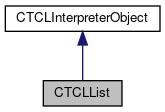

do not remove this div, it is closed by doxygen! 
|  |
| --- |
| FRIBParallelanalysis1.0FrameworkforMPIParalleldataanalysisatFRIB |

 end header part 
 Generated by Doxygen 1.8.13 

 window showing the filter options 

 iframe showing the search results (closed by default)

 top 
[Public Member Functions](#pub-methods) |
[Protected Member Functions](#pro-methods) |
[[List of all members|classCTCLList-members]]

CTCLList Class Reference

header
Inheritance diagram for CTCLList:

[[[legend|graph_legend]]]

Collaboration diagram for CTCLList:

[[[legend|graph_legend]]]

|  |  |
| --- | --- |
| Public Member Functions |
|  | CTCLList(CTCLInterpreter*pInterp) |
|  |
|  | CTCLList(CTCLInterpreter*pInterp, const char *am_pList) |
|  |
|  | CTCLList(CTCLInterpreter*pInterp, const std::string &rList) |
|  |
|  | CTCLList(constCTCLList&aCTCLList) |
|  |
| CTCLList& | operator=(constCTCLList&aCTCLList) |
|  |
| int | operator==(constCTCLList&aCTCLList) |
|  |
| int | operator!=(constCTCLList&aCTCLList) |
|  |
| const char * | getList() const |
|  |
| void | setList(const char *am_pList) |
|  |
| int | Split(StringArray &rElements) |
|  |
| int | Split(int &argc, char ***argv) |
|  |
| const char * | Merge(const StringArray &rElements) |
|  |
| const char * | Merge(int argc, char **argv) |
|  |
| Public Member Functions inherited fromCTCLInterpreterObject |
|  | CTCLInterpreterObject(CTCLInterpreter*pInterp) |
|  |
|  | CTCLInterpreterObject(constCTCLInterpreterObject&aCTCLInterpreterObject) |
|  |
| CTCLInterpreterObject& | operator=(constCTCLInterpreterObject&aCTCLInterpreterObject) |
|  |
| int | operator==(constCTCLInterpreterObject&aCTCLInterpreterObject) const |
|  |
| CTCLInterpreter* | getInterpreter() const |
|  |
| CTCLInterpreter* | Bind(CTCLInterpreter&rBinding) |
|  |
| CTCLInterpreter* | Bind(CTCLInterpreter*pBinding) |
|  |

|  |  |
| --- | --- |
| Protected Member Functions |
| void | DoAssign(constCTCLList&rRhs) |
|  |
| Protected Member Functions inherited fromCTCLInterpreterObject |
| CTCLInterpreter* | AssertIfNotBound() |
|  |

---

The documentation for this class was generated from the following files:- libtclplus/include/tclplus/[[TCLList.h|TCLList_8h_source]]
- libtclplus/tclplus/[[TCLList.cpp|TCLList_8cpp]]

 contents 
 start footer part 

---

Generated by   1.8.13
