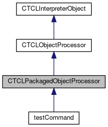
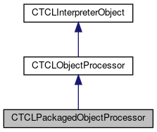

do not remove this div, it is closed by doxygen! 
|  |
| --- |
| FRIBParallelanalysis1.0FrameworkforMPIParalleldataanalysisatFRIB |

 end header part 
 Generated by Doxygen 1.8.13 

 window showing the filter options 

 iframe showing the search results (closed by default)

 top 
[Public Member Functions](#pub-methods) |
[Protected Member Functions](#pro-methods) |
[List of all members](https://github.com/FRIBDAQ/docs/tree/main/apipeline/classCTCLPackagedObjectProcessor-members.md)

CTCLPackagedObjectProcessor Class Reference

header
`#include <TCLPackagedObjectProcessor.h>`

Inheritance diagram for CTCLPackagedObjectProcessor:

[[legend](https://github.com/FRIBDAQ/docs/tree/main/apipeline/graph_legend.md)]

Collaboration diagram for CTCLPackagedObjectProcessor:

[[legend](https://github.com/FRIBDAQ/docs/tree/main/apipeline/graph_legend.md)]

|  |  |
| --- | --- |
| Public Member Functions |
|  | CTCLPackagedObjectProcessor(CTCLInterpreter&interp, std::string command, bool registerMe=true) |
|  |
| virtual | ~CTCLPackagedObjectProcessor() |
|  |
| void | onAttach(CTCLObjectPackage*package) |
|  |
| Public Member Functions inherited fromCTCLObjectProcessor |
|  | CTCLObjectProcessor(CTCLInterpreter&interp, std::string name, bool registerMe=true) |
|  |
| virtual | ~CTCLObjectProcessor() |
|  |
| void | Register() |
|  |
| Tcl_Command | RegisterAs(std::string name) |
|  |
| void | unregister() |
|  |
| void | unregisterAs(Tcl_Command token) |
|  |
| std::string | getName() const |
|  |
| Tcl_CmdInfo | getInfo() const |
|  |
| Public Member Functions inherited fromCTCLInterpreterObject |
|  | CTCLInterpreterObject(CTCLInterpreter*pInterp) |
|  |
|  | CTCLInterpreterObject(constCTCLInterpreterObject&aCTCLInterpreterObject) |
|  |
| CTCLInterpreterObject& | operator=(constCTCLInterpreterObject&aCTCLInterpreterObject) |
|  |
| int | operator==(constCTCLInterpreterObject&aCTCLInterpreterObject) const |
|  |
| CTCLInterpreter* | getInterpreter() const |
|  |
| CTCLInterpreter* | Bind(CTCLInterpreter&rBinding) |
|  |
| CTCLInterpreter* | Bind(CTCLInterpreter*pBinding) |
|  |

|  |  |
| --- | --- |
| Protected Member Functions |
| CTCLObjectPackage* | getPackage() |
|  |
| virtual void | Initialize() |
|  |
| Protected Member Functions inherited fromCTCLObjectProcessor |
| virtual int | operator()(CTCLInterpreter&interp, std::vector<CTCLObject> &objv)=0 |
|  |
| virtual void | onUnregister() |
|  |
| void | bindAll(CTCLInterpreter&interp, std::vector<CTCLObject> &objv) |
|  |
| void | requireAtLeast(std::vector<CTCLObject> &objv, unsigned n, const char *msg=0) const |
|  |
| void | requireAtMost(std::vector<CTCLObject> &objv, unsigned n, const char *msg=0) const |
|  |
| void | requireExactly(std::vector<CTCLObject> &objv, unsigned n, const char *msg=0) const |
|  |
| Protected Member Functions inherited fromCTCLInterpreterObject |
| CTCLInterpreter* | AssertIfNotBound() |
|  |

## Detailed Description

A packaged command is one that has at its disposal the services of some shared set of functions (its package). This class is the base class for all such commands.

In normal usage, the user derives the actual desired class from this. The life of a pacakged command is versy similar to any object command, however at some point it is attached to the package and its onAttach member is invoked to ensure access to the package object.

## Constructor & Destructor Documentation

## [◆](#a37d94d243a6c2c37652874645ebf3070)CTCLPackagedObjectProcessor()

|  |  |  |  |
| --- | --- | --- | --- |
| CTCLPackagedObjectProcessor::CTCLPackagedObjectProcessor | ( | CTCLInterpreter& | interp, |
|  |  | std::string | command, |
|  |  | bool | registerMe=true |
|  | ) |  |  |

Construction passes on to the base class:

- Parameters
  |  |  |
  | --- | --- |
  | interp | - TCL Interpreter on which this command will be defined. |
  | command | - Name of the command. |
  | registerMe | - If true, construction registers the command. |

## [◆](#a8704544c0a9d68aa4028a00cca957ad5)~CTCLPackagedObjectProcessor()

|  |  |  |  |  |  |  |
| --- | --- | --- | --- | --- | --- | --- |
| CTCLPackagedObjectProcessor::~CTCLPackagedObjectProcessor() | CTCLPackagedObjectProcessor::~CTCLPackagedObjectProcessor | ( |  | ) |  | virtual |
| CTCLPackagedObjectProcessor::~CTCLPackagedObjectProcessor | ( |  | ) |  |

Destruction is a NOOP:

## Member Function Documentation

## [◆](#a8a1e68a10499e29a19a0c423d417d1c8)getPackage()

|  |  |  |  |  |  |  |
| --- | --- | --- | --- | --- | --- | --- |
| CTCLObjectPackage* CTCLPackagedObjectProcessor::getPackage() | CTCLObjectPackage* CTCLPackagedObjectProcessor::getPackage | ( |  | ) |  | protected |
| CTCLObjectPackage* CTCLPackagedObjectProcessor::getPackage | ( |  | ) |  |

Return the package pointer so that derived classes can invoke package facilities

- Returns
  CTCLObjectPackage*

## [◆](#a94fc3403370d17a1762cf286ec71ef96)Initialize()

|  |  |  |  |  |  |  |
| --- | --- | --- | --- | --- | --- | --- |
| void CTCLPackagedObjectProcessor::Initialize() | void CTCLPackagedObjectProcessor::Initialize | ( |  | ) |  | protectedvirtual |
| void CTCLPackagedObjectProcessor::Initialize | ( |  | ) |  |

Default initialize is null. The derived class can override this however:

Reimplemented in [testCommand](https://github.com/FRIBDAQ/docs/tree/main/apipeline/classtestCommand.md#a6f085e980b062a895cf423e1c2c4aa9e).

## [◆](#a8121f55148b1eee77ee4316f034af1a1)onAttach()

|  |  |  |  |  |  |
| --- | --- | --- | --- | --- | --- |
| void CTCLPackagedObjectProcessor::onAttach | ( | CTCLObjectPackage* | package | ) |  |

Attachment saves the package pointer for later and invokes the Initialize method (which can get the package via getPackage if it needs.

- Parameters
  |  |  |
  | --- | --- |
  | package | - Pointer to the package. |

---

The documentation for this class was generated from the following files:- libtclplus/include/tclplus/[TCLPackagedObjectProcessor.h](https://github.com/FRIBDAQ/docs/tree/main/apipeline/TCLPackagedObjectProcessor_8h_source.md)
- libtclplus/tclplus/TCLPackagedObjectProcessor.cpp

 contents 
 start footer part 

---

Generated by   1.8.13
