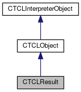

do not remove this div, it is closed by doxygen! 
|  |
| --- |
| FRIBParallelanalysis1.0FrameworkforMPIParalleldataanalysisatFRIB |

 end header part 
 Generated by Doxygen 1.8.13 

 window showing the filter options 

 iframe showing the search results (closed by default)

 top 
[Public Member Functions](#pub-methods) |
[[List of all members|https://github.com/FRIBDAQ/docs/tree/main/apipeline/classCTCLResult-members.md]]

CTCLResult Class Reference

header
`#include <TCLResult.h>`

Inheritance diagram for CTCLResult:

[[[legend|https://github.com/FRIBDAQ/docs/tree/main/apipeline/graph_legend.md]]]

Collaboration diagram for CTCLResult:

[[[legend|https://github.com/FRIBDAQ/docs/tree/main/apipeline/graph_legend.md]]]

|  |  |
| --- | --- |
| Public Member Functions |
|  | CTCLResult(CTCLInterpreter*pInterp, bool reset=true) |
|  |
| virtual | ~CTCLResult() |
|  |
|  | CTCLResult(constCTCLResult&aCTCLResult) |
|  |
| CTCLResult& | operator=(constCTCLResult&aCTCLResult) |
|  |
| CTCLResult& | operator=(const char *rhs) |
|  |
| CTCLResult& | operator=(std::string rhs) |
|  |
| int | operator==(constCTCLResult&aCTCLResult) |
|  |
| int | operator!=(constCTCLResult&rhs) |
|  |
| CTCLResult& | operator+=(const char *pString) |
|  |
| CTCLResult& | operator+=(const std::string &rString) |
|  |
| void | Clear() |
|  |
| void | AppendElement(const char *pString) |
|  |
| void | AppendElement(const std::string &rString) |
|  |
| void | commit() const |
|  |
| std::string | getString() |
|  |
| Public Member Functions inherited fromCTCLObject |
|  | CTCLObject(Tcl_Obj *am_pObject) |
|  |
|  | CTCLObject(constCTCLObject&aCTCLObject) |
|  |
| CTCLObject& | operator=(constCTCLObject&aCTCLObject) |
|  |
| int | operator==(constCTCLObject&aCTCLObject) const |
|  |
| Tcl_Obj * | getObject() |
|  |
| const Tcl_Obj * | getObject() const |
|  |
| CTCLObject& | operator=(const std::string &rSource) |
|  |
| CTCLObject& | operator=(const char *pSource) |
|  |
| CTCLObject& | operator=(int nSource) |
|  |
| CTCLObject& | operator=(constCTCLList&rList) |
|  |
| CTCLObject& | operator=(double dSource) |
|  |
| CTCLObject& | operator=(Tcl_Obj *rhs) |
|  |
| CTCLObject& | operator=(Tcl_WideInt rhs) |
|  |
|  | operator std::string() |
|  |
|  | operator int() |
|  |
|  | operator CTCLList() |
|  |
|  | operator double() |
|  |
| CTCLObject& | operator+=(constCTCLObject&rObject) |
|  |
| CTCLObject& | operator+=(int nItem) |
|  |
| CTCLObject& | operator+=(const std::string &rItem) |
|  |
| CTCLObject& | operator+=(const char *pItem) |
|  |
| CTCLObject& | operator+=(double Item) |
|  |
| CTCLObject& | operator+=(Tcl_Obj *pObj) |
|  |
| CTCLObject | clone() |
|  |
| CTCLObject | operator()() |
|  |
| CTCLObject | getRange(int first, int last) |
|  |
| CTCLObject& | concat(CTCLObject&rhs) |
|  |
| std::vector<CTCLObject> | getListElements() |
|  |
| CTCLObject& | setList(std::vector<CTCLObject> elements) |
|  |
| int | llength() |
|  |
| CTCLObject | lindex(int index) |
|  |
| CTCLObject& | lreplace(int first, int count, std::vector<CTCLObject> newElements) |
|  |
| Public Member Functions inherited fromCTCLInterpreterObject |
|  | CTCLInterpreterObject(CTCLInterpreter*pInterp) |
|  |
|  | CTCLInterpreterObject(constCTCLInterpreterObject&aCTCLInterpreterObject) |
|  |
| CTCLInterpreterObject& | operator=(constCTCLInterpreterObject&aCTCLInterpreterObject) |
|  |
| int | operator==(constCTCLInterpreterObject&aCTCLInterpreterObject) const |
|  |
| CTCLInterpreter* | getInterpreter() const |
|  |
| CTCLInterpreter* | Bind(CTCLInterpreter&rBinding) |
|  |
| CTCLInterpreter* | Bind(CTCLInterpreter*pBinding) |
|  |

|  |  |
| --- | --- |
| Additional Inherited Members |
| Protected Member Functions inherited fromCTCLObject |
| void | setObject(Tcl_Obj *am_pObject) |
|  |
| void | DupIfMust() |
|  |
| void | NewIfMust() |
|  |
| Protected Member Functions inherited fromCTCLInterpreterObject |
| CTCLInterpreter* | AssertIfNotBound() |
|  |

## Detailed Description

Encapsulates an interpreter result. We derive this from a [[CTCLObject|https://github.com/FRIBDAQ/docs/tree/main/apipeline/classCTCLObject.md]] in order to have the full expressive power of that class when building up the result string. The idea is that at construction the interpreter result will be reset or optionally our object loaded with its current value. Command processors will produce their result string here and then either at destruction time or explicitly, we will commit our contents to the result.

## Constructor & Destructor Documentation

## [◆](#a7376054000f14796a40a462c144038e6)CTCLResult() [1/2]

|  |  |  |  |
| --- | --- | --- | --- |
| CTCLResult::CTCLResult | ( | CTCLInterpreter* | pInterp, |
|  |  | bool | reset=true |
|  | ) |  |  |

Constructs a [[CTCLResult|https://github.com/FRIBDAQ/docs/tree/main/apipeline/classCTCLResult.md]]... Results are always bound to an interpreter...therefore our constructor requires an interpreter.

- Parameters
  |  |  |
  | --- | --- |
  | pInterp | : CTCLInterpreter* The interpreter to which we will be bound. |
  | reset | : bool (true) If true, the interpreter's result is reset, otherwise our contents are loaded from the interpreter's current result value. |

## [◆](#ab308cffd7d7c2dfb85870b3b02234deb)~CTCLResult()

|  |  |  |  |  |  |  |
| --- | --- | --- | --- | --- | --- | --- |
| CTCLResult::~CTCLResult() | CTCLResult::~CTCLResult | ( |  | ) |  | virtual |
| CTCLResult::~CTCLResult | ( |  | ) |  |

Destruction of a result implies commiting the contents of that result to the interpreter:

## [◆](#aa75fdcf653263c0e3c20ad69242312f2)CTCLResult() [2/2]

|  |  |  |  |  |  |
| --- | --- | --- | --- | --- | --- |
| CTCLResult::CTCLResult | ( | constCTCLResult& | rhs | ) |  |

Copy construction: we just need to bind ourselves to the same interpreter as the rhs... commit the rhs and load ourselves with the result string.

## Member Function Documentation

## [◆](#a01fd2c813410300de092b1aab33300b9)AppendElement()

|  |  |  |  |  |  |
| --- | --- | --- | --- | --- | --- |
| void CTCLResult::AppendElement | ( | const char * | pString | ) |  |

Append a string as an element. This is the base class +=

## [◆](#a87d5d3bb9eb0dc943581c57055c2f048)Clear()

|  |  |  |  |  |
| --- | --- | --- | --- | --- |
| void CTCLResult::Clear | ( |  | ) |  |

Clear the result string and the interprter result too.

## [◆](#a280c7d8b48d3bc7b99808e66f8d25712)commit()

|  |  |  |  |  |
| --- | --- | --- | --- | --- |
| void CTCLResult::commit | ( |  | ) | const |

Commit this to the result string:

## [◆](#a4d1001f148cfa182206d6b681896980c)getString()

|  |  |  |  |  |
| --- | --- | --- | --- | --- |
| string CTCLResult::getString | ( |  | ) |  |

Commit and returnn the string.

## [◆](#a7c41f6ec18d7e57b4aee787263da91f7)operator!=()

|  |  |  |  |  |  |
| --- | --- | --- | --- | --- | --- |
| int CTCLResult::operator!= | ( | constCTCLResult& | rhs | ) |  |

inequality is just the logical negation of equality:

## [◆](#ac56951e264866c64bf3e418653fb94b3)operator+=()

|  |  |  |  |  |  |
| --- | --- | --- | --- | --- | --- |
| CTCLResult& CTCLResult::operator+= | ( | const char * | pString | ) |  |

+= unfortunately has already been documented to have different semantics than that of the base class.. and we really can't do anything about that without breaking a bunch-o-code. Therefore we just live with it. here += implies string append. For element append, see AppendElement.

- Parameters
  |  |  |
  | --- | --- |
  | pString | : const char* the string to add. |

- Returns
  [[CTCLResult|https://github.com/FRIBDAQ/docs/tree/main/apipeline/classCTCLResult.md]]&

- Return values
  |  |  |
  | --- | --- |
  | *this |  |

## [◆](#ad73168e4f0b77a45f8629cb8273ddfb4)operator=() [1/2]

|  |  |  |  |  |  |
| --- | --- | --- | --- | --- | --- |
| CTCLResult& CTCLResult::operator= | ( | constCTCLResult& | rhs | ) |  |

Assign to *this from another result:

- commit the rhs.
- assign to this from the interpreter string (base class assignment).

## [◆](#a96fb97ed9683ede0ad7f509a3e546a39)operator=() [2/2]

|  |  |  |  |  |  |
| --- | --- | --- | --- | --- | --- |
| CTCLResult& CTCLResult::operator= | ( | const char * | rhs | ) |  |

Assign to self from const char* this is just base class function.

## [◆](#a2e2bbf7ff6137e9a349406f19f74de14)operator==()

|  |  |  |  |  |  |
| --- | --- | --- | --- | --- | --- |
| int CTCLResult::operator== | ( | constCTCLResult& | rhs | ) |  |

equality - comparisons are always true if the interpreters are the sam as there should only be a single underlying result string.

---

The documentation for this class was generated from the following files:- libtclplus/include/tclplus/[[TCLResult.h|https://github.com/FRIBDAQ/docs/tree/main/apipeline/TCLResult_8h_source.md]]
- libtclplus/tclplus/TCLResult.cpp

 contents 
 start footer part 

---

Generated by   1.8.13
