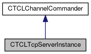
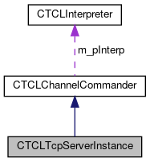

do not remove this div, it is closed by doxygen! 
|  |
| --- |
| FRIBParallelanalysis1.0FrameworkforMPIParalleldataanalysisatFRIB |

 end header part 
 Generated by Doxygen 1.8.13 

 window showing the filter options 

 iframe showing the search results (closed by default)

 top 
[Public Member Functions](#pub-methods) |
[[classCTCLTcpServerInstance-members]]

CTCLTcpServerInstance Class Reference

header
`#include <CTCLTcpServerInstance.h>`

Inheritance diagram for CTCLTcpServerInstance:

[[[graph_legend]]]

Collaboration diagram for CTCLTcpServerInstance:

[[[graph_legend]]]

|  |  |
| --- | --- |
| Public Member Functions |
|  | CTCLTcpServerInstance(CTCLInterpreter*pInterp, Tcl_Channel connection,CTCLServer*pServer) |
|  |
| virtual | ~CTCLTcpServerInstance() |
|  |
| virtual void | onEndFile() |
|  |
| virtual void | returnResult() |
|  |
| Public Member Functions inherited fromCTCLChannelCommander |
|  | CTCLChannelCommander(CTCLInterpreter*interp, Tcl_Channel channel) |
|  |
| virtual | ~CTCLChannelCommander() |
|  |
| virtual void | start() |
|  |
| virtual void | stop() |
|  |
| Tcl_Channel | getChannel() const |
|  |
| virtual void | onInput() |
|  |
| virtual void | onInputException() |
|  |
| virtual void | onCommand() |
|  |
| virtual void | prompt1() |
|  |
| virtual void | prompt2() |
|  |
| virtual void | sendPrompt(std::string prompt) |
|  |
| bool | stopped() const |
|  |

|  |  |
| --- | --- |
| Additional Inherited Members |
| Static Public Member Functions inherited fromCTCLChannelCommander |
| static void | inputRelay(ClientData pData, int mask) |
|  |
| Protected Member Functions inherited fromCTCLChannelCommander |
| std::string | prompt1String() |
|  |
| std::string | prompt2String() |
|  |
| std::string | getPromptString(const char *scriptVariable, const char *defaultValue) |
|  |
| Protected Attributes inherited fromCTCLChannelCommander |
| CTCLInterpreter* | m_pInterp |
|  |
| Tcl_Channel | m_channel |
|  |
| std::string | m_command |
|  |
| bool | m_active |
|  |

## Detailed Description

Server instance for a Tcl TCP server. Subclass of [[classCTCLChannelCommander]] we supply:

- onEndFile - so that we can get removed from the listeners list of active instances.
- returnResult - Which writes the result back at the client.

## Constructor & Destructor Documentation

## [◆](#ac072dd3aeb7406e3385ea7d68fc8d653)CTCLTcpServerInstance()

|  |  |  |  |
| --- | --- | --- | --- |
| CTCLTcpServerInstance::CTCLTcpServerInstance | ( | CTCLInterpreter* | pInterp, |
|  |  | Tcl_Channel | connection, |
|  |  | CTCLServer* | pServer |
|  | ) |  |  |

Construction just invokes base class construction and saves the listener pointer so that onEndFile can call it.

## [◆](#a0c40e4cd94da312062f39c7e861bebf7)~CTCLTcpServerInstance()

|  |  |  |  |  |  |  |
| --- | --- | --- | --- | --- | --- | --- |
| CTCLTcpServerInstance::~CTCLTcpServerInstance() | CTCLTcpServerInstance::~CTCLTcpServerInstance | ( |  | ) |  | virtual |
| CTCLTcpServerInstance::~CTCLTcpServerInstance | ( |  | ) |  |

Destruction gets and closes the channel. Typically destruction happens when onEndFile calls the instanceExite member to indicate it's exiting.

## Member Function Documentation

## [◆](#a3b9d392f4d54f196904547990e642d68)onEndFile()

|  |  |  |  |  |  |  |
| --- | --- | --- | --- | --- | --- | --- |
| void CTCLTcpServerInstance::onEndFile() | void CTCLTcpServerInstance::onEndFile | ( |  | ) |  | virtual |
| void CTCLTcpServerInstance::onEndFile | ( |  | ) |  |

Called when an end file is detected on the socket. This means the client has disconnected.

Reimplemented from [[classCTCLChannelCommander#aafec1c21cbf1a697f56e3d84b70abd18]].

## [◆](#a3ec4aca2a91bafb9115f76620f85b922)returnResult()

|  |  |  |  |  |  |  |
| --- | --- | --- | --- | --- | --- | --- |
| void CTCLTcpServerInstance::returnResult() | void CTCLTcpServerInstance::returnResult | ( |  | ) |  | virtual |
| void CTCLTcpServerInstance::returnResult | ( |  | ) |  |

The resultis returned by writing it to the channel.

Reimplemented from [[classCTCLChannelCommander#a61d2bdbc8ceab654a01e93f8063af807]].

---

The documentation for this class was generated from the following files:- libtclplus/include/tclplus/[[CTCLTcpServerInstance_8h_source]]
- libtclplus/tclplus/CTCLTcpServerInstance.cpp

 contents 
 start footer part 

---

Generated by   1.8.13
