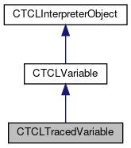

do not remove this div, it is closed by doxygen! 
|  |
| --- |
| FRIBParallelanalysis1.0FrameworkforMPIParalleldataanalysisatFRIB |

 end header part 
 Generated by Doxygen 1.8.13 

 window showing the filter options 

 iframe showing the search results (closed by default)

 top 
[Public Member Functions](#pub-methods) |
[[List of all members|classCTCLTracedVariable-members]]

CTCLTracedVariable Class Reference

header
`#include <TCLTracedVariable.h>`

Inheritance diagram for CTCLTracedVariable:

[[[legend|graph_legend]]]

Collaboration diagram for CTCLTracedVariable:

[[[legend|graph_legend]]]

|  |  |
| --- | --- |
| Public Member Functions |
|  | CTCLTracedVariable(CTCLInterpreter*pInterp, std::string Name,CVariableTraceCallback&Trace, int flags=(TCL_TRACE_READS\|TCL_TRACE_WRITES\|TCL_TRACE_UNSETS)) |
|  |
| virtual | ~CTCLTracedVariable() |
|  |
| CVariableTraceCallback& | getCallback() |
|  |
| virtual char * | operator()(char *pName, char *pElement, int flags) |
|  |
| Public Member Functions inherited fromCTCLVariable |
|  | CTCLVariable(std::string am_sVariable, TCLPLUS::Bool_t am_fTracing) |
|  |
|  | CTCLVariable(CTCLInterpreter*pInterp, std::string am_sVariable, TCLPLUS::Bool_t am_fTracing) |
|  |
|  | CTCLVariable(constCTCLVariable&aCTCLVariable) |
|  |
| CTCLVariable& | operator=(constCTCLVariable&aCTCLVariable) |
|  |
| int | operator==(constCTCLVariable&aCTCLVariable) const |
|  |
| std::string | getVariableName() const |
|  |
| TCLPLUS::Bool_t | IsTracing() const |
|  |
| void | setVariableName(const std::string am_sVariable) |
|  |
| const char * | Set(const char *pValue, int flags=TCL_LEAVE_ERR_MSG\|TCL_GLOBAL_ONLY) |
|  |
| const char * | Set(const char *pSubscript, const char *pValue, int flags=TCL_LEAVE_ERR_MSG\|TCL_GLOBAL_ONLY) |
|  |
| const char * | Get(int flags=TCL_LEAVE_ERR_MSG\|TCL_GLOBAL_ONLY, char *pIndex=0) |
|  |
| int | Link(void *pVariable, int Type) |
|  |
| void | Unlink() |
|  |
| int | Trace(int flags=TCL_TRACE_READS\|TCL_TRACE_WRITES\|TCL_TRACE_UNSETS, char *pIndex=(char *) TCLPLUS::kpNULL) |
|  |
| void | UnTrace() |
|  |
| Public Member Functions inherited fromCTCLInterpreterObject |
|  | CTCLInterpreterObject(CTCLInterpreter*pInterp) |
|  |
|  | CTCLInterpreterObject(constCTCLInterpreterObject&aCTCLInterpreterObject) |
|  |
| CTCLInterpreterObject& | operator=(constCTCLInterpreterObject&aCTCLInterpreterObject) |
|  |
| int | operator==(constCTCLInterpreterObject&aCTCLInterpreterObject) const |
|  |
| CTCLInterpreter* | getInterpreter() const |
|  |
| CTCLInterpreter* | Bind(CTCLInterpreter&rBinding) |
|  |
| CTCLInterpreter* | Bind(CTCLInterpreter*pBinding) |
|  |

|  |  |
| --- | --- |
| Additional Inherited Members |
| Static Public Member Functions inherited fromCTCLVariable |
| static char * | TraceRelay(ClientData pObject, Tcl_Interp *pInterpreter, tclConstCharPtr pName, tclConstCharPtr pIndex, int flags) |
|  |
| Protected Member Functions inherited fromCTCLVariable |
| void | setTracing(TCLPLUS::Bool_t am_fTracing) |
|  |
| void | DoAssign(constCTCLVariable&rRhs) |
|  |
| Protected Member Functions inherited fromCTCLInterpreterObject |
| CTCLInterpreter* | AssertIfNotBound() |
|  |

## Detailed Description

This class is an extension of the [[CTCLVariable|classCTCLVariable]] class designed to make dealing with tracing somewhat simpler. The class will contain a 'trace callback' object which is dispatched to by the trace handler. Thus, in theory, in stead of having a ton of derived CTCLVariables, you'll hopefully only have a few [[CVariableTraceCallback|classCVariableTraceCallback]] objects. The characteristics of the trace are set up at construction time and remain fixed for the lifetime of an object.

## Constructor & Destructor Documentation

## [◆](#ad199a8b57cc9a2622f1d87efc7e8077c)~CTCLTracedVariable()

|  |  |  |  |  |  |  |
| --- | --- | --- | --- | --- | --- | --- |
| CTCLTracedVariable::~CTCLTracedVariable() | CTCLTracedVariable::~CTCLTracedVariable | ( |  | ) |  | virtual |
| CTCLTracedVariable::~CTCLTracedVariable | ( |  | ) |  |

Destructor... Since we are going out of scope we need to first untrace.

## Member Function Documentation

## [◆](#a82ea3bce3d1405bde40f04644e9a0cd5)operator()()

|  |  |  |  |  |  |  |  |  |  |  |  |  |  |  |  |  |  |
| --- | --- | --- | --- | --- | --- | --- | --- | --- | --- | --- | --- | --- | --- | --- | --- | --- | --- |
| char * CTCLTracedVariable::operator()(char *pName,char *pElement,intflags) | char * CTCLTracedVariable::operator() | ( | char * | pName, |  |  | char * | pElement, |  |  | int | flags |  | ) |  |  | virtual |
| char * CTCLTracedVariable::operator() | ( | char * | pName, |
|  |  | char * | pElement, |
|  |  | int | flags |
|  | ) |  |  |

Function call operator.. This is called in response to the trace fire.

- Parameters
  |  |  |
  | --- | --- |
  | pName | (char*) Pointer to the name of the variable that traced. This can differ from the name of the variable because if the variable was an array element, this will be the array's base name. |
  | pElement | (char*) Pointer to the name of the array element or NULL If not an array element. |
  | flags | (int): The flag bit indicating which trace fired. |

- Returns
  char*

- Return values
  |  |  |
  | --- | --- |
  | NULL | - no errors. |
  | not | null - Pointer to an error message string, the access will fail with an error, and this string will represent the error |

Reimplemented from [[CTCLVariable|classCTCLVariable]].

---

The documentation for this class was generated from the following files:- libtclplus/include/tclplus/[[TCLTracedVariable.h|TCLTracedVariable_8h_source]]
- libtclplus/tclplus/TCLTracedVariable.cpp

 contents 
 start footer part 

---

Generated by   1.8.13
