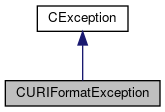

do not remove this div, it is closed by doxygen! 
|  |
| --- |
| FRIBParallelanalysis1.0FrameworkforMPIParalleldataanalysisatFRIB |

 end header part 
 Generated by Doxygen 1.8.13 

 window showing the filter options 

 iframe showing the search results (closed by default)

 top 
[Public Member Functions](#pub-methods) |
[[List of all members|classCURIFormatException-members]]

CURIFormatException Class Reference

header
`#include <URIFormatException.h>`

Inheritance diagram for CURIFormatException:

[[[legend|graph_legend]]]

Collaboration diagram for CURIFormatException:

[[[legend|graph_legend]]]

|  |  |
| --- | --- |
| Public Member Functions |
|  | CURIFormatException(std::string uri, const char *file, int line) |
|  | uri is just not the right format. |
|  |
|  | CURIFormatException(std::string uri, std::string port, const char *file, int line) |
|  | Port is not a port. |
|  |
|  | CURIFormatException(std::string uri, const char *host, const char *file, int line) |
|  | Host fails validity check. |
|  |
|  | CURIFormatException(constCURIFormatException&rhs) |
|  |
| CURIFormatException& | operator=(constCURIFormatException&rhs) |
|  |
| int | operator==(constCURIFormatException&rhs) const |
|  |
| int | operator!=(constCURIFormatException&rhs) const |
|  |
| virtual const char * | ReasonText() const |
|  |
| virtual int | ReasonCode() const |
|  |
| Public Member Functions inherited fromCException |
|  | CException(const char *pszAction) |
|  |
|  | CException(const std::string &rsAction) |
|  |
|  | CException(constCException&aCException) |
|  |
| CException& | operator=(constCException&aCException) |
|  |
| int | operator==(constCException&aCException) const |
|  |
| int | operator!=(constCException&rException) const |
|  |
| const char * | getAction() const |
|  |
| const char * | WasDoing() const |
|  |

|  |  |
| --- | --- |
| Additional Inherited Members |
| Protected Member Functions inherited fromCException |
| void | setAction(const char *pszAction) |
|  |
| void | setAction(const std::string &rsAction) |
|  |
| virtual void | DoAssign(constCException&rhs) |
|  |

## Detailed Description

[[CURIFormatException|classCURIFormatException]] defines an exception that's thrown when parsing an Universal Resource Identifier (URI). The string indicates a human readable reason for the failure. The error code is always -1. The reason text encodes why the exception was thrown as well as where, e.g.:

URI Format Incorrect: reason : thrown at [[file:line|file:line]]

where file is almost always something ending in URI.cpp, and line is the line in that file where the actual exception was constructed.

## Constructor & Destructor Documentation

## [◆](#a8dcf423ecf1170c1bfb1001807780958)CURIFormatException()

|  |  |  |  |  |  |
| --- | --- | --- | --- | --- | --- |
| CURIFormatException::CURIFormatException | ( | constCURIFormatException& | rhs | ) |  |

Copy construction:

## Member Function Documentation

## [◆](#a0d8fedfa7a5d082f237b453dd10abf42)operator!=()

|  |  |  |  |  |  |
| --- | --- | --- | --- | --- | --- |
| int CURIFormatException::operator!= | ( | constCURIFormatException& | rhs | ) | const |

Inequality if ! equal.

## [◆](#a6f30de526f102be1a748500dd08ec501)operator=()

|  |  |  |  |  |  |
| --- | --- | --- | --- | --- | --- |
| CURIFormatException& CURIFormatException::operator= | ( | constCURIFormatException& | rhs | ) |  |

Assignment

## [◆](#a0a32d38445ba9ca350a4c0d4b4a3ce37)operator==()

|  |  |  |  |  |  |
| --- | --- | --- | --- | --- | --- |
| int CURIFormatException::operator== | ( | constCURIFormatException& | rhs | ) | const |

Equality comparison.. all the members must be the same.

## [◆](#a2eff30bfda43e570137d80251258e200)ReasonCode()

|  |  |  |  |  |  |  |
| --- | --- | --- | --- | --- | --- | --- |
| int CURIFormatException::ReasonCode()const | int CURIFormatException::ReasonCode | ( |  | ) | const | virtual |
| int CURIFormatException::ReasonCode | ( |  | ) | const |

ReturnsInt_t 
Return values
|  |  |
| --- | --- |
| -1 |  |

Reimplemented from [[CException|classCException]].

## [◆](#a7e77dadc45ff7d6421c2bbd5fada9285)ReasonText()

|  |  |  |  |  |  |  |
| --- | --- | --- | --- | --- | --- | --- |
| const char * CURIFormatException::ReasonText()const | const char * CURIFormatException::ReasonText | ( |  | ) | const | virtual |
| const char * CURIFormatException::ReasonText | ( |  | ) | const |

Returnsconst char* 
Return values
|  |  |
| --- | --- |
| Return | the full text of the error |

Reimplemented from [[CException|classCException]].

---

The documentation for this class was generated from the following files:- libtclplus/include/exception/[[URIFormatException.h|URIFormatException_8h_source]]
- libtclplus/exception/URIFormatException.cpp

 contents 
 start footer part 

---

Generated by   1.8.13
