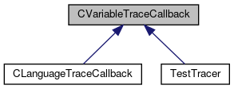

do not remove this div, it is closed by doxygen! 
|  |
| --- |
| FRIBParallelanalysis1.0FrameworkforMPIParalleldataanalysisatFRIB |

 end header part 
 Generated by Doxygen 1.8.13 

 window showing the filter options 

 iframe showing the search results (closed by default)

 top 
[Public Member Functions](#pub-methods) |
[[classCVariableTraceCallback-members]]

CVariableTraceCallback Class Referenceabstract

header
`#include <VariableTraceCallback.h>`

Inheritance diagram for CVariableTraceCallback:

[[[graph_legend]]]

|  |  |
| --- | --- |
| Public Member Functions |
| virtual char * | operator()(CTCLInterpreter*pInterp, char *pVariable, char *pElement, int flags)=0 |
|  |

## Detailed Description

This is an abstract base class that defines the interface into a variable trace callback object. Variable trace callback objects are used along with the CTracedVariable class to support a simplified interface to callbacks.

---

The documentation for this class was generated from the following file:- libtclplus/include/tclplus/[[VariableTraceCallback_8h_source]]

 contents 
 start footer part 

---

Generated by   1.8.13
