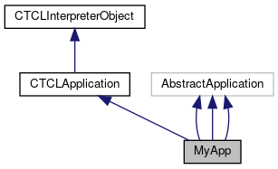

do not remove this div, it is closed by doxygen! 
|  |
| --- |
| FRIBParallelanalysis1.0FrameworkforMPIParalleldataanalysisatFRIB |

 end header part 
 Generated by Doxygen 1.8.13 

 window showing the filter options 

 iframe showing the search results (closed by default)

 top 
[Public Member Functions](#pub-methods) |
[Protected Member Functions](#pro-methods) |
[[List of all members|classMyApp-members]]

MyApp Class Reference

header
Inheritance diagram for MyApp:

[[[legend|graph_legend]]]

Collaboration diagram for MyApp:

[[[legend|graph_legend]]]

|  |  |
| --- | --- |
| Public Member Functions |
|  | MyApp(int argc, char **argv) |
|  |
| virtual void | dealer(int argc, char **argv,AbstractApplication*pApp) |
|  |
| virtual void | farmer(int argc, char **argv,AbstractApplication*pApp) |
|  |
| virtual void | outputter(int argc, char **argv,AbstractApplication*pApp) |
|  |
| virtual void | worker(int argc, char **argv,AbstractApplication*pApp) |
|  |
|  | MyApp(int argc, char **argv) |
|  |
| virtual void | dealer(int argc, char **argv,AbstractApplication*pApp) |
|  |
| virtual void | farmer(int argc, char **argv,AbstractApplication*pApp) |
|  |
| virtual void | outputter(int argc, char **argv,AbstractApplication*pApp) |
|  |
| virtual void | worker(int argc, char **argv,AbstractApplication*pApp) |
|  |
| std::string | getOutputFile(int argc, char **argv) |
|  |
| std::string | getParameterOutputFile(int argc, char **argv) |
|  |
| std::string | getInputFile(int argc, char **argv) |
|  |
|  | MyApp(int argc, char **argv) |
|  |
| virtual void | dealer(int argc, char **argv,AbstractApplication*pApp) |
|  |
| virtual void | farmer(int argc, char **argv,AbstractApplication*pApp) |
|  |
| virtual void | outputter(int argc, char **argv,AbstractApplication*pApp) |
|  |
| virtual void | worker(int argc, char **argv,AbstractApplication*pApp) |
|  |
| std::string | getOutputFile(int argc, char **argv) |
|  |
| std::string | getInputFile(int argc, char **argv) |
|  |
| virtual int | operator()() |
|  |
| Public Member Functions inherited fromCTCLApplication |
|  | CTCLApplication() |
|  |
|  | CTCLApplication(constCTCLApplication&aCTCLApplication) |
|  |
| CTCLApplication& | operator=(constCTCLApplication&aCTCLApplication) |
|  |
| int | operator==(constCTCLApplication&aCTCLApplication) |
|  |
| void | getProgramArguments(int &argc, char **&argv) |
|  |
| Tcl_ThreadId | getThread() const |
|  |
| Public Member Functions inherited fromCTCLInterpreterObject |
|  | CTCLInterpreterObject(CTCLInterpreter*pInterp) |
|  |
|  | CTCLInterpreterObject(constCTCLInterpreterObject&aCTCLInterpreterObject) |
|  |
| CTCLInterpreterObject& | operator=(constCTCLInterpreterObject&aCTCLInterpreterObject) |
|  |
| int | operator==(constCTCLInterpreterObject&aCTCLInterpreterObject) const |
|  |
| CTCLInterpreter* | getInterpreter() const |
|  |
| CTCLInterpreter* | Bind(CTCLInterpreter&rBinding) |
|  |
| CTCLInterpreter* | Bind(CTCLInterpreter*pBinding) |
|  |

|  |  |
| --- | --- |
| Protected Member Functions |
| void | RegisterCommands() |
|  |
| Protected Member Functions inherited fromCTCLInterpreterObject |
| CTCLInterpreter* | AssertIfNotBound() |
|  |

## Member Function Documentation

## [◆](#a8a7dff4e6e87f9fdf80034341a53fdc7)dealer()

|  |  |  |  |  |  |  |  |  |  |  |  |  |  |  |  |  |  |
| --- | --- | --- | --- | --- | --- | --- | --- | --- | --- | --- | --- | --- | --- | --- | --- | --- | --- |
| void MyApp::dealer(intargc,char **argv,AbstractApplication*pApp) | void MyApp::dealer | ( | int | argc, |  |  | char ** | argv, |  |  | AbstractApplication* | pApp |  | ) |  |  | virtual |
| void MyApp::dealer | ( | int | argc, |
|  |  | char ** | argv, |
|  |  | AbstractApplication* | pApp |
|  | ) |  |  |

The dealer First we create a raw event file - then we can distribute it to the worker(s) – run this so there's only one worker so that the output file is faithful.

Parameters
|  |  |
| --- | --- |
| argc,argv | - command line parameters |
| pApp | - the application. |

## [◆](#a38adff57af78fecf21b79f5a892e9a99)worker()

|  |  |  |  |  |  |  |  |  |  |  |  |  |  |  |  |  |  |
| --- | --- | --- | --- | --- | --- | --- | --- | --- | --- | --- | --- | --- | --- | --- | --- | --- | --- |
| void MyApp::worker(intargc,char **argv,AbstractApplication*pApp) | void MyApp::worker | ( | int | argc, |  |  | char ** | argv, |  |  | AbstractApplication* | pApp |  | ) |  |  | virtual |
| void MyApp::worker | ( | int | argc, |
|  |  | char ** | argv, |
|  |  | AbstractApplication* | pApp |
|  | ) |  |  |

the worker - it's just going to get data from the dealer and write it to file - note that the headers in the response are written as well as the ring items so tests can look at those and be sure they're right.

Parameters
|  |  |
| --- | --- |
| argc,argv | - command line parameters |
| pApp | - the application. |

worker We open an output file and just put the data we get from the dealer into it for later examination. Note that both the header and contents will be written.

---

The documentation for this class was generated from the following files:- base/[[testInput.cpp|testInput_8cpp]]
- base/[[testParinput.cpp|testParinput_8cpp]]
- base/[[testWorker2.cpp|testWorker2_8cpp]]
- libtclplus/tclplus/TCLTest.cpp

 contents 
 start footer part 

---

Generated by   1.8.13
