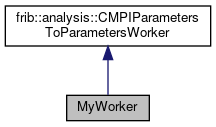

do not remove this div, it is closed by doxygen! 
|  |
| --- |
| FRIBParallelanalysis1.0FrameworkforMPIParalleldataanalysisatFRIB |

 end header part 
 Generated by Doxygen 1.8.13 

 window showing the filter options 

 iframe showing the search results (closed by default)

 top 
[Public Member Functions](#pub-methods) |
[[classMyWorker-members]]

MyWorker Class Reference

header
Inheritance diagram for MyWorker:

[[[graph_legend]]]

Collaboration diagram for MyWorker:

[[[graph_legend]]]

|  |  |
| --- | --- |
| Public Member Functions |
|  | MyWorker(int argc, char **argv,AbstractApplication*pApp) |
|  |
| virtual void | process() |
|  |
| Public Member Functions inherited fromfrib::analysis::CMPIParametersToParametersWorker |
|  | CMPIParametersToParametersWorker(int argc, char **argv,AbstractApplication*pApp) |
|  |
| virtual | ~CMPIParametersToParametersWorker() |
|  |
| virtual void | operator()() |
|  |

|  |  |
| --- | --- |
| Additional Inherited Members |
| Public Types inherited fromfrib::analysis::CMPIParametersToParametersWorker |
| typedef std::pair< std::string, double > | VariableInfo |
|  |
| Protected Member Functions inherited fromfrib::analysis::CMPIParametersToParametersWorker |
| VariableInfo * | getVariable(const char *pVarName) |
|  |
| void | loadVariable(const char *pVarName) |
|  |
| std::vector< std::string > | getVariableNames() |
|  |

---

The documentation for this class was generated from the following file:- base/[[testWorker2_8cpp]]

 contents 
 start footer part 

---

Generated by   1.8.13
