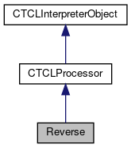

do not remove this div, it is closed by doxygen! 
|  |
| --- |
| FRIBParallelanalysis1.0FrameworkforMPIParalleldataanalysisatFRIB |

 end header part 
 Generated by Doxygen 1.8.13 

 window showing the filter options 

 iframe showing the search results (closed by default)

 top 
[Public Member Functions](#pub-methods) |
[[List of all members|classReverse-members]]

Reverse Class Reference

header
Inheritance diagram for Reverse:

[[[legend|graph_legend]]]

Collaboration diagram for Reverse:

[[[legend|graph_legend]]]

|  |  |
| --- | --- |
| Public Member Functions |
|  | Reverse(CTCLInterpreter*pInterp, string command=string("reverse")) |
|  |
| virtual int | operator()(CTCLInterpreter&interp,CTCLResult&result, int argc, char **argv) |
|  |
| virtual void | OnDelete() |
|  |
| bool | isDeleted() |
|  |
| bool | wasPreCalled() |
|  |
| bool | wasPostCalled() |
|  |
| virtual void | preCommand() |
|  |
| virtual void | postCommand() |
|  |
| Public Member Functions inherited fromCTCLProcessor |
|  | CTCLProcessor(const std::string sCommand,CTCLInterpreter*pInterp) |
|  |
|  | CTCLProcessor(const char *pCommand,CTCLInterpreter*pInterp) |
|  |
| virtual | ~CTCLProcessor() |
|  |
| std::string | getCommandName() const |
|  |
| void | Register() |
|  |
| void | Unregister() |
|  |
| void | RegisterAll() |
|  |
| void | UnregisterAll() |
|  |
| int | ParseInt(const char *pString, int *pInteger) |
|  |
| int | ParseInt(const std::string &rString, int *pInteger) |
|  |
| int | ParseDouble(const char *pString, double *pDouble) |
|  |
| int | ParseDouble(const std::string &rString, double *pDouble) |
|  |
| int | ParseBoolean(const char *pString, TCLPLUS::Bool_t *pBoolean) |
|  |
| int | ParseBoolean(const std::string &rString, TCLPLUS::Bool_t *pBoolean) |
|  |
| virtual void | preDelete() |
|  |
| virtual void | postDelete() |
|  |
| CTCLInterpreter* | Bind(CTCLInterpreter&binding) |
|  |
| CTCLInterpreter* | Bind(CTCLInterpreter*binding) |
|  |
| Public Member Functions inherited fromCTCLInterpreterObject |
|  | CTCLInterpreterObject(CTCLInterpreter*pInterp) |
|  |
|  | CTCLInterpreterObject(constCTCLInterpreterObject&aCTCLInterpreterObject) |
|  |
| CTCLInterpreterObject& | operator=(constCTCLInterpreterObject&aCTCLInterpreterObject) |
|  |
| int | operator==(constCTCLInterpreterObject&aCTCLInterpreterObject) const |
|  |
| CTCLInterpreter* | getInterpreter() const |
|  |
| CTCLInterpreter* | Bind(CTCLInterpreter&rBinding) |
|  |
| CTCLInterpreter* | Bind(CTCLInterpreter*pBinding) |
|  |

|  |  |
| --- | --- |
| Additional Inherited Members |
| Static Public Member Functions inherited fromCTCLProcessor |
| static std::string | ConcatenateParameters(int nArguments, char *pArguments[]) |
|  |
| static int | MatchKeyword(std::vector< std::string > &MatchTable, const std::string &rValue, int NoMatch=-1) |
|  |
| Protected Member Functions inherited fromCTCLProcessor |
| void | NextParam(int &argc, char **&argv) |
|  |
| Protected Member Functions inherited fromCTCLInterpreterObject |
| CTCLInterpreter* | AssertIfNotBound() |
|  |

## Member Function Documentation

## [◆](#acfe4a22505ffb7d9f54808c386160b72)OnDelete()

|  |  |  |  |  |  |  |
| --- | --- | --- | --- | --- | --- | --- |
| void Reverse::OnDelete() | void Reverse::OnDelete | ( |  | ) |  | virtual |
| void Reverse::OnDelete | ( |  | ) |  |

Called when the command is being deleted. The default action is to do nothing.

Reimplemented from [[CTCLProcessor|classCTCLProcessor#a9bda5ca8d5f26700a81bedbacbefc7e2]].

## [◆](#a272c1777ee49cb371dc0b7275da36dc3)postCommand()

|  |  |  |  |  |  |  |
| --- | --- | --- | --- | --- | --- | --- |
| void Reverse::postCommand() | void Reverse::postCommand | ( |  | ) |  | virtual |
| void Reverse::postCommand | ( |  | ) |  |

This is a hook that can be overiddent by derived classes. It is called just after the execution of operator()... success or failure.

Reimplemented from [[CTCLProcessor|classCTCLProcessor#a8d2679eaeb414dcd09b77c44ad474444]].

## [◆](#aaf8be85be7e0621c6030e48a7bad73a3)preCommand()

|  |  |  |  |  |  |  |
| --- | --- | --- | --- | --- | --- | --- |
| void Reverse::preCommand() | void Reverse::preCommand | ( |  | ) |  | virtual |
| void Reverse::preCommand | ( |  | ) |  |

This is a hook that can be overridden by derived classes. It is called just prior to the execution of operator().

Reimplemented from [[CTCLProcessor|classCTCLProcessor#af98ca1f8e40691f762159480380c3af8]].

---

The documentation for this class was generated from the following file:- libtclplus/tclplus/compatcommand.cpp

 contents 
 start footer part 

---

Generated by   1.8.13
