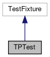

do not remove this div, it is closed by doxygen! 
|  |
| --- |
| FRIBParallelanalysis1.0FrameworkforMPIParalleldataanalysisatFRIB |

 end header part 
 Generated by Doxygen 1.8.13 

 window showing the filter options 

 iframe showing the search results (closed by default)

 top 
[Public Member Functions](#pub-methods) |
[Protected Member Functions](#pro-methods) |
[[List of all members|classTPTest-members]]

TPTest Class Reference

header
Inheritance diagram for TPTest:

[[[legend|graph_legend]]]

Collaboration diagram for TPTest:

[[[legend|graph_legend]]]

|  |  |
| --- | --- |
| Public Member Functions |
| void | setUp() |
|  |
| void | tearDown() |
|  |

|  |  |
| --- | --- |
| Protected Member Functions |
| void | initial() |
|  |
| void | next_1() |
|  |
| void | next_2() |
|  |
| void | next_3() |
|  |
| void | next_4() |
|  |
| void | collect_1() |
|  |
| void | collect_2() |
|  |
| void | dlimits() |
|  |
| void | dbins() |
|  |
| void | dunits() |
|  |
| void | getEvent() |
|  |
| void | getsb() |
|  |
| void | construct_1() |
|  |
| void | construct_2() |
|  |
| void | construct_3() |
|  |
| void | construct_4() |
|  |
| void | construct_5() |
|  |
| void | construct_6() |
|  |
| void | construct_7() |
|  |
| void | construct_8() |
|  |
| void | construct_9() |
|  |
| void | init_1() |
|  |
| void | init_2() |
|  |
| void | init_3() |
|  |
| void | init_4() |
|  |
| void | init_5() |
|  |
| void | dup_1() |
|  |
| void | dup_2() |
|  |
| void | cvtdouble_1() |
|  |
| void | cvtdouble_2() |
|  |
| void | cvtdouble_3() |
|  |
| void | assign_1() |
|  |
| void | assign_2() |
|  |
| void | assign_3() |
|  |
| void | assign_4() |
|  |
| void | assign_5() |
|  |
| void | assign_6() |
|  |
| void | assign_7() |
|  |
| void | pluseq_1() |
|  |
| void | pluseq_2() |
|  |
| void | pluseq_3() |
|  |
| void | minuseq_1() |
|  |
| void | minuseq_2() |
|  |
| void | minuseq_3() |
|  |
| void | timeseq_1() |
|  |
| void | timeseq_2() |
|  |
| void | timeseq_3() |
|  |
| void | diveq_1() |
|  |
| void | diveq_2() |
|  |
| void | diveq_3() |
|  |
| void | postinc_1() |
|  |
| void | postinc_2() |
|  |
| void | postinc_3() |
|  |
| void | preinc_1() |
|  |
| void | preinc_2() |
|  |
| void | preinc_3() |
|  |
| void | postdec_1() |
|  |
| void | postdec_2() |
|  |
| void | postdec_3() |
|  |
| void | predec_1() |
|  |
| void | predec_2() |
|  |
| void | predec_3() |
|  |
| void | getname_1() |
|  |
| void | getname_2() |
|  |
| void | getid_1() |
|  |
| void | getid_2() |
|  |
| void | getbins_1() |
|  |
| void | getbins_2() |
|  |
| void | setbins_1() |
|  |
| void | setbins_2() |
|  |
| void | getstart_1() |
|  |
| void | getstart_2() |
|  |
| void | setstart_1() |
|  |
| void | setstart_2() |
|  |
| void | getstop_1() |
|  |
| void | getstop_2() |
|  |
| void | setstop_1() |
|  |
| void | setstop_2() |
|  |
| void | getinc_1() |
|  |
| void | getinc_2() |
|  |
| void | setinc_1() |
|  |
| void | setinc_2() |
|  |
| void | setinc_3() |
|  |
| void | getunit_1() |
|  |
| void | getunit_2() |
|  |
| void | setunit_1() |
|  |
| void | setunit_2() |
|  |
| void | isvalid_1() |
|  |
| void | isvalid_2() |
|  |
| void | isvalid_3() |
|  |
| void | setinvalid_1() |
|  |
| void | setinvalid_2() |
|  |
| void | haschanged_1() |
|  |
| void | haschanged_2() |
|  |
| void | haschanged_3() |
|  |
| void | haschanged_4() |
|  |
| void | haschanged_5() |
|  |
| void | haschanged_6() |
|  |
| void | setchanged_1() |
|  |
| void | setchanged_2() |
|  |
| void | resetchanged_1() |
|  |
| void | resetchanged_2() |
|  |
| void | resetall() |
|  |
| void | getdef_1() |
|  |
| void | getdef_2() |
|  |

## Member Function Documentation

## [◆](#a7f656564ad4c635a9100fa941ece0f47)resetall()

|  |  |  |  |  |  |  |
| --- | --- | --- | --- | --- | --- | --- |
| void TPTest::resetall() | void TPTest::resetall | ( |  | ) |  | protected |
| void TPTest::resetall | ( |  | ) |  |

never was.

## [◆](#a6d6f298d92d8a2f12592decfa9107e5e)resetchanged_1()

|  |  |  |  |  |  |  |
| --- | --- | --- | --- | --- | --- | --- |
| void TPTest::resetchanged_1() | void TPTest::resetchanged_1 | ( |  | ) |  | protected |
| void TPTest::resetchanged_1 | ( |  | ) |  |

changed

---

The documentation for this class was generated from the following file:- base/[[treeparamtests.cpp|treeparamtests_8cpp]]

 contents 
 start footer part 

---

Generated by   1.8.13
