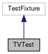

do not remove this div, it is closed by doxygen! 
|  |
| --- |
| FRIBParallelanalysis1.0FrameworkforMPIParalleldataanalysisatFRIB |

 end header part 
 Generated by Doxygen 1.8.13 

 window showing the filter options 

 iframe showing the search results (closed by default)

 top 
[Public Member Functions](#pub-methods) |
[Protected Member Functions](#pro-methods) |
[[classTVTest-members]]

TVTest Class Reference

header
Inheritance diagram for TVTest:

[[[graph_legend]]]

Collaboration diagram for TVTest:

[[[graph_legend]]]

|  |  |
| --- | --- |
| Public Member Functions |
| void | setUp() |
|  |
| void | tearDown() |
|  |

|  |  |
| --- | --- |
| Protected Member Functions |
| void | crdef_1() |
|  |
| void | crdef_2() |
|  |
| void | crdef_3() |
|  |
| void | lookupdef_1() |
|  |
| void | lookupdef_2() |
|  |
| void | names_1() |
|  |
| void | names_2() |
|  |
| void | getdef_1() |
|  |
| void | getdef_2() |
|  |
| void | iter_1() |
|  |
| void | iter_2() |
|  |
| void | size_1() |
|  |
| void | size_2() |
|  |
| void | construct_1() |
|  |
| void | construct_2() |
|  |
| void | construct_3() |
|  |
| void | construct_4() |
|  |
| void | construct_5() |
|  |
| void | construct_6() |
|  |
| void | double_1() |
|  |
| void | double_2() |
|  |
| void | assign_1() |
|  |
| void | assign_2() |
|  |
| void | assign_3() |
|  |
| void | assign_4() |
|  |
| void | pluseq_1() |
|  |
| void | pluseq_2() |
|  |
| void | minuseq_1() |
|  |
| void | minuseq_2() |
|  |
| void | timeseq_1() |
|  |
| void | timeseq_2() |
|  |
| void | diveq_1() |
|  |
| void | diveq_2() |
|  |
| void | postinc_1() |
|  |
| void | postinc_2() |
|  |
| void | preinc_1() |
|  |
| void | preinc_2() |
|  |
| void | postdec_1() |
|  |
| void | postdec_2() |
|  |
| void | predec_1() |
|  |
| void | predec_2() |
|  |
| void | name_1() |
|  |
| void | name_2() |
|  |
| void | value_1() |
|  |
| void | value_2() |
|  |
| void | value_3() |
|  |
| void | value_4() |
|  |
| void | unit_1() |
|  |
| void | unit_2() |
|  |
| void | unit_3() |
|  |
| void | unit_4() |
|  |
| void | changed_1() |
|  |
| void | changed_2() |
|  |
| void | resetchanged_1() |
|  |
| void | resetchanged_2() |
|  |

---

The documentation for this class was generated from the following file:- base/[[treevariabletests_8cpp]]

 contents 
 start footer part 

---

Generated by   1.8.13
