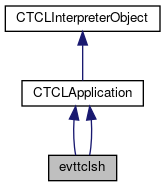

do not remove this div, it is closed by doxygen! 
|  |
| --- |
| FRIBParallelanalysis1.0FrameworkforMPIParalleldataanalysisatFRIB |

 end header part 
 Generated by Doxygen 1.8.13 

 window showing the filter options 

 iframe showing the search results (closed by default)

 top 
[Public Member Functions](#pub-methods) |
[List of all members](https://github.com/FRIBDAQ/docs/tree/main/apipeline/classevttclsh-members.md)

evttclsh Class Reference

header
Inheritance diagram for evttclsh:

[[legend](https://github.com/FRIBDAQ/docs/tree/main/apipeline/graph_legend.md)]

Collaboration diagram for evttclsh:

[[legend](https://github.com/FRIBDAQ/docs/tree/main/apipeline/graph_legend.md)]

|  |  |
| --- | --- |
| Public Member Functions |
| virtual int | operator()() |
|  |
| virtual int | operator()() |
|  |
| Public Member Functions inherited fromCTCLApplication |
|  | CTCLApplication() |
|  |
|  | CTCLApplication(constCTCLApplication&aCTCLApplication) |
|  |
| CTCLApplication& | operator=(constCTCLApplication&aCTCLApplication) |
|  |
| int | operator==(constCTCLApplication&aCTCLApplication) |
|  |
| void | getProgramArguments(int &argc, char **&argv) |
|  |
| Tcl_ThreadId | getThread() const |
|  |
| Public Member Functions inherited fromCTCLInterpreterObject |
|  | CTCLInterpreterObject(CTCLInterpreter*pInterp) |
|  |
|  | CTCLInterpreterObject(constCTCLInterpreterObject&aCTCLInterpreterObject) |
|  |
| CTCLInterpreterObject& | operator=(constCTCLInterpreterObject&aCTCLInterpreterObject) |
|  |
| int | operator==(constCTCLInterpreterObject&aCTCLInterpreterObject) const |
|  |
| CTCLInterpreter* | getInterpreter() const |
|  |
| CTCLInterpreter* | Bind(CTCLInterpreter&rBinding) |
|  |
| CTCLInterpreter* | Bind(CTCLInterpreter*pBinding) |
|  |

|  |  |
| --- | --- |
| Additional Inherited Members |
| Protected Member Functions inherited fromCTCLInterpreterObject |
| CTCLInterpreter* | AssertIfNotBound() |
|  |

---

The documentation for this class was generated from the following files:- libtclplus/tclplus/evttclsh.cpp
- libtclplus/tclplus/tcpservertest.cpp

 contents 
 start footer part 

---

Generated by   1.8.13
