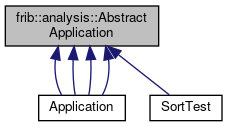

do not remove this div, it is closed by doxygen! 
|  |
| --- |
| FRIBParallelanalysis1.0FrameworkforMPIParalleldataanalysisatFRIB |


 end header part 
 Generated by Doxygen 1.8.13 


 window showing the filter options 


 iframe showing the search results (closed by default) 


- **frib**
- **analysis**
- [AbstractApplication](https://github.com/FRIBDAQ/docs/tree/main/apipeline/classfrib_1_1analysis_1_1AbstractApplication.md)

 top 
[Public Member Functions](#pub-methods) |
[Protected Member Functions](#pro-methods) |
[List of all members](https://github.com/FRIBDAQ/docs/tree/main/apipeline/classfrib_1_1analysis_1_1AbstractApplication-members.md)


frib::analysis::AbstractApplication Class Referenceabstract

header
`#include <AbstractApplication.h>`


Inheritance diagram for frib::analysis::AbstractApplication:





[[legend](https://github.com/FRIBDAQ/docs/tree/main/apipeline/graph_legend.md)]


|  |  |
| --- | --- |
| Public Member Functions |
|  | AbstractApplication(int argc, char **argv) |
|  |
| virtual | ~AbstractApplication() |
|  |
| virtual void | operator()(CParameterReader&paramReader) |
|  |
| virtual void | dealer(int argc, char **argv,AbstractApplication*pApp)=0 |
|  |
| virtual void | farmer(int argc, char **argv,AbstractApplication*pApp)=0 |
|  |
| virtual void | outputter(int argc, char **argv,AbstractApplication*pApp)=0 |
|  |
| virtual void | worker(int argc, char **argv,AbstractApplication*pApp)=0 |
|  |
| MPI_Datatype & | messageHeaderType() |
|  |
| MPI_Datatype & | requestDataType() |
|  |
| MPI_Datatype & | parameterHeaderDataType() |
|  |
| MPI_Datatype & | parameterValueDataType() |
|  |
| MPI_Datatype & | parameterDefType() |
|  |
| MPI_Datatype & | variableDefType() |
|  |
| unsigned | numWorkers() |
|  |
| void | forwardPassThrough(const void *pData, size_t nBytes) |
|  |
| int | getRequest() |
|  |
| void | sendEofs() |
|  |
| void | sendEof() |
|  |
| void | requestData(size_t maxBytes) |
|  |
| void | throwMPIError(int status, const char *reason) |
|  |
|  | AbstractApplication(int argc, char **argv) |
|  |

|  |  |
| --- | --- |
| Protected Member Functions |
| int | getArgc() const |
|  |
| char ** | getArgv() |
|  |
| void | makeDataTypes() |
|  |


<a name="details"></a>## Detailed Description


This class is a strategy pattern for the dealer/worker/farmer/outputter parallel execution pattern implemented in MPI. If an application has MPI rank n it will allocate them as follows:

- 0 - Dealer
- 1 - Farmer
- 2 - Outputter
- 3-n - Workers.


The dealer, rank 0 is connected to the data source. Workers send requests to it for work items the dealer respondes either with data or an end message indicating there is no more data. When the dealer has sent ends to all of the workers it will call MPI_Finalize to do our part to exit the application.


The Farmer gets messags from the workers and re-orders them into the original order. When the dealer sends a work item it will actually be sent as a pair of messages. The first message will contain a work item number and a payload size while the second message will contain a size of the following message (sent as an array of chars). The Farmer orders the work items by item number and sends them to the Outputtter. End messages from the workers are counted and when the farmer has gotten an end message from all workers it will send an end message to the outputter call MPI_Finalize to do its part to exit.


The outputter gets messages from the farmer that are either results or end marks. The outputter is connected to the data sink. It will write the messages from the farmer to the data sink. When it receives an end messages, it will call MPI_Finalize ot do its part to exit.


Workers are responsible for actually doing the application specific operations on the data. They request and receive blocks of data to operate on from the Dealer. They transform those blocks into output data which they then send to the Farmer for re-ordering. If the dealer sends them a worker and end message, it will send and end message to the farmer and call MPI_Finalize to do its part to exit.


Each process type is implemented as a pure virtual method. The function call operator():

- Calls MPI_INIT
- Uses the ParameterReader it was passed to read in the parameter configuration.
- If rank 0 figures out the extent of the program and if it is sufficient to run at least one worker.
- Depending on the rank, invokes the appropriate strategy methods to be the appropriate role.
- When the strategy method exists, invokes MPI_Finalize and returns to the caller who, presumably, exits.


- Note
  the operator() is also virtual to allow that logic to be overridden.

A typical use of this class woud be to:

```
*
* using namespace frib::analysis;
* int main(argc, char**argv) {
*  // define a MyApplication deriveds, concrete class class from
*  //   AbstractApplication
*
*   CTCLParameterReader configReader("configFile.tcl");
*   MyApplication app(argc, argv);
*   app(configReader);
*
*   // When we get here our role has called MPI_Finalize
*
*    exit(EXIT_SUCCESS);
*  }
*  
*  
```

## Constructor & Destructor Documentation


## [◆](#a7f7a06f14708d5c85e281da6f0c2d369)AbstractApplication()


|  |  |  |  |
| --- | --- | --- | --- |
| AbstractApplication::AbstractApplication | ( | int | argc, |
|  |  | char ** | argv |
|  | ) |  |  |

constructor

- Parameters
  |  |  |
  | --- | --- |
  | argc | -number of command line arguments. |
  | argv | - pointer to the command line arguments. |


## [◆](#adf5af96182e880bd6012c2d6aa520715)~AbstractApplication()


|  |  |  |  |  |  |  |
| --- | --- | --- | --- | --- | --- | --- |
| AbstractApplication::~AbstractApplication() | AbstractApplication::~AbstractApplication | ( |  | ) |  | virtual |
| AbstractApplication::~AbstractApplication | ( |  | ) |  |

destructor


## Member Function Documentation


## [◆](#a942e121cd877b6bff95c57c0a010cdc1)forwardPassThrough()


|  |  |  |  |
| --- | --- | --- | --- |
| void AbstractApplication::forwardPassThrough | ( | const void * | pData, |
|  |  | size_t | nBytes |
|  | ) |  |  |

forwardPassThrough Send bytes without any real interpretation to the output

- Parameters
  |  |  |
  | --- | --- |
  | pData | - data to send. |
  | nBytes | - number of bytes to send. |


## [◆](#ab22b8c43f7372537ec1d697f5e7e12a7)getArgc()


|  |  |  |  |  |  |  |
| --- | --- | --- | --- | --- | --- | --- |
| int AbstractApplication::getArgc()const | int AbstractApplication::getArgc | ( |  | ) | const | protected |
| int AbstractApplication::getArgc | ( |  | ) | const |

getArgc

- Returns
  int - number of command line parameters after MPI_Init is done modifying them.

///////////////////////////// Utility methods for the subclasses ////////

```
    /**
       getArgc
         @return int - number of command line parameters after MPI_Init is
           done modifying them.
```


## [◆](#afe10b3e1eb7b1db14eba96b2f66ebaac)getArgv()


|  |  |  |  |  |  |  |
| --- | --- | --- | --- | --- | --- | --- |
| char ** AbstractApplication::getArgv() | char ** AbstractApplication::getArgv | ( |  | ) |  | protected |
| char ** AbstractApplication::getArgv | ( |  | ) |  |

getArgv

- Returns
  const char** - pointer to list oif argument pointers.


## [◆](#aba659c2561ee078e0b4969d770f8d011)getRequest()


|  |  |  |  |  |
| --- | --- | --- | --- | --- |
| int AbstractApplication::getRequest | ( |  | ) |  |

getRequest Receive a request from a worker and return the rank of the sender.

- Returns
  int - requesting worker.


## [◆](#aac8252e5e21c448705b6c63d81e302a9)makeDataTypes()


|  |  |  |  |  |  |  |
| --- | --- | --- | --- | --- | --- | --- |
| void AbstractApplication::makeDataTypes() | void AbstractApplication::makeDataTypes | ( |  | ) |  | protected |
| void AbstractApplication::makeDataTypes | ( |  | ) |  |

makeDataTypes Creates any MPI custom data types we need. This sets member data datatypes. Getters exist to fetch references to the data types we've created.


## [◆](#a5185ccf668ee2098b0786a057e75f5a9)messageHeaderType()


|  |  |  |  |  |
| --- | --- | --- | --- | --- |
| MPI_Datatype & AbstractApplication::messageHeaderType | ( |  | ) |  |

messageHeaderType Returns a reference to the MPI type item for a message header:


## [◆](#a769d6d2c41df55f6cb9608a22ab15502)numWorkers()


|  |  |  |  |  |
| --- | --- | --- | --- | --- |
| unsigned AbstractApplication::numWorkers | ( |  | ) |  |

return the number of worker processes in the application. This is just size-3 (dealer, farmer, outputer).


## [◆](#a5bf065943cfc2865504da5b5db406779)operator()()


|  |  |  |  |  |  |  |  |
| --- | --- | --- | --- | --- | --- | --- | --- |
| void AbstractApplication::operator()(CParameterReader&reader) | void AbstractApplication::operator() | ( | CParameterReader& | reader | ) |  | virtual |
| void AbstractApplication::operator() | ( | CParameterReader& | reader | ) |  |

operator() Entry point to the MPI pattern.

- Parameters
  |  |  |
  | --- | --- |
  | paramReader | - object that knows how to read the parameter file. |


## [◆](#a0493e974efd48b09f07c5411e7bf802d)parameterDefType()


|  |  |  |  |  |
| --- | --- | --- | --- | --- |
| MPI_Datatype & AbstractApplication::parameterDefType | ( |  | ) |  |

parameterDefType

- Returns
  MPI_Datatype& - references data type for parameter definition.


## [◆](#ae6372b441eac110cc1bc77088a67a2f5)parameterHeaderDataType()


|  |  |  |  |  |
| --- | --- | --- | --- | --- |
| MPI_Datatype & AbstractApplication::parameterHeaderDataType | ( |  | ) |  |

parameterHeaderDataType

- Returns
  MPI_DataType& reference to the header data type for a parameter message.


## [◆](#a148b53c78f9259570554bc659fdded85)parameterValueDataType()


|  |  |  |  |  |
| --- | --- | --- | --- | --- |
| MPI_Datatype & AbstractApplication::parameterValueDataType | ( |  | ) |  |

parameterValueDataType

- Returns
  MPI_DataType& - reference to the data type for parameter values.


## [◆](#a6912961ab356feec28c5feba56a7380c)requestData()


|  |  |  |  |  |  |
| --- | --- | --- | --- | --- | --- |
| void AbstractApplication::requestData | ( | size_t | maxBytes | ) |  |

requestData Send a request for data to the dealer

- Parameters
  |  |  |
  | --- | --- |
  | maxBytes | - maxium payload we want to accept. |


## [◆](#a4eaa12a19d5d8a0fe9628d955f0c3e38)requestDataType()


|  |  |  |  |  |
| --- | --- | --- | --- | --- |
| MPI_Datatype & AbstractApplication::requestDataType | ( |  | ) |  |

requestDataType returns a reference to the MPI type item for a data request record.


## [◆](#ac7c47c29a42e3966bee5cec1ac545ff5)sendEof()


|  |  |  |  |  |
| --- | --- | --- | --- | --- |
| void AbstractApplication::sendEof | ( |  | ) |  |

get a request and send an EOF to it.


## [◆](#a801d4278156338b224e2c7b7228ec02b)sendEofs()


|  |  |  |  |  |
| --- | --- | --- | --- | --- |
| void AbstractApplication::sendEofs | ( |  | ) |  |

sendEofs Send all the EOFS to workers.


## [◆](#a80527bacc6595b44b24eaab256b64046)throwMPIError()


|  |  |  |  |
| --- | --- | --- | --- |
| void AbstractApplication::throwMPIError | ( | int | status, |
|  |  | const char * | prefix |
|  | ) |  |  |

throwMPIError Analyzes an MPI call status return throwing a runtime error if the status is not normal

- Parameters
  |  |  |
  | --- | --- |
  | status | - status from the MPI call. |
  | prefix | - Prefix to the error text from status |


## [◆](#abf5850ea1d16538a27fbc3f98377ec90)variableDefType()


|  |  |  |  |  |
| --- | --- | --- | --- | --- |
| MPI_Datatype & AbstractApplication::variableDefType | ( |  | ) |  |

variableDefType

- Returns
  MPI_Datatype& - references the data type for variable values.


---

The documentation for this class was generated from the following files:- base/[AbstractApplication.h](https://github.com/FRIBDAQ/docs/tree/main/apipeline/AbstractApplication_8h_source.md)
- spectcl/[workerTest.cpp](https://github.com/FRIBDAQ/docs/tree/main/apipeline/workerTest_8cpp.md)
- AbstractApplication.cpp

 contents 
 start footer part 

---


Generated by  [](http://www.doxygen.org/index.html) 1.8.13
