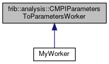

do not remove this div, it is closed by doxygen! 
|  |
| --- |
| FRIBParallelanalysis1.0FrameworkforMPIParalleldataanalysisatFRIB |

 end header part 
 Generated by Doxygen 1.8.13 

 window showing the filter options 

 iframe showing the search results (closed by default) 

- **frib**
- **analysis**
- [[CMPIParametersToParametersWorker|https://github.com/FRIBDAQ/docs/tree/main/apipeline/classfrib_1_1analysis_1_1CMPIParametersToParametersWorker.md]]

 top 
[Public Types](#pub-types) |
[Public Member Functions](#pub-methods) |
[Protected Member Functions](#pro-methods) |
[[List of all members|https://github.com/FRIBDAQ/docs/tree/main/apipeline/classfrib_1_1analysis_1_1CMPIParametersToParametersWorker-members.md]]

frib::analysis::CMPIParametersToParametersWorker Class Referenceabstract

header
Inheritance diagram for frib::analysis::CMPIParametersToParametersWorker:

[[[legend|https://github.com/FRIBDAQ/docs/tree/main/apipeline/graph_legend.md]]]

|  |  |
| --- | --- |
| Public Types |
| typedef std::pair< std::string, double > | VariableInfo |
|  |

|  |  |
| --- | --- |
| Public Member Functions |
|  | CMPIParametersToParametersWorker(int argc, char **argv,AbstractApplication*pApp) |
|  |
| virtual | ~CMPIParametersToParametersWorker() |
|  |
| virtual void | operator()() |
|  |
| virtual void | process()=0 |
|  |

|  |  |
| --- | --- |
| Protected Member Functions |
| VariableInfo * | getVariable(const char *pVarName) |
|  |
| void | loadVariable(const char *pVarName) |
|  |
| std::vector< std::string > | getVariableNames() |
|  |

## Constructor & Destructor Documentation

## [◆](#ad517988e801ae26ddb55223b6cdb858a)CMPIParametersToParametersWorker()

|  |  |  |  |
| --- | --- | --- | --- |
| frib::analysis::CMPIParametersToParametersWorker::CMPIParametersToParametersWorker | ( | int | argc, |
|  |  | char ** | argv, |
|  |  | AbstractApplication* | pApp |
|  | ) |  |  |

constructor

- Parameters
  |  |  |
  | --- | --- |
  | argc,argv | - command line parameters after MPI_Init's strip. |
  | pApp | - pointer to the application object. |

## [◆](#a7bb18d7ab9d09bc811ac2167d0593c17)~CMPIParametersToParametersWorker()

|  |  |  |  |  |  |  |
| --- | --- | --- | --- | --- | --- | --- |
| frib::analysis::CMPIParametersToParametersWorker::~CMPIParametersToParametersWorker() | frib::analysis::CMPIParametersToParametersWorker::~CMPIParametersToParametersWorker | ( |  | ) |  | virtual |
| frib::analysis::CMPIParametersToParametersWorker::~CMPIParametersToParametersWorker | ( |  | ) |  |

destructor - The tree parameters in the tree map were dynamically created by the receipt of the parameter definition record so They must be deleted.

## Member Function Documentation

## [◆](#a948829243569a872126e90a27d06075d)getVariable()

|  |  |  |  |  |  |  |  |
| --- | --- | --- | --- | --- | --- | --- | --- |
| CMPIParametersToParametersWorker::VariableInfo * frib::analysis::CMPIParametersToParametersWorker::getVariable(const char *pVarName) | CMPIParametersToParametersWorker::VariableInfo * frib::analysis::CMPIParametersToParametersWorker::getVariable | ( | const char * | pVarName | ) |  | protected |
| CMPIParametersToParametersWorker::VariableInfo * frib::analysis::CMPIParametersToParametersWorker::getVariable | ( | const char * | pVarName | ) |  |

getVariable Return the information block that describes a variable received from the dealer.

- Parameters
  |  |  |
  | --- | --- |
  | pVarName | - name of the variable we want. |

- Returns
  CMPIParametersToParametersWorker::VariableInfo*

- Return values
  |  |  |
  | --- | --- |
  | nullptr | - no matching variable definition. |

## [◆](#a1aa237b408f975337ef7031e70e1dc5b)getVariableNames()

|  |  |  |  |  |  |  |
| --- | --- | --- | --- | --- | --- | --- |
| std::vector< std::string > frib::analysis::CMPIParametersToParametersWorker::getVariableNames() | std::vector< std::string > frib::analysis::CMPIParametersToParametersWorker::getVariableNames | ( |  | ) |  | protected |
| std::vector< std::string > frib::analysis::CMPIParametersToParametersWorker::getVariableNames | ( |  | ) |  |

getVariableNames Return a vector of variable names received from the dealer.

- Returns
  std::vector<std::string>

## [◆](#a84cccc26f3c0efc21da0ec6f36daaa7a)loadVariable()

|  |  |  |  |  |  |  |  |
| --- | --- | --- | --- | --- | --- | --- | --- |
| void frib::analysis::CMPIParametersToParametersWorker::loadVariable(const char *pVarName) | void frib::analysis::CMPIParametersToParametersWorker::loadVariable | ( | const char * | pVarName | ) |  | protected |
| void frib::analysis::CMPIParametersToParametersWorker::loadVariable | ( | const char * | pVarName | ) |  |

loadVariable Given a variable loads its information into the current set of tree variables.

- Parameters
  |  |  |
  | --- | --- |
  | pVarName | - name of the variable. |

- Exceptions
  |  |  |
  | --- | --- |
  | std::invalid_argument | - if there's no matching variable. |

- Note
  If there's no matching *locally defined* variable, we will create a new one but this new variable will not be known to the outputter.

## [◆](#add885039232a004266ddac6cc9c0d258)operator()()

|  |  |  |  |  |  |  |
| --- | --- | --- | --- | --- | --- | --- |
| void frib::analysis::CMPIParametersToParametersWorker::operator()() | void frib::analysis::CMPIParametersToParametersWorker::operator() | ( |  | ) |  | virtual |
| void frib::analysis::CMPIParametersToParametersWorker::operator() | ( |  | ) |  |

operator() Entry point for the worker. The top level logic is simple: Receive the parameter definitions - those are first. Receive the variable definitions - those must be second. Recieve/process all of the events:

---

The documentation for this class was generated from the following files:- base/[[MPIParametersToParametersWorker.h|https://github.com/FRIBDAQ/docs/tree/main/apipeline/MPIParametersToParametersWorker_8h_source.md]]
- base/[[MPIParametersToParametersWorker.cpp|https://github.com/FRIBDAQ/docs/tree/main/apipeline/MPIParametersToParametersWorker_8cpp.md]]

 contents 
 start footer part 

---

Generated by   1.8.13
