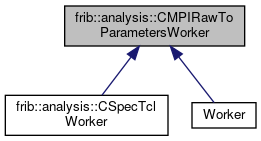

do not remove this div, it is closed by doxygen! 
|  |
| --- |
| FRIBParallelanalysis1.0FrameworkforMPIParalleldataanalysisatFRIB |

 end header part 
 Generated by Doxygen 1.8.13 

 window showing the filter options 

 iframe showing the search results (closed by default) 

- **frib**
- **analysis**
- [[CMPIRawToParametersWorker|https://github.com/FRIBDAQ/docs/tree/main/apipeline/classfrib_1_1analysis_1_1CMPIRawToParametersWorker.md]]

 top 
[Public Member Functions](#pub-methods) |
[[List of all members|https://github.com/FRIBDAQ/docs/tree/main/apipeline/classfrib_1_1analysis_1_1CMPIRawToParametersWorker-members.md]]

frib::analysis::CMPIRawToParametersWorker Class Referenceabstract

header
`#include <MPIRawToParametersWorker.h>`

Inheritance diagram for frib::analysis::CMPIRawToParametersWorker:

[[[legend|https://github.com/FRIBDAQ/docs/tree/main/apipeline/graph_legend.md]]]

|  |  |
| --- | --- |
| Public Member Functions |
|  | CMPIRawToParametersWorker(AbstractApplication&App) |
|  |
| virtual | ~CMPIRawToParametersWorker() |
|  |
| virtual void | operator()(int argc, char **argv) |
|  |
| virtual void | initializeUserCode(int argc, char **argv,AbstractApplication&pApp) |
|  |
| virtual void | unpackData(const void *pData)=0 |
|  |

## Detailed Description

This is an abstract base class for a worker that maps raw parameter data into parameter data. The framework takes care of getting data from the dealer, asking user code to map the associated data into tree parameters and then firing those parameters on to the trigger sorter.

Normally this is used by deriving from this class and supplying an implementation for the unpackData method. This method is expected to analyze the ring item it is given and fill in associated tree parameters. The tree parameters must be those which are defined in the tree parameter setup file. Any new tree parameters can be created and output, but they will not be described in the output file which makes it possible they won't be decipherable at other stages of the analysis pipeline.

The very top levels of the MPI framework are expected to have read in the parameter definition file and assignment of names to ids is assumed to be deterministic.

Users *must* implement unpackData as it is pure virtual. Users *may* implement initializeUserCode if they have one-time initialization code they must run.

- Note
  unpack data will only get PHYSICS_EVENT ring items. all other ring item types are treated as passthrough items and sent directly, as such, to the outputter.

  implementers that are porting SpecTcl code should look at MPISpecTclWorker which tries to allow users to re-use SpecTcl event processor code as much as possible.

## Constructor & Destructor Documentation

## [◆](#aff53c2f12054e393131cb4b9fea297b0)CMPIRawToParametersWorker()

|  |  |  |  |  |  |
| --- | --- | --- | --- | --- | --- |
| frib::analysis::CMPIRawToParametersWorker::CMPIRawToParametersWorker | ( | AbstractApplication& | App | ) |  |

Constructor

- Parameters
  |  |  |
  | --- | --- |
  | App | - referencees the application |

## [◆](#a63e68aeb99164d97490120af12049ad2)~CMPIRawToParametersWorker()

|  |  |  |  |  |  |  |
| --- | --- | --- | --- | --- | --- | --- |
| frib::analysis::CMPIRawToParametersWorker::~CMPIRawToParametersWorker() | frib::analysis::CMPIRawToParametersWorker::~CMPIRawToParametersWorker | ( |  | ) |  | virtual |
| frib::analysis::CMPIRawToParametersWorker::~CMPIRawToParametersWorker | ( |  | ) |  |

Destructor Kill off the parameter bufer:

## Member Function Documentation

## [◆](#ad5f4ca21f243f98d0ed3dc29da46c6a7)operator()()

|  |  |  |  |  |  |  |  |  |  |  |  |  |  |
| --- | --- | --- | --- | --- | --- | --- | --- | --- | --- | --- | --- | --- | --- |
| void frib::analysis::CMPIRawToParametersWorker::operator()(intargc,char **argv) | void frib::analysis::CMPIRawToParametersWorker::operator() | ( | int | argc, |  |  | char ** | argv |  | ) |  |  | virtual |
| void frib::analysis::CMPIRawToParametersWorker::operator() | ( | int | argc, |
|  |  | char ** | argv |
|  | ) |  |  |

operator() The entry point for the application object.

- Initialize the user code.
- Until we get an end header, request data/get data
- Process the data block.

- Parameters
  |  |  |
  | --- | --- |
  | argc,argv | - the program parameters. |

---

The documentation for this class was generated from the following files:- base/[[MPIRawToParametersWorker.h|https://github.com/FRIBDAQ/docs/tree/main/apipeline/MPIRawToParametersWorker_8h_source.md]]
- base/[[MPIRawToParametersWorker.cpp|https://github.com/FRIBDAQ/docs/tree/main/apipeline/MPIRawToParametersWorker_8cpp.md]]

 contents 
 start footer part 

---

Generated by   1.8.13
