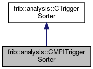

do not remove this div, it is closed by doxygen! 
|  |
| --- |
| FRIBParallelanalysis1.0FrameworkforMPIParalleldataanalysisatFRIB |

 end header part 
 Generated by Doxygen 1.8.13 

 window showing the filter options 

 iframe showing the search results (closed by default) 

- **frib**
- **analysis**
- [[CMPITriggerSorter|classfrib_1_1analysis_1_1CMPITriggerSorter]]

 top 
[Public Member Functions](#pub-methods) |
[[List of all members|classfrib_1_1analysis_1_1CMPITriggerSorter-members]]

frib::analysis::CMPITriggerSorter Class Reference

header
Inheritance diagram for frib::analysis::CMPITriggerSorter:

[[[legend|graph_legend]]]

Collaboration diagram for frib::analysis::CMPITriggerSorter:

[[[legend|graph_legend]]]

|  |  |
| --- | --- |
| Public Member Functions |
|  | CMPITriggerSorter(int outputterRank, MPI_Datatype &headers, MPI_Datatype &param) |
|  |
| virtual | ~CMPITriggerSorter() |
|  |
| virtual void | emitItem(pParameterItemitem) |
|  |
| Public Member Functions inherited fromfrib::analysis::CTriggerSorter |
|  | CTriggerSorter() |
|  |
| virtual | ~CTriggerSorter() |
|  |
| void | addItem(pParameterItemitem) |
|  |
| void | flush() |
|  |

## Constructor & Destructor Documentation

## [◆](#a5afeeeb0ed35db1014931dcb3b5fefca)CMPITriggerSorter()

|  |  |  |  |
| --- | --- | --- | --- |
| frib::analysis::CMPITriggerSorter::CMPITriggerSorter | ( | int | outputterRank, |
|  |  | MPI_Datatype & | headers, |
|  |  | MPI_Datatype & | param |
|  | ) |  |  |

constructor The parameters really tell us how to talk to the outputter:

Parameters
|  |  |
| --- | --- |
| outputRank | - the rank to which we send our sorted items. |
| headers | - MPI Data type for FRIB_MPI_Parameter_MessageHeader normallyAbstractApplicationcomputed this. |
| param | - MPIData type for FRIB_MPI_Parameter_Value which, again, is normally created byAbstractApplication. |

Note- we're going to pre-allocate 100 FRIB_MPI_Parameter_Value items just to get us started.

## [◆](#a0efa7e03c7222406909ef495eceb17f0)~CMPITriggerSorter()

|  |  |  |  |  |  |  |
| --- | --- | --- | --- | --- | --- | --- |
| frib::analysis::CMPITriggerSorter::~CMPITriggerSorter() | frib::analysis::CMPITriggerSorter::~CMPITriggerSorter | ( |  | ) |  | virtual |
| frib::analysis::CMPITriggerSorter::~CMPITriggerSorter | ( |  | ) |  |

Destructor -The cool thing about unique pointers is they destroy themselves.,\

## Member Function Documentation

## [◆](#ae4a9f90f00538528a6a656909a1c9bca)emitItem()

|  |  |  |  |  |  |  |  |
| --- | --- | --- | --- | --- | --- | --- | --- |
| void frib::analysis::CMPITriggerSorter::emitItem(pParameterItemitem) | void frib::analysis::CMPITriggerSorter::emitItem | ( | pParameterItem | item | ) |  | virtual |
| void frib::analysis::CMPITriggerSorter::emitItem | ( | pParameterItem | item | ) |  |

emitItem Marshall the event up into a header and parameter block and send it on its way to the m_outputRank receiver.

Parameters
|  |  |
| --- | --- |
| item | -pointer to the ring item that contains the parameters. |

Noteitem will be deleted after we no longer need its data. 
Implements [[frib::analysis::CTriggerSorter|classfrib_1_1analysis_1_1CTriggerSorter]].

---

The documentation for this class was generated from the following files:- base/[[MPITriggerSorter.h|MPITriggerSorter_8h_source]]
- base/[[MPITriggerSorter.cpp|MPITriggerSorter_8cpp]]

 contents 
 start footer part 

---

Generated by   1.8.13
