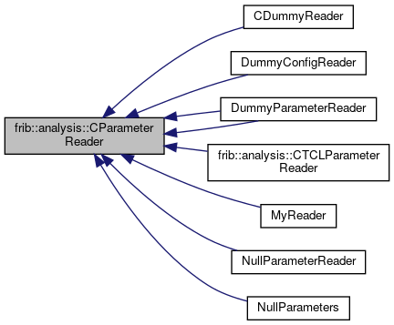

do not remove this div, it is closed by doxygen! 
|  |
| --- |
| FRIBParallelanalysis1.0FrameworkforMPIParalleldataanalysisatFRIB |

 end header part 
 Generated by Doxygen 1.8.13 

 window showing the filter options 

 iframe showing the search results (closed by default) 

- **frib**
- **analysis**
- [[classfrib_1_1analysis_1_1CParameterReader]]

 top 
[Public Member Functions](#pub-methods) |
[Protected Attributes](#pro-attribs) |
[[classfrib_1_1analysis_1_1CParameterReader-members]]

frib::analysis::CParameterReader Class Referenceabstract

header
`#include <ParameterReader.h>`

Inheritance diagram for frib::analysis::CParameterReader:

[[[graph_legend]]]

|  |  |
| --- | --- |
| Public Member Functions |
|  | CParameterReader(const char *pFilename) |
|  |
| virtual void | read()=0 |
|  |

|  |  |
| --- | --- |
| Protected Attributes |
| std::string | m_filename |
|  |

## Detailed Description

Reads parameter/variable definition files. This is an abstract base class so that definition files can be in e.g. Tcl or in Python or any other useful language.

---

The documentation for this class was generated from the following file:- base/[[ParameterReader_8h_source]]

 contents 
 start footer part 

---

Generated by   1.8.13
